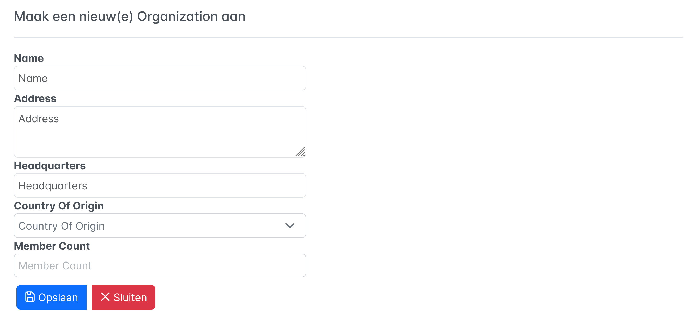

= Dynamo
:toc:
:toclevels: 2
:icons: font

image:media/logo-dynamo.png[image]

Web Application Accelerator Framework

Developed, maintained and sponsored by

image:media/logo-opencirclesolutions.svg[image,width=256,height=53]

Main committer: Bas Rutten

Copyright © 2014 - 2024 Open Circle Solutions BV.

Nothing from this document may be copied and/or made public by use of
print, photocopy, microfilm or by any other means, without prior
permission of Open Circle Solutions BV.

== Introduction

The Dynamo Web Application Accelerator Framework is a software
development framework developed by Open Circle Solutions that aims to
increase productivity by using design principles such as convention over
configuration, model-driven development and DRY (don’t repeat yourself).

At the core of Dynamo is the concept of the _Entity Model_. The Entity
Model describes the attributes and behaviour of an entity (a.k.a. a
domain object) in your application. This Entity Model can then be used
as the basis for creating forms, , search screens etc.

The _Entity Model_ of an entity is automatically constructed based on
the properties of the attributes of the entity (using sensible defaults
as described by the convention over configuration principle) and can
further be modified by using annotations and message bundle entries. The
main goal is to reduce the amount of (boilerplate) code required to
perform common actions like creating search screens and edit forms.

Complementing the _Entity Model_ is a set of user interface components
(widgets) that can be used to quickly construct screens for common use
cases, and several base classes for the Data Access and Service layers.

The Dynamo framework is built around a number of proven and highly
productive set of technologies:

* JPA2 for ORM
* QueryDSL for type-safe query generation
* Spring Boot as the application framework
* Angular (v16) as the front-end framework of choice
* PrimeNG for a rich suite of components

== Architectural overview

The general principle of the Dynamo Framework is as follows:

* The developer creates a back-end application (based on Spring Boot)
that can communicate with a relational database for storing and
retrieving data.
* The back-end application contains any number of domain
objects/entities that correspond to the database tables.
* Based on these entities, Dynamo constructs _Entity Models_ that
describe the behaviour of the user interface that can be used to
manipulate these entities. This includes things like being able to
define whether it is possible to search on certain attributes, when and
how attributes can be edited, which values are allowed, how the values
are formatted etc (there are dozens of different settings).
* The back-end application offers several APIs that are used by the
front-end: one API that can be used to retrieve the Entity Model for a
certain entity, and one API that can be used (in a generic fashion) to
perform CRUD operations on the entity. In addition to this there are
also APIs for uploading files, for exporting data to CSV/Excel, and for
automatically filling forms based on LLM.
* The developer also creates a front-end application, using the Dynamo
Front End library based on Angular and PrimeNG. This application offers
a number of reusable user interface components (e.g. a search screen, an
edit layout, a split layout etc.) that allow the developer to quickly
define CRUD screens. This generally takes just a couple of lines of code
and is almost completely declarative.
* At run-time, when the user accesses a screen, the Dynamo Framework
will call the entity model API in order to retrieve the entity model for
a certain entity. The data from this entity model will then be used to
render the screen, e.g. to display the correct fields in a search form
or the correct columns in a table. In conjunction with this, the
framework will also call the CRUD API to retrieve the data to display.

==  The Entity Model

=== Basics

==== Back-end

To create the entity model, you need access to an *EntityModelFactory*.
The *EntityModelFactory* is a Spring singleton and can be acquired by
injection (@Inject or @Autowired). You can also acquire a reference to
the *EntityModelFactory* by calling the *getEntityModelFactory* method
on the *ServiceLocator* which in turn can be retrieved by calling
*ServiceLocatorFactory.getServiceLocator().*

You can then acquire the *EntityModel* for a certain entity by calling
the *getModel(Class<?> clazz)* method. This will retrieve the entity
model for the specified class, lazily constructed when needed. Note that
the entity model is effectively immutable and application-scoped (or
more precisely, it has the Spring Singleton scope, i.e. there is one
instance per Spring application context).

This also means that the same entity model is in principle used by all
screens within an application. Since this would be too restrictive in
practice, it is possible to construct separate instances for separate
screens or use cases, by calling the *getModel(String reference,
Class<?> clazz)* method. This will construct the Entity Model based on
the provided class (the second parameter), but it will allow you to
override certain attributes using message bundle entries (more on this
later). The *reference* string is the unique identifier that you assign
to the model (if you just call the *getModel* variant with a single
parameter, then the simple name of the class is used as the reference)
and which is then used as part of the message bundle entry.

The classes for which you create an Entity Model must inherit from the
*org.dynamoframework.domain.AbstractEntity* class. See chapter 6 for details.

==== API

The back-end application offers an API for retrieving the entity model
for a certain entity. The entity model can be retrieved by doing a GET
request to */model/\{entityName}.* The entity name is the same as the
simple name of the Java class. E.g. to retrieve the entity model for the
“Organization” entity, make the following call:

*model/Organization*

Optionally, you can pass along a *reference* parameter to specify an
exact version of the entity model to retrieve (we learn more about
versions of entity models in section 3.5)

*model/Organization?reference=PersonOrganizationSearch*

As you will see later on, entity models can be nested: if an entity has
a reference to another entity (one-to-many, many-to-one, etc.) then a
nested entity model for that entity will be created. You can retrieve a
nested entity model by performing a GET to
*/model/\{entityName}/attribute/attributeName,* e.g.
*/model/Gift/attribute/translations*

Generally speaking, you should not have to call these endpoints directly
as the framework will do it for you.

=== Entity level settings

The Entity Model supports several attributes that define how the entity
itself is represented. These include:

* *displayName*: the name of the entity (e.g. “Car”)
* *displayNamePlural*: the name of the entity, in plural form (e.g.
“Cars”)
* *description*: textual description of the entity
* *displayProperty*: the name of the property to use when displaying the
entity inside e.g. a combo box. This property is also used as the title
of the entity that is placed above an edit form.
* *sortOrder*: how the entities are sorted by default when displayed in
a grid or list. The *sortOrder* consists of a comma separated list of
attribute names and sort directions, e.g. “name asc, age desc”. The
direction is optional and if it is not supplied, “asc” will be used by
default. This should be familiar to anybody who has worked with SQL.
* *maxSearchResults* indicates the maximum number of results to return
form a search query (not just per page, but in total). By default this
is set to the value of *Integer.MAX_VALUE* which means there are no
restrictions in place. If you set this to a lower value, the result set
of a search will be capped at this maximum value – the table and
paginator will only show results up to the maximum (and anything beyond
that will appear to not exist).
* *createAllowed* indicates whether creating new entities is allowed.
* *updateAllowed* indicates whether updating existing entities is
allowed.
* *listAllowed* indicates whether executing GET requests (without
specifying an ID) to request the full list of entities is allowed.
* *getAllowed* indicates whether executing a GET request to retrieve a
single entity is allowed.
* *exportAllowed* indicates whether exporting the data to Excel or CSV
is allowed.

=== Attributes

Every Entity Model consists of a number of *Attribute Models*. By
default, an Attribute Model is created for every valid property of the
entity. E.g. if you have an entity Person with properties “name” and
“age”, then the attribute model for the Person entity will contain two
attribute models, one for “name” and one for “age”.

The following rules apply when constructing the attribute models:

* An attribute model will be created for every public, non-static,
no-parameter getter-method that follows the JavaBean naming convention
(e.g., “getAge()”; for Boolean or boolean properties, the getter may
also start with “is”, e.g. “isValid”).
* You can use Lombok to generate getters and setters for you.
* The entity class does not necessarily have to contain an actual field
corresponding to the property. This allows you to create attribute
models for read-only or composite properties (e.g. a “*getNameAndAge*()”
method which concatenates the name and age as a String). Note that such
an attribute will have to be defined as read-only.
* Certain attributes are ignored. Currently this includes only “version”
(used for JPA optimistic locking) and “class” (as every object has a
“getClass()” method).
* Attributes can be simple (String, Integer, Long, enumerated types
etc.) or complex (a reference to another entity, a collection of
primitive values, or a collection of other entities). The Entity Model
generation is nested, which means that if a property of an entity is
again an entity, then an entity model for the nested property will also
be generated. This entity model is separate from the non-nested entity
model that would be constructed directly for the entity.
** Nearly all settings for nested models are treated the same as the
setting on the top level, but there is one exception: the *searchable*
setting on attributes of nested entities is ignored – this is because
when you are creating a search screen for an entity, you normally want
to search on the attributes of that entity, not on the nested
attributes.
** For nested entity models, the *id* attribute and the
*displayProperty* attribute will be marked with “visibleInGrid=true”.
This is done so that a textual description of a nested entity can be
shown inside a grid.
* Getters that are annotated with *@AssertTrue* or *@AssertFalse*
are skipped (these are methods that are used for Bean Validations, not
properties for the meta model).

An attribute model has a *name* attribute that is equal to the name of
the property. This *name* can be used to retrieve the attribute model
from the entity model:

AttributeModel getAttributeModel(String attributeName);

For a nested attribute model, the name of the model consists of the
concatenation of the names of the non-nested models separated by
periods. E.g. if you have a Person entity that has an attribute
*address* of type Address, then the “*houseNumber*” attribute model of
the address has the path “**address.houseNumbe**r”.

This should all make sense as it corresponds to the paths that are used
in e.g. JPQL queries and for data binding in Angular.

=== Defaults and attribute overrides

The Entity Model generation is based on sensible defaults and metadata.
E.g. the value of the *type* setting of an Attribute Model is directly
taken from the Java type of the property, and certain other aspects e.g.
whether the attribute is visible in a grid or can be used in a search
form are derived from this type (e.g. by default a complex attribute
will not be visible in a grid).

In addition to this, the Entity Model generation process will take
certain JSR-303 annotations (e.g. *@NotNull, @Size*) into account. A
detailed explanation for each setting will be given below.

If the default values are not sufficient, you can override them by using
annotations:

* On the entity level, you can use the *@Model* annotation.
* On the attribute level, you can use the *@Attribute* annotation.

The *@Model* annotation can be used like this:

[source,java]
--
@Model(displayProperty = "description")
public class Meeting extends AbstractEntity<Integer> {
--

The *@Attribute* annotation can be placed either directly on the
property, or on its getter method. Annotations placed on the getter
method override those placed on the property, to easily allow you to
override default behaviour in subclasses. Within a single entity class,
you can use both access types interchangeably.

=== Message bundle overrides

The annotation override mechanism is quite powerful, but it has some
drawbacks. E.g. it hard-codes certain String values (display name,
description) into your application, and it does not directly allow for
internationalization. It also only allows you to override the behaviour
of the “default” Entity Model that is based directly on the class, and
not the behaviour of any derived Entity Models.

If you need to override the behaviour of a derived Entity Model, you can
use the message bundle mechanism to achieve this. Message bundle
overrides must be placed in the *src/main/resources/META-INF/entitymodel.properties* file
(create a locale-specific version of this file if you need to; the normal Java
message bundle mechanic is supported).

Message bundle entries in general have the following structure:

*[Reference].[Attribute Model Name].[Attribute]=[Value]*

Where:

* *[Reference]* is the reference to the attribute model. This is the
simple class name of the entity for a standard entity model, and the
user-provided reference for a non-standard model.
* *[Attribute Model Name]* is the (possibly nested) name of the
attribute model. This is empty in case you are directly overriding a
setting of the Entity.
* *[Attribute]* is the setting that you want to modify. For a full list,
see the *EntityModel* class which contains constants that denote the
possible values (or refer to the sections below).
* *[Value]* is the desired value of the setting.

The *[Attribute Model Name]* part must be omitted when you want to
directly set an attribute of the Entity Model itself.

Some examples:

[source,properties]
--
Organization.displayName=Criminal Organization
--

Sets the display name of the Organization entity to “Criminal
Organization”.

[source,properties]
--
Person2.displayName=Gang Member
--

Sets the display name for Person in the “Person2” entity model to “Gang
Member”

[source,properties]
--
Person.name.visibleInForm=true
--

Sets the visibility of the “name” attribute model to *true*

[source,properties]
--
Person.address.street.readOnly=true
--

Sets the “read only” setting of the *address.street* attribute model (a
nested attribute model) to false.

Please remember the following:

* For Boolean values, use the (lower case) values “true” and “false”.
* For numeric values, simply use the String representation of the
numeric value. Use the period “.” as the decimal separator.
* For enumeration values, use the upper-case String representation of
the enumeration value.
* For dates and times, the value of the attribute models’
*displayFormat* setting is used. By default, this has the following
values:
** “dynamoframework.defaults.date-format” (dd-MM-yyyy) for dates
** “dynamoframework.defaults.time-format” (HH:mm:ss) for times
** “dynamoframework.defaults.date-time-format” (dd-MM-yyyy HH:mm:ss)
* For the *visibleInForm* and *visibleInGrid* settings, both the
enumeration values (SHOW/HIDE) and the Boolean values *true* and *false*
are supported.

== Attribute Model settings

In this section, we explain all the supported settings of the attribute
model.

=== AllowedExtensions

In message bundle: *allowedExtensions = [String]*

This setting can be used to specify the extensions of the files that are
accepted by the file upload component that is generated for a LOB
property. By default, its value is empty, which means there are no
restrictions on the file type.

The value can be set to a comma-separated list of supported extensions,
e.g. *bmp,jpg,png*. Any “.” characters must not be included.

On the *@Attribute* annotation, you can use an array of String values
instead of a comma-separated String. Extensions are not case-sensitive,
and you must not include the “.” character.

=== AttributeType

The *attributeType* setting is a classification of the type of the
property. It is determined automatically during the Entity Model
generation process and can have the following values:

* *BASIC*: represents a simple property like a String, a number, a date
etc.
* *DETAIL*: a property that appears as a *@OneToMany* or *@ManyToMany*
relation in the entity class, e.g. the *orderLines* attribute inside an
*Order* entity will be considered a *DETAIL* attribute.
* *MASTER*: a property that appears as a *@OneToOne* or *@ManyToOne* in
the entity class.
* *LOB*: a property that is annotated with *@Lob* and represents a large
binary object (like a file or an image).
* *EMBEDDED*: used during the Entity Model construction process to
handle embedded properties (using the *@Embedded* annotation). This will
be covered in the _Advanced_ section.
* *ELEMENT_COLLECTION*: a property that is annotated with the
*@ElementCollection* annotation, i.e. a collection of simple values like
integers and Strings (The JPA spec does allow more complex element
collections, but these are not currently supported by Dynamo).

The attribute type in combination with the Java type determines how a
certain attribute will be displayed on-screen in an edit form:

* For a *BASIC* property, a simple user interface component will be
displayed, based on the type of the property:
** For String fields and numeric fields, a text field will be rendered.
For a String property, you can use the *textFieldMode* setting to render
a text area or a password field instead. For an Integer field, you can
use the *numberFieldMode* setting to render an “integer field” instead.
** For a Boolean, a check box will be rendered by default. You can
change this to a toggle button by changing the value of the
*booleanFieldMode* setting.
** For a *LocalTime* attribute, a time picker will be rendered.
** For a *LocalDate* attribute, a date picker will be rendered.
** For a *LocalDateTime* or *Instant* attribute, a date/time picker will
be rendered.
** For an enumeration, a combo box will be created. You can use the
message bundle mechanism to specify translations for the enumeration
values (more on this below).
* For a *LOB* property, a file upload field will be created.
* For a *MASTER* property, by default a combo box that contains all the
possible values (as retrieved from the repository) will be created. You
can replace this by a lookup field or ListSelect by changing the value
of the *selectMode* setting.
* For a *DETAIL* property, the behaviour will depend on the value of the
*nestedDetails* setting:
** In case *nestedDetails* is set to true, a table that can be used to
edit the details inline as part of the edit form is rendered. This is
used for nested collections that cannot exist without the parent entity,
e.g. the OrderLines belonging to an Order.
** In case *nestedDetails* is set to false, a multiple select component
that can be used to select various (already existing) entities is
rendered. You can switch this to a lookup field by changing the value of
the *selectMode* setting.
* For an *ELEMENT_COLLECTION* property, the application either renders a
“chips” component (a component that allows you to specify multiple
values by typing) or a simple pop-up dialog that allows you to enter
extra values. You can modify this behaviour by changing the value of the
*elementCollectionMode* setting.

Inside a search form the rendering is a slightly different:

* For a *BASIC* property:
** For a String property, a text field is created. This text field can
be used to perform a search. You can use additional properties to toggle
the case sensitivity and whether to allow prefix or substring matches.
The *textAreaMode* setting is ignored in search forms.
** For a numeric or a date/time property, two search fields are
generated. These allow the user to perform an interval search (return
all values that are higher than or equal to the value in the first field
and lower than or equal to the value in the second field). If you do not
want this behaviour, you can change the value of the
*searchForExactValue* setting to *true*; if you do this then only a
single search field will appear.
** For a property of type *LocalDateTime* or *Instant* you can set the
*searchForDate* setting to true. If you do this then only a single
search field will be created. In this field you can select the date to
search on.
** For a Boolean property, a three-way checkbox displayed. This checkbox
has three possible values: true, false, and “no value”.
** For an enumeration, a combo box containing all values of the
enumeration is displayed.
* For a *MASTER* property, by default a combo box containing all
possible values of the master entity is displayed. You can use the
*searchSelectMode* and/or *selectMode* settings to replace this by a
lookup field.
* For a *DETAIL* property, by default a multi-select field is created.
You can use the *searchSelectMode* and/or *selectMode* settings to
replace this by a lookup field.
* *LOB* properties cannot be used in search forms.

The *attributeType* setting also determines whether the property will be
visible by default:

* In a results grid, by default only *BASIC* attributes will be visible.
Use the *visibleInGrid* attribute to show a complex attribute inside a
grid.
** For a *MASTER* property, the value of its *displayProperty* property
will be used.
** For a *DETAIL* property (remember, this represents a collection!),
the values of the *displayProperty* properties of all individual
entities in the collection will be displayed, separated by commas.
* Attributes of type *MASTER* and *DETAIL* will by default not be
displayed inside an edit form. You can change this by setting the
*visibleInForm* setting of the attribute model to true.
* When displaying an enumeration value inside a combo box, the values
that are displayed inside the combo box are taken from the message
bundle:

[source,properties]
--
[Simple Class Name].[Enumeration Value]=[desired value]
--

E.g.:

[source,properties]
--
Reputation.REALLY_NOT_FEARSOME=Really not [.underline]#fearsome#
Reputation.MILDLY_FEARSOME=Mildly [.underline]#fearsome#
Reputation.FEARSOME=[.underline]#Fearsome#
Reputation.EXTREMELY_FEARSOME=Extremely [.underline]#fearsome#
--

=== AutofillInstructions

In message bundle: *autofillInstructions = [String]*

The *autofillInstructions* setting can be used to define the
attribute-specific instructions for automatically filling a form based
on an AI service (Large Language Model). This is covered in more detail
in a later section.

=== BooleanFieldMode

In message bundle: *booleanFieldMode = CHECKBOX | TOGGLE | SWITCH*

The *booleanFieldMode* setting can be used to change the type of user
interface component that is used to modify an attribute of type Boolean.

The default value for this setting is derived from the value of the
system property “dynamoframework.defaults.boolean-field-mode”. It defaults to
*CHECKBOX* but can be changed to *TOGGLE* (a toggle button) or *SWITCH*
(an on/off switch).

This only affects the component that is used inside an edit form. Inside
a search form, the framework will always use a tri-state checkbox (i.e.
a component that can have the values true, false, or undefined).

=== Cascade

In message bundle:

[source,properties]
--
cascade.[index] = [path to attribute]
cascadeFilterPath.[index] = [path to attribute]
cascadeMode.[index] = BOTH | EDIT | SEARCH
--

The *cascade* setting can be used to define “cascading search” for
selection components. Cascading search means that when you select a
value in a certain component, the available values in another component
change based on this choice. E.g. suppose that you are editing or
searching for an *Organization* and you have selection fields for a
country and for a list of members of the organization– choosing a
country from the list will limit the values in member list to the people
that originate from that country.

To set up cascading, you can define one or more *@Cascade* annotations
as part of the *@Attribute* annotation. Each @*Cascade* annotation takes
three parameters:

* *cascadeTo* - this is the path to the attribute for which the
selection must change in response to a change of the annotated
attribute. In our example, the attribute to change is “members” (see
below).
* *filterPath* – this is the path that determines which filter to apply
to the selection component that is on the receiving end of the cascade
action. In our example, we want to filter a list of Persons so that only
persons from a certain country are returned – this country is stored in
the *countryOfOrigin* property of the person so this is our filter path.
* *mode* - this specifies whether the cascading should be enabled in search
forms, in edit forms, or in both cases. The default is *BOTH*.

[source,java]
--
@Attribute(visibleInGrid = VisibilityType.SHOW, searchable = SearchMode.ALWAYS, visibleInForm = VisibilityType.SHOW, cascade = @Cascade(cascadeTo = "members", filterPath = "countryOfOrigin", mode = CascadeMode.EDIT))
private Country countryOfOrigin;

@Attribute(searchable = true, visibleInForm = VisibilityType.SHOW)
private Set<Person> members = new HashSet<>();
--

Setting up cascading in a message bundle is a bit more involved. You can
do so by defining two or three messages like this:

[source,properties]
--
Organization.countryOfOrigin.cascade.1=members
Organization.countryOfOrigin.cascadeFilterPath.1=countryOfOrigin
Organization.countryOfOrigin.cascadeMode.1=EDIT
--

The *cascade* message defines the property to apply the cascading to –
the *cascadeFilterPath* is the property path to filter on and the
optional *cascadeMode* determines when to apply the cascading. Each
message must end with a number that is used to group the messages
together. The numbering starts at “1” and must use increments of 1, so
if e.g. you want to define another cascade for the same attribute, that
would look like this:

[source,properties]
--
Organization.cascade.2=[some other property to cascade]
Organization.cascadeFilterPath.2=[some other path]
Organization.cascadeMode.2=EDIT
--

=== CurrencyCode

In message bundle: *currencyCode = <ISO currency code>*

This setting can be used to specify that a numeric field (currently only
supported for BigDecimal properties) contains a currency value. If this
setting is changed to a valid ISO 4217 currency code, then a currency
symbol will be displayed in front of the value of the property.

If the specified currency code corresponds to a symbol (e.g. “$” for US
dollar) then this symbol will be used instead of the code.

=== DateType

In message bundle: *dateType = LOCAL_DATE_TIME | INSTANT | DATE | TIME*

The *dateType* setting can be used to determine how an attribute of type
*LocalTime, LocalDate*, *LocalDateTime* or *Instant* will be managed:

The allowed values are:

* *LOCAL_DATE_TIME or INSTANT*: In this case the application renders a
date picker that includes a time selection component.
* *DATE*: in this case the application renders a date picker without a
time selection component.
* *TIME*: in this case a custom time selection component is rendered.

By default, the value of the *dateType* setting is derived from the Java
type of the property. You do not normally have to manually override it.

Dynamo does not support the legacy Java date types (java.util.Date and
java.sql.Date).

=== DefaultSearchValue

In message bundle: *defaultSearchValue = [String]*

The *defaultSearchValue* setting can be used to set the default value
that appears inside an input component inside a search form. This is
only supported for simple attributes like strings and number, not for
entities. It is only used when a single UI component is rendered for
searching (as opposed to two components for specifying an upper or lower
bound; in that case use *defaultSearchValueFrom* and
*defaultSearchValueTo*)

You always specify this setting as a string; if the value must be
converted to a decimal number, use the period (“.”) as the decimal
separator. For enumeration values, use the upper-case String
representation of the desired value.

For date attributes, use the String representations according to the
system properties *dynamoframework.defaults.date-format* _(dd-MM-yyyy),_
*dynamoframework.defaults.time-format* _(HH:mm:ss),_ *dynamoframework.defaults.date-time-format*
_(dd-MM-yyyy HH:mm:ss)_.

=== DefaultSearchValueFrom

In message bundle: *defaultSearchValueFrom = [String]*

The *defaultSearchValueFrom* setting can be used to set the default
value that appears as the lower bound inside a user interface component
inside a search form. This is only supported for simple attributes like
strings and number, not for entities. It is only used when two input
components (upper and lower bound) are rendered for the search, e.g. in
case of a numeric value or date range.

You always specify this setting as a String; if the value must be
converted to a decimal number, use the period (“.”) as the decimal
separator. For enumeration values, use the upper-case String
representation of the desired value.

For date attributes, use the String representations according to the
system properties *dynamoframework.defaults.date-format* _(dd-MM-yyyy),_
*dynamoframework.defaults.time-format* _(HH:mm:ss),_ *dynamoframework.defaults.date-time-format*
_(dd-MM-yyyy HH:mm:ss)_

=== DefaultSearchValueTo

In message bundle: *defaultSearchValueTo = [String]*

The *defaultSearchValueTo* setting can be used to set the default value
that appears as the upper bound inside a user interface component inside
a search form. This is only supported for simple attributes like strings
and number, not for entities. It is only used when two input components
(upper and lower bound) are rendered for the search, e.g. in case of a
numeric value or date range.

You always specify this setting as a String; if the value must be
converted to a decimal number, use the period (“.”) as the decimal
separator. For enumeration values, use the upper-case String
representation of the desired value.

For date/time attributes, use the String representations according to
the system properties *dynamoframework.defaults.date-format* _(dd-MM-yyyy),_
*dynamoframework.defaults.time-format* _(HH:mm:ss),_ *dynamoframework.defaults.date-time-format*
_(dd-MM-yyyy HH:mm:ss)_.

=== DefaultValue

In message bundle: *defaultValue = [String]*

The *defaultValue* setting can be used to set the default value that
appears inside a user interface component when creating a new entity.
This is only supported for simple attributes like Strings and numbers,
not for entities.

You always specify this setting as a String; if the value must be
converted to a decimal number, use the period (“.”) as the decimal
separator. For enumeration values, use the upper-case String
representation of the desired value.

For date/time attributes, use the String representations according to
the system properties *dynamoframework.defaults.date-format* _(dd-MM-yyyy),_
*dynamoframework.defaults.time-format* _(HH:mm:ss),_ *dynamoframework.defaults.date-time-format*
_(dd-MM-yyyy HH:mm:ss)_

=== Description

In message bundle: *description = [String]*

The *description* setting determines the value of the tooltip that the
user will see when hovering over the input field for the property.

If not explicitly set, it will default to the value of the *displayName*
setting.

This setting supports localization.

=== DisplayFormat

In message bundle: *displayFormat = [String]*

The *displayFormat* setting indicates how date/time values will be
formatted. It is supported for attributes of a Java 8 date/time type
(LocalDate, LocalTime etc).

The value of the *displayFormat* attribute must be a valid Java
data/time formatting pattern, e.g. “dd-MM-yyyy”, but you can use
different separators like “dd/MM-yyyy” or use formats like “yyyy-MM-dd”.

If you do not explicitly specify a displayFormat for an attribute, the
framework will default to the value of the *dynamoframework.defaults.date-format,
dynamoframework.defaults.time-format,* *dynamoframework.defaults.date-time-format,* or system
variables depending on the *dateType* of the attribute model.

This setting supports localization.

=== DisplayName

In message bundle: *displayName=[String]*

The *displayName* setting determines how the attribute will be named
onscreen. By default, it is derived from the *name* setting, replacing
CamelCase notation by spaces and then capitalizing individual words,
e.g. “mininumAge” will be translated to “Minimum Age”. You can use the
system property *dynamoframework.capitalize-property-names* and set it to *false* so that
only the first word will be capitalized.

This setting supports localization.

=== DownloadAllowed

In message bundle: *downloadAllowed= true | false*

The *downloadAllowed* setting indicates whether it is allowed to
download files that were uploaded using the file upload functionality.
It defaults to *false.* When set to *true*, a “download” button will
show up next to the preview of the image in a file upload component.

=== EditableType

In message bundle: *editableType = READ_ONLY | CREATE_ONLY | EDITABLE |
HIDDEN*

The *editableType* setting specifies when an attribute can be edited.
The default value *EDITABLE* means that the attribute can be edited both
when creating a new entity or when editing an existing one.
*CREATE_ONLY* means that the attribute can only be edited when
creating a new entity. *READ_ONLY* means that the property is read-only
and cannot be edited in the user interface.

The special value *HIDDEN* can be used in cases in which an attribute
must be filled with a value that is not directly entered inside the edit
form but depends on another non-constant value. E.g. you are in detail
screen and have a reference to a parent object which must be set on the
new entity.

The values of properties that are set to *EDITABLE* or *CREATE_ONLY*
will still be shown inside edit forms, however it will not be possible
to change the values.

=== ElementCollectionMode

In message bundle: *elementCollectionMode = CHIPS | DIALOG*

This setting specifies the type of component to use for editing an
attribute of type *ELEMENT_COLLECTION*. The default value, CHIPS, will
result in a “chips” component (basically a field that holds multiple
tags). You can change this to DIALOG to render a component that uses a
popup dialog to enter additional values.

=== Email

In message bundle: *N/A*

The *email* setting can be used to specify that a field must contain a
valid email address. It is automatically set to *true* if the property
is annotated with the *@Email* annotation (from the Java validation
framework).

=== EnumfieldMode

In message bundle: *enumFieldMode = DROPDOWN | RADIO*

The *enumFieldMode* determines which input component to use when
managing an attribute of type ENUM. By default, the value DROPDOWN is
used, which means that a dropdown field (combo box) will be used. You
can change this default by modifying the value of the system property
*dynamoframework.defaults.enum-field-mode*. When the value is changed to *RADIO* a
set of radio buttons will be used instead.

NOTE: within a search form, this setting will be ignored, and a
dropdown component will always be used in order to save space.

=== FileNameProperty

In message bundle: *fileNameProperty = [property name]*

The *fileNameProperty* setting can be used to specify the name of the
property that is used to store the name of an uploaded file after a file
upload. This setting is intended to be used on attributes of type *LOB*:

[source,java]
--
@Lob
@Attribute(image = true, fileNameProperty = "logo.fileName")
private byte[] image;

// hide in grid to prevent fetch issues
@Attribute(editableType = EditableType.READ_ONLY, visibleInGrid = VisibilityType.HIDE)
private String fileName;
--

By default, if you define an attribute of type LOB, the application
will render a file upload component for editing this attribute. The byte
content of the uploaded file will be stored in the property itself, but
the file name of the file that was uploaded will not be persisted.

If you want to store the file name as well, simply create another
property (of type String) and then point the *fileNameProperty* of the
*@Attribute* annotation that is placed on the property that holds the
binary representation to this property. The framework will then
store the name of the uploaded file in this property as part of the file
upload process.

The actual “fileName” property must be annotated as “readOnly” since it
is automatically set by the framework and does not need to be modified
by the user.

If you don’t specify a *fileNameProperty* for an attribute that is meant
for file upload, the upload and download will still work, however when
downloading a file, it will be assigned a default file name because the
actual file name is unknown.

=== GroupTogetherWith

In message bundle: *groupTogetherWith = [comma separated list of
attribute names]*

The *groupTogetherWith* setting can be used to specify that the input
components for several attributes must be placed together on a single
row in an edit form. This can be a good way of saving screen space. The
value of this setting consists of a list of attribute names. The input
components for these attributes will be placed behind the original
attribute, in the order in which they are defined.

Here you see an example of this for the “region” attribute:

[source,java]
--
@Attribute(visibleInForm = VisibilityType.SHOW, visibleInGrid = VisibilityType.SHOW, searchable = true, groupTogetherWith = {"region"})
private Country country;

--

And this is the input form that will be generated:

image:media/image2.png[image,width=560,height=64]

You can still use all available settings to modify the behaviour of the
components for the “extra” attributes that are placed behind the first
attribute. The framework makes sure that the extra attributes do not
show up more than once.

NOTE: for this to work properly, the attribute that the
*groupTogetherWith* setting refers to must occur in the attribute order
*after* the attribute that does the referring (for the example
above, *region* must come after *country*). If this rule is not
observed, then an exception will be thrown and the component will
not be displayed properly.

=== IgnoreInSearchFilter

In message bundle: *ignoreInSearchFilter = true | false*

This setting can be used for rare occasions in which you want to use an
attribute inside a search form (e.g. for setting up cascading) but you
want to ignore the selected value when actually performing a search.

=== Image

In message bundle: *image = true | false*

This setting can be used on a LOB property to specify whether it
represents an image. By default, this setting has the value *false*.
If set to *true*, the application will try to render a preview image of
the value (byte contents) of the property.

=== LookupEntityReference

In message bundle: *lookupEntityReference = <string value>*

The *lookupEntityReference* setting can be used to specify the reference
(unique identifier) that is to be used when looking up nested entities.
E.g. suppose that you have an Organization entity that has an attribute
Country. By default, when looking up countries (e.g. when filling a
dropdown list), the default “Country” entity model will be used. If you
want to use a different entity model, you can specify this using this
setting.

You can use the message bundle (entitymodel.properties) to modify how
this entity model behaves.

=== LookupQueryType

In message bundle: *lookupQueryType = PAGING | ID_BASED*

The *lookupQueryType* setting can be used to specify the query type to
use inside a popup search dialog that is used inside a lookup field
component.

=== MaxCollectionSize

The *maxCollectionSize* setting determines the maximum number of allowed
elements in an element collection, one-to-many relation, or many-to-many
relation. Its value is derived from the *max* value on the standard Java
Validation *@Size* annotation.

=== MaxLength

In message bundle: *maxLength = [integer value]*

The *maxLength* setting can be used to specify the maximum allowed
length of an attribute of type String. This value is normally
automatically derived from the *@Size(max=<value>)* annotation.

It can also be used to set the maximum length of string values inside an
element collection. In this case, you must set the *maxLength* directly
using the *@Attribute* annotation.

[source,java]
---
@ElementCollection(fetch = FetchType.LAZY)
@CollectionTable(name = "person_tags")
@Column(name = "tag")
@Attribute(visibleInForm = VisibilityType.SHOW, visibleInGrid = VisibilityType.HIDE,
        minLength = 4, maxLength = 12, elementCollectionMode = ElementCollectionMode.DIALOG)
---

=== MaxLengthInGrid

In message bundle: *maxLengthInGrid = [integer value]*

The *maxLengthInGrid* setting can be used to set the maximum length of
the value of a String property when it is displayed inside a grid – if
the value of the property is longer than this, the value will be
truncated after the first *maxLengthInGrid* characters. This can help
save space in grids.

=== MaxValue

In message bundle: *maxValue = [integer value]*

The *maxValue* setting can be used to specify the maximum value of a
numeric attribute. This value is automatically derived from the *@Max*
annotation for Integer or Long fields.

It can also be used to set the maximum value of numeric values inside an
element collection. In this case, you must set the *maxValue* directly
using the *@Attribute* annotation.

[source,java]
---
@ElementCollection(fetch = FetchType.LAZY)
@CollectionTable(name = "person_lucky_numbers")
@Column(name = "lucky_number")
@Attribute(visibleInForm = VisibilityType.SHOW, visibleInGrid = VisibilityType.HIDE,
        minValue = 10, maxValue = 100, elementCollectionMode = ElementCollectionMode.CHIPS)
@Size(max = 3)
private Set<@Min(10) @Max(value = 100) Integer> luckyNumbers = new HashSet<>();
---

=== MemberType

In message bundle: *N/A*

The *memberType* setting can be used to explicitly set the member type
(i.e. the type of an individual entity) of an attribute type *DETAIL*.
Normally, the member type can be derived from the source code
automatically, but there are certain cases in which this is not
possible, e.g. when working with a property that does not directly map
to a member field, but rather returns a collection that is calculated on
the fly. In this case, you can use the *memberType* to set the exact
type of the members of the collection.

This setting is only supported as an annotation override.

=== MinCollectionSize

The *minCollectionSize* setting determines the minimum number of allowed
elements in an element collection, one-to-many relation, or many-to-many
relation. Its value is derived from the *min* value on the *@Size*
annotation from the Java validation framework.

=== MinLength

In message bundle: *minLength = [integer value]*

The *minLength* setting can be used to specify the minimum allowed
length of an attribute of type String. This value is automatically
derived from the *@Size(min=<value>)* annotation.

It can also be used to set the minimum length of string values inside an
element collection. In this case, you must set the *minLength* directly
on the *@Attribute* annotation.

[source,java]
--
@Column(name = "tag")
@Attribute(visibleInForm = VisibilityType.SHOW, visibleInGrid = VisibilityType.HIDE,
        minLength = 4, maxLength = 12, elementCollectionMode = ElementCollectionMode.DIALOG)
private Set<@Size(min = 4, max = 12) String> tags = new HashSet<>();
--

=== MinValue

In message bundle: *minValue = [integer value]*

The *minValue* setting can be used to specify the minimum value for a
numeric attribute. This value is automatically derived from the *@Min*
annotation.

It can also be used to set the minimum value of numeric values inside an
element collection. In this case, you must set the *minValue* directly
using the *@Attribute* annotation.

[source,java]
--
@ElementCollection(fetch = FetchType.LAZY)
@CollectionTable(name = "person_lucky_numbers")
@Column(name = "lucky_number")
@Attribute(visibleInForm = VisibilityType.SHOW, visibleInGrid = VisibilityType.HIDE,
        minValue = 10, maxValue = 100, elementCollectionMode = ElementCollectionMode.CHIPS)
@Size(max = 3)
private Set<@Min(10) @Max(value = 100) Integer> luckyNumbers = new HashSet<>();
--

=== MultipleSearch

In message bundle: *multipleSearch = true | false*

The *multipleSearch* setting can be used to allow searching on multiple
values at once for attributes of type *MASTER*. By default, the user
would only be allowed to search on a single value at a time for such
attributes, but if you set this setting to *true* you will be allowed to
select multiple values (and the application will return all entities
that match at least one of the selected values). This will also change
the component that is rendered by default from a combo box to a multiple
select field.

You can use the *searchSelectMode* to further modify the type of the
search component that is rendered (you can also use a lookup field by
using the value *LOOKUP*).

[source,java]
--
@NotNull
@JoinColumn(name = "country_of_origin")
@ManyToOne(fetch = FetchType.LAZY)
@Attribute(searchable = SearchMode.ALWAYS, visibleInForm = VisibilityType.SHOW, visibleInGrid = VisibilityType.SHOW,
        multipleSearch = true, searchSelectMode = AttributeSelectMode.LOOKUP, navigable = true)
private Country countryOfOrigin;
--

=== Navigable

In message bundle: *navigable = true | false*

The *navigable* setting can be used to specify that a hyperlink for
in-application navigation must be rendered for a certain property. This
works both in a grid and inside an edit form. This is only supported for
properties of type *MASTER* (i.e. many-to-one relations).

In order to use this form of navigation, you first need to set the
*navigable* setting for the property to true. This will then make the
attribute values clickable inside results tables, and inside a form that
is in read-only mode.

=== NavigationLink

In message bundle: *navigationLink = <string value>*

The *navigationLink* setting can be used to specify the path to use for
intra-application navigation (see also under *navigable)*. By default,
the application will use the name of the referenced entity (with the
first letter lower-cased) as the value of the navigation link, but this
can be modified by setting the navigation link. If this setting has a
value that is not equal to the empty string, then this setting will be
used rather than the default.

=== NeededInData

In message bundle: *neededInData = true | false*

The Dynamo framework only returns the attributes that are actually
needed for displaying or editing the entities to the front-end. In very
rare occasions it can happen that there are attributes that are not
directly needed in the UI but that are used as the input for certain
other (read-only) attributes. By default, the values of these attributes
are not returned by the API. In these cases, you can set the
*neededInData* setting to *true* in order to return these attribute
values anyway.

=== NumberFieldMode

In message bundle: *numberFieldMode* = *TEXTFIELD | NUMBERFIELD*

The *numberFieldMode* setting can be used to set the field mode to use
for a numeric property When set to *TEXTFIELD* application will
render a text field. This field has input validation so that only
numbers can be entered.

When set to *NUMBERFIELD*, the application will render a text field
with a pair of spinner buttons that can be used to increase or decrease the value.

The default value of this setting can be modified by changing the system
variable *dynamoframework.defaults.number-field-mode*.

=== NumberFieldStep

In message bundle: *numberFieldStep* = *<integer>*

The *numberFieldStep* setting can be used to set the step size to be used for a
number field (see the previous section). The default value is 1, but you
can set this to any positive integer.

=== Percentage

In message bundle: *percentage = true | false*

The *percentage* setting is used to indicate whether a numeric value
represents a percentage. By default, this attribute has the value
*false*. If set to *true*, the value of the property will be
displayed with a “%” sign following it, both in read-only and edit mode.

The percentage sign is purely cosmetic; the actual value of the property
is not converted or changed in any way.

=== Precision

In message bundle: *precision = [Numeric value]*

The *precision* setting determines the number of digits will be shown
behind the decimal separator when displaying non-integer numbers. By
default, it is set to *2*, but you can change this by changing the value
of the system property *dynamoframework.defaults.decimal-precision*.

=== Prompt

In message bundle: *prompt=[String]*

The *prompt* setting determines the value of the prompt that shows up
inside the editable field for the attribute (in Angular/PrimeNG this is
known as the “placeholder”)

If not set, it defaults to the value of the *displayName* setting.

=== QuickAddAllowed

In message bundle: *quickAddAllowed = true | false*

The *quickAddAllowed* setting can be used to allow the creation of
entities directly from inside a form, for a UI component that is used to
manage a *MASTER* or *DETAIL* relation. Normally, in such a case a combo
box, multi-select or similar component will be rendered (depending on
the value of the *selectMode* setting)

If you set the *quickAddAllowed* setting to *true*, an additional button
will be rendered next to the edit component for the property. When
pressed, this button will bring up a dialog that will allow the user to
create a new entity.

When the user presses the *OK* button in this dialog, the framework will
create a new entity based on the contents of the dialog. This comes with
an automatic check for duplicate values, provided you have configured
this on the underlying service.

As an example, consider the following:

[source,java]
--
@NotNull
@JoinColumn(name = "country_of_origin")
@ManyToOne(fetch = FetchType.LAZY)
@Attribute(visibleInForm = VisibilityType.SHOW, quickAddAllowed = true, selectMode = AttributeSelectMode.LOOKUP)
private Country countryOfOrigin;
--

Here, we define a “countryOfOrigin” property that is of type “Country”..
We set the *quickAddAllowed* to “true”. Once the user now starts the
application, they will see an “Add” button behind the field that can be
used to create a new country. Once pressed, the button will bring up the
following dialog:

The user can now enter the properties of the country in the popup – once
they press the “OK” button the application will store the new Country,
add it to the options that are present in the selection component, and
select it.

The application will carry out an automatic check for duplicates when
the user tries to save the entity (based on the *findIdenticalEntity*
functionality), and will then look for an error message stored under the
“<short name of entity>.not.unique” key in order to display an error
message. E.g. in the example above, you should add a
“Country.not.unique” message to the message bundle.

=== ReplacementSearchPath

In message bundle: *replacementSearchPath = [desired string value]*

The *replacementSearchPath* setting can be used to modify the search
path that is used when translating search filters into a query – it can
happen that you are using a derived property in your search screen (e.g.
to allow searching on only a subset of values) and when you take no
further action this will produce an error when carrying out the query
since the property is not known in JPA. In cases like this, you can use
the *replacementSearchPath* setting to specify the alternate (real) path
to use during the search.

The *replacementSearchPath* setting is managed completely in the
back-end.

=== ReplacementSortPath

In message bundle: *replacementSortPath = [desired string value]*

You can use this setting to override the path to sort on when the user
clicks on a column header in a search results grid. By default, the
application will then sort on the exact path to the property, but if the
*replacementSortPath* is set, that value will be used instead.

The *replacementSortPath* setting is managed completely in the
back-end.

=== RequiredForSearching

In message bundle: *requiredForSearching = true | false*

The *requiredForSearching* setting determines if a property is required
before a search can be carried out inside a *SearchLayout.* If you
create a search form that contains properties that have
*requiredForSearching* set tot true, you will not be able to carry out a
search (i.e. the *Search* button will be disabled) until you provide a
search value for these properties. Note that for an attribute for which
two search fields will be rendered, at least one of the fields must
contain a value.

The default value of this setting is *false.*

=== Searchable

In message bundle: *searchable = NONE | ALWAYS | ADVANCED*

*searchable = NONE | ALWAYS | ADVANCED*

The *searchable* setting determines whether a property will show up in a
search form on a search screen. By default, it is set to *NONE* which
means it will not show up in a search form. Setting this property to
*ALWAYS* means it will always show up in a search form. Setting it to
*ADVANCED* means it will only show up in search forms for which the
“advanced search” mode has been enabled.

=== SearchCaseSensitive

In message bundle: *searchCaseSensitive = true | false*

The *searchCaseSensitive* setting determines whether search operations
on the attribute are case-sensitive. The default is given by the system
property *dynamoframework.defaults.search-case-sensitive* which defaults to “false”.
This setting is only used for attributes of type String and ignored in
all other cases.

On the attribute, you can use the values BooleanType.TRUE and
BooleanType.FALSE.

This setting is managed completely on the back-end.

=== SearchDateOnly

In message bundle: *searchDateOnly = true | false*

The *searchDateOnly* setting determines whether search operations on an
attribute that represents a date/time (either LocalDateTime or an
Instant) are carried out using only date selection fields rather than
time selection fields.

By default, when searching on a date/time attribute, the application
will render two timestamp search fields that allow you to specify a
search interval. When you change this setting to *true* then instead the
application will render to date selection fields. Searching using these
date selection fields will return any time stamps that fall within the
specified date interval (inclusive). E.g. if you enter the search values
*2020-04-04* to *2020-04-06* you will return any records for which the
time stamp value matches the interval from *2020-04-04 00:00:00* up to
*2020-04-06 23:59:599999999*

=== SearchForExactValue

In message bundle: *searchForExactValue = true | false*

This setting determines whether to search for an exact value rather than
a range, when searching for numeric or date values. By default, for such
a field two search fields will be rendered: one for the lower bound of
the range to search for, and one for the upper bound of the range to
search for.

By default, this setting has the value *false.* If set to *true,* then
instead of the two search fields, a single field will be rendered that
allows the user to search for an exact value.

=== SearchPrefixOnly

In message bundle: *searchPrefixOnly = true | false*

The *searchPrefixOnly* setting determines whether search operations on
the property check only for a prefix match. If this is set to *true*,
then searching for e.g. “a” will only match “almond” (“a” appears at
start) but not “walnut” (“a” appears in the middle). If set to false,
then “a” will match both “almond” and “walnut”.

By default, this setting has the value *false*. This setting is only
used for attributes of type String and ignored in all other cases.

This setting is managed completely on the back-end.

=== SearchSelectMode

In message bundle: *searchSelectMode = AUTO_COMPLETE | COMBO | LOOKUP |
MULTI_SELECT*

The *searchSelectMode* setting is used to specify how the component for
searching an attribute of attribute type *MASTER* or *DETAIL* will be
rendered (inside a search form).

By default, the value of the *searchSelectMode* setting is equal to the
value of the *selectMode*, but you can change it explicitly if you want a
different component to be rendered inside a search form.

The following restrictions apply:

* For a property of type *MASTER* you can use the values *COMBO*,
*LOOKUP* or *AUTO_COMPLETE*.
* For a property of type *DETAIL* you can use the values *LOOKUP* and
*MULTI_SELECT*

Depending on the type of component that is selected, different calls to
the back-end will be performed:

* For select mode *COMBO,* if no field filter is applied, a call to the
“list” endpoint (*GET /crud/<entityName>* is performed. This will simply
result a sorted list of all the known entities of the requested type.
Use this with care as it is a bad idea to use this for large collections
* For select mode *COMBO,* if a field filter is applied, a call to the
“search” endpoint (*POST /crud/<entityName>/search* is performed. This
will result in a list of entities that match the provided field filter,
restricted to a maximum of 100 results.
* For select mode *AUTO_COMPLETE ,* a call to the search endpoint (*POST
/crud/<entityName>/search*) is performed, using a search filter based on
the *displayProperty* of the entity and the value entered by the user.
* For select mode *LOOKUP*, initially no search is performed. Instead,
the user can press a button to bring up a search dialog which can be
used to perform a search.

=== SelectMode

In message bundle: *selectMode = AUTO_COMPLETE | COMBO | LOOKUP |
MULTI_SELECT*

The *selectMode* setting is used to specify how the component for
selecting an attribute of type *MASTER* or *DETAIL* will be rendered
(inside an edit form).

The following restrictions apply:

* For a property of type *MASTER* you can use the values *COMBO*,
*LOOKUP* or *AUTO_COMPLETE*.
* For a property of type *DETAIL* you can use the values *LOOKUP* and
*MULTI_SELECT*

Depending on the type of component that is selected, different calls to
the back-end will be performed:

* For select mode *COMBO,* if no field filter is applied, a call to the
“list” endpoint (*GET /crud/<entityName>* is performed. This will simply
result a sorted list of all the known entities of the requested type.
Use this with care as it is a bad idea to use this for large collections.
* For select mode *COMBO,* if a field filter is applied, a call to the
“search” endpoint (*POST /crud/<entityName>/search* is performed. This
will result in a list of entities that match the provided field filter,
restricted to a maximum of 100 results.
* For select mode *AUTO_COMPLETE ,* a call to the search endpoint (*POST
/crud/<entityName>/search*) is performed, using a search filter based on
the *displayProperty* of the entity and the value entered by the user.
* For select mode *LOOKUP*, initially no search is performed. Instead,
the user can press a button to bring up a search dialog which can be
used to perform a search.

=== Sortable

In message bundle: *sortable = true | false*

The *sortable* setting can be used to specify whether a grid can be
sorted on the attribute. By default, it is set to *true* for all
attributes.

=== TextFieldMode

In message bundle: *textFieldMode = TEXTAREA | TEXTFIELD | PASSWORD*

The *textFieldMode* setting can be used to specify whether to render
either a text field, a text area or a password field for editing an
attribute of type String. The default is *TEXTFIELD*_._ Yhr value
*TEXTAREA* will be ignored inside a search form. The value *PASSWORD*
will be ignored inside a search form.

=== TrimSpaces

In message bundle: *trimSpaces = true | false*

This indicates whether extraneous space characters will be trimmed from
the start and end of the input inside text areas and text fields. This
defaults to false but can be modified by changing the value of the
defaults to false but can be modified by changing the value of the
*dynamoframework.defaults.trim-spaces* system property.

On the @Attribute annotation, you can use the “trimSpaces” setting which
supports the values INHERIT, TRIM and NO_TRIM. When INHERIT is used, it
will just use the value of the system property. With TRIM and NO_TRIM
you can either enable or disable the trimming for this specific
attribute.

=== TrueRepresentation and FalseRepresentation

In message bundle: *trueRepresentation = [desired value]*,
*falseRepresentation = [desired value]*

The *trueRepresentation* and *falseRepresentation* settings can be used
to modify how a Boolean value is displayed in read-only mode. By
default, such a value will simply be displayed as “true” or “false”, but
this can be overruled by setting respectively the *trueRepresentation*
and *falseRepresentation* values.

This setting does nothing in edit mode, since in that case a checkbox or
toggle button will be rendered.

=== URL

In message bundle: *url = true | false*

The *url* setting can be used to specify that a certain String property
must be rendered as a clickable URL.

The default value is *false*. If set to *true,* then a validator will
be added to the field (when in edit mode) that checks if the entered
value is a valid URL (must start with http or https). Also, in view mode
the framework will render a clickable URL containing the value of
the attribute – when clicked it will open the provided URL in a separate
browser window.

=== VisibleInForm

In message bundle: *visibleInForm = true | false | SHOW | HIDE*

The *visibleInForm* setting determines whether a property will be
displayed inside an edit form. It is not to be confused with the
*visibleInGrid* attribute that governs whether a property shows up in a
grid.

By default, all simple properties will have *visibleInForm* set to
*true*. All complex (master and detail) properties will be hidden by default.

Instead of *true* you can also use the value *SHOW* and instead of
*false* you can also sue the value *HIDE*.

=== VisibleInGrid

In message bundle: *visibleInGrid = true | false | SHOW | HIDE*

The *visibleInGrid* setting determines whether a property will be
displayed in a search results grid.

By default, all simple properties will have *visibleInGrid* set to
*true*. All complex (master and detail) properties will be hidden by default.

Instead of *true* you can also use the value *SHOW* and instead of
*false* you can also sue the value *HIDE*.

== Attribute ordering and grouping

=== Attribute ordering

In message bundle: *attributeOrder=[comma separated list of attribute
names]*

By default, the properties of an entity will be displayed in the order
in which they appear in the Java class file. This can be overruled by
using an *@AttributeOrder* annotation or setting the *attributeOrder*
via the message bundle.

The *@AttributeOrder* annotation takes a single parameter, named
*attributeNames* which contains an array of field names – the order in
which the attributes appear in the array is the order in which they will
appear in the application.

[source,java]
--
@AttributeOrder(attributeNames = { "name", "headQuarters", "address", "countryOfOrigin", "reputation" })
public class Organization extends AbstractEntity<Integer> {
--

You can achieve the same effect by including a message like
*Organization.attributeOrder=name,headquarters,address,countryOfOrigin,reputation*
in the message bundle (use commas to separate the values). The message
in the bundle will overwrite the ordering set by @AttributeOrder. If
your entity has a large number of attributes this might get a bit
unwieldy though.

The ordering does not have to contain all properties; if you leave
out any attributes, then those will be placed (in the normal order)
after any attributes that are explicitly mentioned in the annotation or
the message bundle.

=== Grid and search form attribute ordering

Also by default, the attribute order in a search form and in results
grid is the same as the default attribute order (see the previous
paragraph). You can override this by using the *@GridAttributeOrder* and
*@SearchAttributeOrder* annotations.

[source,java]
--
@GridAttributeOrder(attributeNames = { "name", "headQuarters", "address", "countryOfOrigin", "reputation" })
@SearchAttributeOrder(attributeNames = { "name", "headQuarters", "address", "countryOfOrigin", "reputation" })
public class Organization extends AbstractEntity<Integer> {
--

These annotations do the following:

* *GridAttributeOrder* sets the order of the attributes in the search
results grid for the *SearchLayout* and the *SplitLayout*.
* *SearchAttributeOrder* set the order of the attributes in the search
form for the *SimpleSearchLayout* and in popup search screens.

These additional attribute orders completely overwrite the default
attribute order, so you will have to redefine all attributes in the
order you want to see them. Any attributes that are not explicitly
mentioned are included at the end in alphabetical order.

You can also overwrite these orders using the message bundle:

[source,properties]
--
Organization.searchAttributeOrder=name,headquarters,address,countryOfOrigin,reputation
Organization.gridAttributeOrder=name,headquarters,address,countryOfOrigin,reputation
--

=== Attribute grouping

In addition to ordering the attributes, they can also be grouped
together. To do this, you can include an *@AttributeGroups* annotation
on your class definition, which can in turn include any number of
*@AttributeGroup* annotations.

Each *@AttributeGroup* annotation contains the name of the group and an
array that contains the names of the properties that must be included in
the group. As an example, consider:

[source,java]
--
@AttributeGroup(messageKey = "Organization.first", attributeNames = { "name", "address", "headQuarters", "countryOfOrigin" }),
@AttributeGroup(messageKey = "Organization.second", attributeNames = { "reputation" })
@AttributeOrder(attributeNames = { "name", "headQuarters", "address", "countryOfOrigin", "reputation" })
public class Organization extends AbstractEntity<Integer> {
--

The above defines two attribute groups identified by the message keys
“Organization.first” and “Organization.second”. The display names of the
groups can be defined in the message bundle:

[source,properties]
--
Organization.first=First
Organization.second=Second
--

When you want to achieve the same using a message bundle, you can do
this in the following way:

[source,properties]
--
Organization.attributeGroup.1.messageKey=Organization.first
Organization.attributeGroup.1.attributeNames=name,address,headquarters,countryOfOrigin
Organization.attributeGroup.2.displayName=Organization.second
Organization.attributeGroup.2.attributeNames=reputation
--

I.e. you include two messages for every attribute group: one containing
the message bundle key and one containing the attribute names as a list
of comma-separated attribute names. The messages are numbered starting
at “1”.

The attribute grouping is only used to determine which properties to
group together, not to determine the order in which the attributes
appear within this group. This order is still determined by the
*@AttributeOrder* annotation as described earlier.

When you want to refer to a certain attribute group in your code, you
should do so by using the (unique) message key of that group.

== Advanced entity model topics

=== Nested entity models

The Dynamo framework supports dealing with nested entities. When Dynamo
generates an entity model for an entity, it automatically creates nested
entity models for all complex properties it encounters. This is
currently supported up to three levels deep. The models are constructed
lazily when needed.

The entity model that is created for a nested entity is a separate model
from the top-level model for the entity. So, the direct model for the
“Address” entity is a different model than the nested model for
*Person.address.*

Some settings behave differently for nested entity models. E.g. for any
properties of nested entities, the *searchable* and *visibleInGrid*
settings will be set to false by default.

You can override settings on nested attribute models in the same way as
you can override attributes of non-nested entities, i.e. by including a
message in the message bundle that contains the full path to the
property (e.g. *Movie.director.name.displayName=Director Name*).

=== Element collections

The Entity Model framework also supports dealing with “element
collection” properties, i.e. properties that are collections of simple
types (currently String, Integer, Long and BigDecimal are supported) and
that are annotated with the *@ElementCollection* annotation.

For these properties, the application will automatically generate either
a chips component or a dialog component (depending on the value of the
*elementCollectionMode* setting) that allows you to add items to, remove
items from, and modify items in the collection. You can use the
*minLength* and *maxLength* settings to modify the minimum allowed
length and maximum allowed length of the individual items (in case of a
collection of Strings), or use the *minValue* and *maxValue* settings to
define a minimum or maximum value for a collection of numeric values.

The *@Size* annotation (from the Java validation framework) can be used
to restrict the minimum and maximum number of elements that are allowed
in the collection as a whole.

An example of a “chips” component used to manage an element collection:

image:media/image5.png[image,width=411,height=129]

== Data access, Service layers and general concepts

=== Data access layer and entities

Dynamo has certain requirements regarding the Data Access layer and
Entity classes that are used in applications developed with the
framework.

All Entity classes (i.e. classes that map to a table in the database) must
inherit from the *AbstractEntity* class. This means that they inherit a
*version* field (used for optimistic locking) and an *id* field that
denotes the technical primary key. The type of this id field is
configurable via the type parameter of the *AbstractEntity* class.

An example Entity class looks like this:

[source,java]
--
@Entity
@Model(displayProperty = "name")
@Table(name = "organization")
public class Organization extends AbstractEntity<Integer> {
--

In principle, it is allowed to use inheritance when defining entities.
However, be careful when using abstract superclasses: their use is
currently only allowed when the abstract superclass itself is *not* directly
exposed via the REST services. This is because the REST serialization
and deserialization process cannot properly deal with abstract classes.

For every Entity class, you must (normally) create a Data Access Object
(DAO) interface and the accompanying implementation. The DAO must
inherit from the *BaseDao* interface:

[source,java]
--
public interface OrganizationDao extends BaseDao<Integer, Organization> {
}
--

And the implementation must inherit from *BaseDaoImpl*:

[source,java]
--
@Repository("organizationDao")
public class OrganizationDaoImpl extends BaseDaoImpl<Integer, Organization> implements OrganizationDao {

	private QOrganization qOrganization = QOrganization.organization;

	@Override
	public Class<Organization> getEntityClass() {
		return Organization.class;
	}

	@Override
	protected EntityPathBase<Organization> getDslRoot() {
		return qOrganization;
	}
}
--

The minimal implementation contains just two methods: getEntityClass()
which returns the type of the entity that is managed by the DAO, and
getDslRoot() which returns the QueryDSL root.

QueryDSL is a framework that is used by the Dynamo Framework to create
type-safe queries. Basically, what QueryDSL does is create a QueryDSL
class for every entity class in your application. When developing in
Eclipse or Intellij, the IDE will automatically generate the appropriate
classes. You can also run a command line Maven build to generate them.

Finally, note that the DAO implementation class is annotated with
*@Repository*, which will register it as a Spring bean (it also has
additional functionality in Spring Data, but Dynamo does not currently
use the Spring Data library).

=== Service

In addition to developing a DAO for your entity, you must also create a
service class. This service class in its most basic form will serve as a
delegate to the DAO, but it is also the place where you can place
business logic.

The declaration of a service interface is very easy; the service must
extend *BaseService*.

[source,java]
--
@Service("organizationService")
public class OrganizationServiceImpl extends BaseServiceImpl<Integer, Organization> implements OrganizationService {

	@Autowired
	private OrganizationDao dao;

	@Override
	protected BaseDao<Integer, Organization> getDao() {
		return dao;
	}
}

--

You can define a service by extending the *BaseServiceImpl* class and
inject the appropriate DAO. This DAO must also be returned by the
*getDao* method. Note that the service must be annotated with
@*Service*, registering it as a Spring service.

By default, the methods of the service that manipulate data (basically,
*save* and *delete)* are already annotated with the *@Transactional*
annotation (from the Spring framework). If you add any methods yourself
that also need an active transaction, you either have to mark these
methods (in the service implementation class) as transactional.
Alternatively, you can place the *@Transactional* annotation on the
service implementation subclass in order to make all methods in that
service transactional.

=== Fetching and paging

The Dynamo framework is built around the concept of fetching data (using
fetch join queries) whenever possible. The philosophy behind this is
that it is usually much faster to fetch all required data using a single
query than performing numerous smaller queries to achieve the same
result.

For this reason, we recommend to keep the use of eager fetching to an
minimum and use lazy fetching combined with fetch joins whenever
possible.

The framework supports several methods that make it possible to fetch
data based on a primary key or collection of keys, and also allow you to
specify with relations to fetch as part of the query.

Note e.g. the following method defined in *BaseService*:

[source,java]
--
public T fetchById(ID id, FetchJoinInformation... joins);
--

As you can see, this method accepts a _vararg_ parameter that specifies
which relations to fetch. If left empty, the application will use the
default setup, which you can specify by using the *@FetchJoins*
annotation on an entity class.

[source,java]
--
@FetchJoins(joins = {@FetchJoin(attribute = "countryOfOrigin"),
@FetchJoin(attribute = "mainActivity")},
        detailJoins = {@FetchJoin(attribute = "countryOfOrigin"), @FetchJoin(attribute = "neighbourhoods")})
public class Organization extends AbstractEntity<Integer> {
--

This means that whenever you perform a fetch query (for multiple
entities) using a standard service method, and you do not explicitly
specify which relations to fetch, all relations specified by the “joins”
property will be returned.

When performing a query to fetch just a single entity (and its
relations), the *detailJoins* will be used instead.

The consequence of this is that the *joins* setting should normally
contain the relations that you want to display in a results table,
whereas the *detailJoins* should contain the relations that you want to
display inside an edit form.

When declaring a *@FetchJoin*, you can specify the type of join. The
default is LEFT JOIN which means that the entity will be returned even
if the relation to fetch is empty. You can change this to INNER. This
will often improve performance but only used this if it relation you are
fetching is mandatory and thus always present.

Take care not to include any substantially large relations, since this
can lead to poor performance.

If you create a component that contains a tabular display of
data, you can specify the way in which the data will be retrieved. There
are two options here:

* *ID_BASED* – As described above. The application will execute a query
that will retrieve the primary keys of the entities to be displayed,
followed by a query that fetches a number of these entities (and their
relations) based on these primary keys and information about which
relations to fetch.
* *PAGING* – The application will first execute a query to determine the
amount of entities, and will then use a paging query (using
*firstResults* and *maxResults*) to retrieve a subset of the desired
entities). This approach supports the fetching of associated relations,
but take care that you must only fetch many-to-one or one-to-one
relations in this fashion. This is because if you fetch one-to-many or
many-to-many relations, the result set will contain multiple rows per
entity, which clashes with the *firstResults* and *maxResults* settings
and will cause the underlying ORM provider to retrieve the entire data
set first and do the filtering in memory. This is often very
inefficient.

In both cases, the grid is filled lazily – only a small subset of the
available data will be retrieved. The best approach depends on the
situation – if you have a large data set and no relations to fetch then
paging is preferred. If you have a lot of relations to fetch (or if you
must fetch any one-to-many or many-to-many relations), use the ID-based
approach.

In addition to defining the joins using the @FetchJoin annotation, it is
also possible to configure the joins in the entitymodel.properties message bundle.

This is done as follows

[source,properties]
---
[Entity Model Reference].[join|detailJoin].[number].attribute= [name of the attribute]
[Entity Model Reference].[join|detailJoin].[number].joinType= 'LEFT'| 'RIGHT' | 'INNER'
---

I.e.:
- you can use "join" to define joins that are used when fetching multiple entities
and "detailJoin" to define joins that are used when fetching single entities
- Joins (per type) are numbered, starting with 1
- Use "attribute" to specify the name of the attribute

E.g, to set up two joins for the Organization entity, you can do the following

[source,properties]
---
Organization.join.1.attribute=mainActivity
Organization.join.1.joinType=LEFT
Organization.join.2.attribute=neighbourhoods
Organization.join.2.joinType=LEFT
---

And to define three joins to be used when fetching a single entity:

[source,properties]
---
Organization.detailJoin.1.attribute=mainActivity
Organization.detailJoin.1.joinType=LEFT
Organization.detailJoin.2.attribute=neighbourhoods
Organization.detailJoin.2.joinType=LEFT
Organization.detailJoin.3.attribute=countryOfOrigin
Organization.detailJoin.3.joinType=INNER
---

=== Entity Initialization

As you have seen before, it is possible to set default values for simple
attributes. These default values are applied on the client side when
creating a new entity. As an alternative to using these default values,
you can also create an entity with default values in the back-end.

In order to do this, override the *initialize* method in the
implementation of the entity’s service. In this method you can
initialize the entity with all the desired default values. This is
especially useful when creating entities with nested collections.

[source,java]
--
@Override
public ServiceStaff initialize() {
    ServiceStaff staff =  super.initialize();
    staff.setStartDate(LocalDate.now());

    for (ServiceStaffDayType weekDay : ServiceStaffDayType.values()) {
        ServiceStaffAvailability ssa = new ServiceStaffAvailability();
        ssa.setDay(weekDay);
        ssa.setStartTime(LocalTime.of(8, 0));
        ssa.setEndTime(LocalTime.of(21, 0));
        ssa.setAvailable(true);
        staff.addServiceStaffAvailability(ssa);
    }

    return staff;
}
--

=== REST API

By default, you do not need to make any changes to the REST API offered
by the Dynamo framework in order to be able to use an entity in the
front-end – as long as you properly create an entity class, a DAO, and a
service as described above, the endpoints for creating, updating and
searching this entity will be made available by the framework – you
should simply be able to create a component in the user interface that
refers to the new entity, and all endpoints will work out of the box.

=== Validation

The validation functionality offered by the Dynamo Framework are based
on the JSR 303 (Bean Validation) standard: to express validation rules,
simply use the standard annotations (@NotNull, @Size, @Min etc.) on the
properties of your entity.

You can also use *AssertTrue* and *@AssertFalse* to express more complex
(inter-field) validation rules, or write your own validations by
implementing the *ConstraintValidator* interface. To use *@AssertTrue* or
*@AssertFalse*, create a method on the entity class that returns a
Boolean, then annotate that method with either of these annotations –
during the validation process these methods will be executed and if the
return value does not match the value expected by the annotation then a
validation error will be reported.

Custom validation messages can be included in the
*ValidationMessages.properties* message bundle.

When you save an entity (by calling the service method *save*), it is
automatically validated against these validation rules, and an
*OCSValidationException* will be thrown if any of the validations fail.

If you need to perform any custom validations for a certain entity
class, you can do so by overriding the *validate* method in the Service
implementation class for that entity.

The settings that are relevant for validation will also be exposed via
the Entity Model API to the front-end, and will be used to create the
appropriate Angular validators. The following validators are supported:

* Minimum and maximum value (for numeric attribute)
* Minimum and maximum length (for String attributes)
* Email validation (for String attributes annotated with @Email)
* URL validation (for String attributes annotated with @URL)
* Required validator (all type of attributes)
* Minimum and maximum collection size (many-to-many and one-to-many
relations, element collections).

When the user submits a form, the validators mentioned above will be
executed, and if any of them fail the form will not be submitted to the
back-end.

If all validations pass on the front-end, a call to the back-end will be
performed. In the back-end, the same validations will be performed
again, possible augmented with any custom validations defined
exclusively in the back-end. In case any of these validations fail, the
call will be rejected and a validation error message will be shown.

Unfortunately, it is not possible to automatically replicate the custom
back-end validations in the front-end. However, it is possible to
replicate the validations by using custom validators. This will be
covered in more detail later in this manual.

==== Checking for identical entities

There is one additional feature with regard to validation that we must
mention here. In case you have an entity that contains a logical primary
key (either a single field or a combination of fields) the framework
provides an easy way to check for possible duplicates. To do so, you
only have to override the *findIdenticalEntity* method from the
*BaseServiceImpl* in your service implementation class.

This method takes an entity as its only parameter; inside the method
body, you can perform any query to check if there already is an entity
that has the same values for the unique field or combination of fields.
If the method returns a non-null value, then the framework will throw an
*OCSValidationException* as part of the validation process.

Consider the following example that checks if there already is an
organization with the same name as the organization you are trying to
save (which is passed as a parameter to the method):

[source,java]
--
@Override
protected Organization findIdenticalEntity(Organization entity) {
	return dao.fetchByUniqueProperty("name", entity.getName(), false);
}
--

NOTE: you do not have to check if the entity being returned is equal
to the entity being validated, the framework will take care of this for
you.

=== Default Services and DAOs

It can happen that you have a very simple entity for which you will only
need the default methods provided by *BaseService*_._ If this is the
case, then you do not have to go through the trouble of creating a DAO
and Service class. Instead, you can configure a *DefaultServiceImpl*
and/or *DefaultDaoImpl* in a configuration class. This looks as follows:

[source,java]
--
@Bean
public BaseDao<Integer, Region> regionDao() {
    return new DefaultDaoImpl<>(QRegion.region, Region.class);
}

@Bean
public BaseService<Integer, Region> regionService(BaseDao<Integer, Region> regionDao) {
    DefaultServiceImpl<Integer, Region> regionService = new DefaultServiceImpl<>(regionDao, "code");
    return regionService;
}
--

As you can see, you can configure a bean that is an instance of
*DefaultServiceImpl* and supply the necessary arguments to the
constructor. This includes:

* An instance of *DefaultDaoImpl*_._ This in turn has two (or three)
constructor arguments, namely:
** The QueryDSL base class (the QEntity class)
** The entity class.
** Optionally, the names of the properties to fetch when performing a
fetch query (these will always be fetched using a left join).
* Optionally, the name of the properties for which the values must be
unique. You can use a comma-separated list to specify multiple
properties, e.g. “code,name” means that both the “code” and “name”
properties must be unique.
* Optionally, a boolean parameter that indicates whether the search for
the unique value is case sensitive (defaults to *false*).

After you have configured a service like this, you can inject it into
your code as follows. Note that an *@Qualifier* annotation that matches
the name of the bean is required:

[source,java]
--
@Autowired
@Qualifier("countryService")
private BaseService<Integer, Country> countryService;
--

=== Cheat sheet – adding a new entity

This section provides a handy overview of the steps that have to be
carried out in order to add a new entity to the system

* Create a new database table to hold the data.
* Create a new entity class, and annotate it with the standard JPA
annotations for ORM mapping and validation.
* Annotate the entity with the *@Model* annotation to configure the
entity model settings like *displayProperty*, *sortOrder*, and
*createAllowed*
* Annotate the entity with the *@AttributeOrder* (and optionally
*@GridAttributeOrder* and *@SearchAttributeOrder)* in order to configure
the attribute ordering.
* Annotate the entity with one or more *@AttributeGroup* annotations if
you want the attributes to be grouped in a specific way inside the edit
form.
* Use *@FetchJoins* to specify which relations to fetch in case of a
search/list and in case of the retrieval of an individual entity.
* Create the DAO and Service interfaces and their implementations

Make sure the individual attribute settings are correct (this can
involve a lot of tweaking since there are many settings, but this should
cover the basics)

* Set the correct values for *searchable*, *visibleInGrid* and
*visibleInForm*. Note that by default no attributes are searchable,
and that only basic attributes are visible inside grids and forms. For
any complex attributes, you will have to set *visibleInGrid* or
*visibleInForm* to true if you want these attributes to show up in
respectively grids or forms.

The following table lists some of the common things to look out for, for
attributes of certain types

[width="100%",cols="50%,50%",options="header",]
|===
|*Attribute type* |*Hints*
|String a|
* Set the *textFieldMode* to determine whether you want to use a text
field or a text area
* Use the *@Attribute(url=true)* when the field represents a URL

|Integer or Long a|
* Use the *numberFieldMode* to determine whether to use spinner
buttons

|Decimal number (BigDecimal) a|
* Use the *currencyCode* or *percentage* settings when dealing with
currencies or percentages

|Enumeration a|
* Make sure to provide translations for the enumeration values in
_entityModel.properties_
* Use the *enumFieldMode* to determine which input component to use.

|(Local)Date a|
* Set the displayFormat
* Determine whether you want to search using *searchExactValue* if
applicable

|Instant or LocalDateTime a|
* Set the displayFormat
* Determine whether you want to search using *searchForDateOnly*

|Many-to-one relationship (“master”) a|
* Set the *selectMode* to distinguish between using a combo box, au
autocomplete component or a lookup field
* Make sure the “*displayProperty*” of the related entity is set
* If this attribute is searchable, considers whether you wants to set
*multipleSearch* to true to allow searching on multiple values.
* Set the @Attribute(nestedDetails) setting to *false*

|Many-to-many relationship a|

* Set the *selectMode* to distinguish between using a multi-select
component or a lookup field
* Make sure the *displayProperty* of the related entity is set
* Think about whether you want the *quickAddAllowed* setting to be
*true*
* *Make sure the entities are wired correctly (see below)*

|One-to-many relationship (nested/dependent attributes) a|
* Make sure the *nestedDetails* setting is set to true.

|Element collection table a|
* Make sure the *elementCollectionMode* is set correctly
* Use *minLength* and *maxLength* to set the minimum and maximum length
(in case of strings)

|Boolean a|
* Set the *booleanFieldMode* to the desired value
* Consider adding custom *trueRepresentation* and *falseRepresentation*
values

|===

For nested/dependent attributes it is important that the
entities always wired correctly (meaning that the parent entity correctly refers
to the nested entity and vice versa). The Dynamo Framework offers a
utility method in the EntityUtils class for achieving this. Here you can
see an example of this.

[source,java]
--
public void setTranslations(Set<GiftTranslation> translations) {
    wireRelations(this, this.translations, translations, (translation, gift) -> translation.setGift(gift));
}
--

The *wireRelations* function is static function from the *EntityModelUtils* class.

== Project set-up

=== Back-end set-up

Back-end applications that want to use the Dynamo framework are fairly standard
Spring Boot applications. Below is a sample pom.xml file that shows the minimal set-up for a
Dynamo back-end.

Replace the placeholders between square brackets by your own values

This example POM also does not include any database drivers. This means you
will likely need to add your own database driver (e.g. Postgresql).

It also does not contain any dependencies for setting up application security,
however the three dependencies that you need to set up Spring security based
on OAuth are included in the pom but commented out.

[source,xml]
----
<?xml version="1.0" encoding="UTF-8"?>
<project xmlns="http://maven.apache.org/POM/4.0.0" xmlns:xsi="http://www.w3.org/2001/XMLSchema-instance"
  xsi:schemaLocation="http://maven.apache.org/POM/4.0.0 https://maven.apache.org/xsd/maven-4.0.0.xsd">
  <modelVersion>4.0.0</modelVersion>
  <parent>
    <groupId>org.springframework.boot</groupId>
    <artifactId>spring-boot-starter-parent</artifactId>
    <version>3.3.2</version>
    <relativePath/> <!-- lookup parent from repository -->
  </parent>
  <groupId>[YOUR GROUP ID]</groupId>
  <artifactId>[YOUR ARTEFACT ID]</artifactId>
  <version>0.0.1-SNAPSHOT</version>
  <name>[YOUR NAME]</name>
  <properties>
    <java.version>21</java.version>
    <dynamo.version>4.0.0-SNAPSHOT</dynamo.version>
  </properties>
  <repositories>
    <repository>
      <id>spring-milestones</id>
      <name>Spring Milestones</name>
      <url>https://repo.spring.io/milestone</url>
      <snapshots>
        <enabled>false</enabled>
      </snapshots>
    </repository>
  </repositories>
  <dependencies>
    <dependency>
      <groupId>org.dynamoframework</groupId>
      <artifactId>dynamo-rest</artifactId>
      <version>${dynamo.version}</version>
    </dependency>
    <dependency>
      <groupId>org.dynamoframework</groupId>
      <artifactId>dynamo-formfill</artifactId>
      <version>${dynamo.version}</version>
    </dependency>
    <dependency>
      <groupId>org.dynamoframework</groupId>
      <artifactId>dynamo-functional-domain</artifactId>
      <version>${dynamo.version}</version>
    </dependency>
    <dependency>
      <groupId>org.dynamoframework</groupId>
      <artifactId>dynamo-export</artifactId>
      <version>${dynamo.version}</version>
    </dependency>
    <dependency>
      <groupId>org.springframework.boot</groupId>
      <artifactId>spring-boot-starter-data-jpa</artifactId>
    </dependency>
    <dependency>
      <groupId>org.springframework.boot</groupId>
      <artifactId>spring-boot-starter-validation</artifactId>
    </dependency>
    <dependency>
      <groupId>org.springframework.boot</groupId>
      <artifactId>spring-boot-starter-web</artifactId>
    </dependency>
    <dependency>
      <groupId>org.springdoc</groupId>
      <artifactId>springdoc-openapi-starter-webmvc-ui</artifactId>
      <version>2.5.0</version>
    </dependency>
    <dependency>
      <groupId>commons-io</groupId>
      <artifactId>commons-io</artifactId>
      <version>2.16.1</version>
    </dependency>
    <dependency>
      <groupId>org.projectlombok</groupId>
      <artifactId>lombok</artifactId>
    </dependency>
    <dependency>
      <groupId>org.springframework.boot</groupId>
      <artifactId>spring-boot-starter-test</artifactId>
      <scope>test</scope>
    </dependency>
    <dependency>
      <groupId>com.querydsl</groupId>
      <artifactId>querydsl-jpa</artifactId>
      <version>5.1.0</version>
      <classifier>jakarta</classifier>
    </dependency>
    <dependency>
      <groupId>com.querydsl</groupId>
      <artifactId>querydsl-apt</artifactId>
      <version>5.1.0</version>
      <classifier>jakarta</classifier>
      <scope>provided</scope>
    </dependency>
    <dependency>
      <groupId>com.h2database</groupId>
      <artifactId>h2</artifactId>
      <version>2.2.224</version>
    </dependency>
    <dependency>
      <groupId>org.apache.poi</groupId>
      <artifactId>poi</artifactId>
      <version>5.2.5</version>
    </dependency>
    <dependency>
      <groupId>org.apache.poi</groupId>
      <artifactId>poi-ooxml</artifactId>
      <version>5.2.5</version>
    </dependency>
    <dependency>
      <groupId>com.opencsv</groupId>
      <artifactId>opencsv</artifactId>
      <version>5.9</version>
    </dependency>
  </dependencies>
  <build>
    <plugins>
      <plugin>
        <groupId>org.apache.maven.plugins</groupId>
        <artifactId>maven-compiler-plugin</artifactId>
        <version>3.13.0</version>
        <configuration>
          <source>${java.version}</source>
          <target>${java.version}</target>
          <parameters>true</parameters>
          <compilerArgs>
            <arg>-parameters</arg>
          </compilerArgs>
        </configuration>
      </plugin>
      <plugin>
        <groupId>org.springframework.boot</groupId>
        <artifactId>spring-boot-maven-plugin</artifactId>
        <version>3.3.1</version>
        <executions>
          <execution>
            <configuration>
              <outputDirectory>target/generated-sources/annotations</outputDirectory>
              <processor>com.querydsl.apt.jpa.JPAAnnotationProcessor</processor>
            </configuration>
          </execution>
        </executions>
        <configuration>
          <image>
            <builder>paketobuildpacks/builder-jammy-base:latest</builder>
          </image>
          <excludes>
            <exclude>
              <groupId>org.projectlombok</groupId>
              <artifactId>lombok</artifactId>
            </exclude>
          </excludes>
        </configuration>
      </plugin>
      <plugin>
        <groupId>org.apache.maven.plugins</groupId>
        <artifactId>maven-surefire-plugin</artifactId>
        <version>3.3.0</version>
      </plugin>
    </plugins>
  </build>
</project>
----

With this in place, there is only a little bit of set-up needed to be able to use
the application. First of all, include an ApplicationConfig class as follows

[source,java]
----
package com.opencircle.gts.configuration;

import com.opencircle.gts.domain.MainActivity;
import com.opencircle.gts.domain.QMainActivity;
import org.dynamoframework.configuration.ApplicationConfigurationSupport;
import org.dynamoframework.dao.BaseDao;
import org.dynamoframework.dao.impl.DefaultDaoImpl;
import org.dynamoframework.functional.domain.Country;
import org.dynamoframework.functional.domain.QCountry;
import org.dynamoframework.functional.domain.QRegion;
import org.dynamoframework.functional.domain.Region;
import org.dynamoframework.service.BaseService;
import org.dynamoframework.service.impl.DefaultServiceImpl;
import org.springframework.context.annotation.Bean;
import org.springframework.context.annotation.Configuration;

@Configuration
public class ApplicationConfig extends ApplicationConfigurationSupport {

	@Override
	protected String[] getBaseNames() {
		return new String[] { "classpath:/META-INF/entitymodel", "classpath:/messages",
				"classpath:/ocscommon", "classpath:/ValidationMessages" };
	}

    // some default DAOs and services for illustration purposes. Remove at your discretion.
	@Bean
	public BaseDao<Integer, Region> regionDao() {
		return new DefaultDaoImpl<>(QRegion.region, Region.class);
	}

	@Bean
	public BaseService<Integer, Region> regionService(BaseDao<Integer, Region> regionDao) {
        return new DefaultServiceImpl<>(regionDao, "code");
	}

	@Bean
	public BaseDao<Integer, Country> countryDao() {
		return new DefaultDaoImpl<>(QCountry.country, Country.class, "parent");
	}

	@Bean
	public BaseService<Integer, Country> countryService(BaseDao<Integer, Country> dao) {
		return new DefaultServiceImpl<>(dao, "code");
	}
}
----

Finally, we need a Spring Boot Application class

[source,java]
----
package com.opencircle.gts;

import org.dynamoframework.configuration.DynamoConfigurationProperties;
import org.springframework.boot.SpringApplication;
import org.springframework.boot.autoconfigure.SpringBootApplication;
import org.springframework.boot.autoconfigure.domain.EntityScan;
import org.springframework.boot.context.properties.ConfigurationProperties;
import org.springframework.boot.context.properties.EnableConfigurationProperties;
import org.springframework.boot.context.properties.EnableConfigurationProperties;
import org.springframework.context.annotation.ComponentScan;
import org.springframework.data.jpa.repository.config.EnableJpaAuditing;

@SpringBootApplication
@ComponentScan(basePackages = {"[YOUR PACKAGE GOES HERE]","org.dynamoframework"})
@EntityScan({"org.dynamoframework.functional.domain", "[YOUR PACKAGE GOES HERE]"})
@EnableConfigurationProperties(DynamoConfigurationProperties.class)
public class MyApplication {

    public static void main(String[] args) {
        SpringApplication.run(MyApplication.class, args);
    }
}
----

Be sure to replace the placeholders above by the directories that contain your
entities (for the @EntityScan) and your services/components (for the @ComponentScan)

The application also needs access to an implementation of the Dynamo
interface *UserDetailsService*. This service is responsible for checking whether a user is in
a certain role and whether they are allowed to perform certain actions. The implementation of
this service depends on your authentication provider of choice and implementing it is
beyond the scope of this documentation. Below you find a dummy implementation that will
never reject a request.

[source,java]
----
@Service
public class MockUserDetailsService implements UserDetailsService {
    @Override
    public boolean isUserInRole(String... roles) {
        return true;
    }

    @Override
    public void validateReadAllowed(EntityModel<?> model) {

    }

    @Override
    public void validateWriteAllowed(EntityModel<?> model) {

    }

    @Override
    public void validateDeleteAllowed(EntityModel<?> model) {

    }
}
----

=== Message bundles

A Dynamo application uses a number of message bundles.
These message bundles are made available to the Spring
Framework and you can retrieve a message from them using the
*MessageService* which is a Spring-managed singleton bean that you can
inject into your services. Note that many standard components already
have a reference to this *MessageService*.

The message bundle that is most
important for updating the application is the message bundle located at
*src/main/resources/entitymodel.properties*. While the application will function
without this message bundle, it is very useful for specifying e.g. localizations of
enumeration values or for overriding entity model defaults defined in the annotations.

The *MessageService* provides a number of methods for retrieving
messages. Some of these are used internally by the framework and should
not normally be used directly. The following methods are intended for
developers:

* *getMessage(String key, Locale locale)* retrieves a message based on
its key, using the specified locale. If no message is found, then a
warning message will be returned.
* *getMessage(String key, Locale locale, Object… args)* retrieves a
message based on its key, using the specified locale, and using the
specified parameters. If the message contains placeholders (\{0}, \{1},
\{2} etc.) these will be replaced by the provided parameters.

If a message with a certain key cannot be found, then a default warning
message will be returned. If you do not want this behaviour, you can use
the *getMessageNoDefault* version of the method instead. This version
returns *null* when a message cannot be found.

As a Dynamo application is a Spring Boot application, you can add or
modify any properties by changing the *application.properties* file
which should be located in the src/main/resources directory of the UI
subproject. The properties specific to Dynamo will be covered in the
section on system properties.

=== Authentication and authorization

Dynamo does not have any functionality for directly dealing with
authentication. It is recommended to use Spring
Security for securing your application.

The following gives some pointers for setting up Spring Security, using
OAuth2 (with the backend serving as an OAuth resource server)

[source,java]
--
@EnableWebSecurity
@EnableMethodSecurity
@Configuration
public class GtsSecurityAdapter {

    @Bean
    MvcRequestMatcher.Builder mvc(HandlerMappingIntrospector introspector) {
        return new MvcRequestMatcher.Builder(introspector);
    }

    @Bean
    public SecurityFilterChain filterChain(HttpSecurity http, MvcRequestMatcher.Builder mvc) throws Exception {
        return http
                .authorizeHttpRequests(
                        config -> config.requestMatchers(mvc.pattern("/api/dynamo/status"),
                                mvc.pattern("/v3/api-docs")).permitAll())
                .csrf(csrf -> csrf.disable())
                .authorizeHttpRequests(auth -> auth
                        .anyRequest().authenticated())
                .oauth2ResourceServer(config -> config.jwt(jwtConfigurer -> jwtConfigurer
                        .jwtAuthenticationConverter(
                                new RolesClaimConverter(
                                        new JwtGrantedAuthoritiesConverter()
                                )
                        ))).build();
    }

    @Bean
    GrantedAuthorityDefaults grantedAuthorityDefaults() {
        return new GrantedAuthorityDefaults("");
    }
}

--

* We create a class, and annotate it with the *@EnableWebSecurity* and
*@EnableMethodSecurity* annotations in order to enable Spring security.
* We create a *MvcRequestMatcher* that allows us to define certain patterns
that are excluded form the authentication (e.g. the “status” endpoint).
* We set up HTTP security, permitting access to some URIs based on the
request matcher, and adding JWT-based security for all other endpoints.
* We set up a way of extracting the roles from the JWT token. This part
depends a lot on the OAuth server you are using, so there is no
catch-all way to configure this.
* The *GrantedAuthorityDefaults* is a convenience feature, it removes
the “ROLE” prefix from all role names.

=== Front-end set-up

When you start a new front-end project that uses the Dynamo framework in its
front-end, there are several approaches you can take. The easiest approach is
to use the blueprint project found at
https://github.com/opencirclesolutions/dynamo-blueprint

This project contains the skeleton for an Angular application that uses the
Dynamo framework. It comes with:

* A package.json containing the required dependencies/libraries
* The sources generated by the OpenAPI code generator (more on this below) based
on the endpoints offered by the back-end. These are included in the *dynamo/model* directory
* The generic components that make up the Dynamo framework. These are located
in the /src/app/shared directory
* A basic skeleton for the application (app.module.ts with all
the required dependencies)

The fastest way to get started is to fork this project, then replace all
occurrences of "dynamo-blueprint" by your desired project name.

With this in place, you should be able to run the *ng serve* command
to start a minimal application. This application has all the infrastructure
in place but does not do any authentication or authorization.

In order to add custom logic to this application, you can run the *ng generate
component <name>* command to create a component. Inside this component, you
can use the dynamo components like "<app-generic-search-layout>".

In order to be able to actually use the component, don't forget to add a route
to it in the *app-routing.module.ts*, e.g.

[source,typescript]
----
  {
    path: '',
    title: 'Organizations',
    component: OrganizationSearchComponent
  },
----

=== Adding Dynamo to an existing front-end project

If you already have an existing front-end project you can also copy the Dynamo sources
directly to your project.

To do so, make sure that your project uses the following dependencies

[source,yaml]
----
  "dependencies": {
    "@angular/animations": "^16.1.2",
    "@angular/common": "^16.1.2",
    "@angular/compiler": "^16.1.2",
    "@angular/core": "^16.1.2",
    "@angular/forms": "^16.1.2",
    "@angular/platform-browser": "^16.1.2",
    "@angular/platform-browser-dynamic": "^16.1.2",
    "@angular/router": "^16.1.2",
    "@ngx-translate/core": "^15.0.0",
    "@ngx-translate/http-loader": "^7.0.0",
    "angular-oauth2-oidc": "^15.0.1",
    "bootstrap": "^5.2.3",
    "date-fns": "^3.3.1",
    "ngx-extended-pdf-viewer": "^19.7.1",
    "primeicons": "^6.0.1",
    "primeng": "^16.0.2",
    "quill": "^2.0.1",
    "rxjs": "^7.8.1",
    "tslib": "^2.3.0",
    "zone.js": "^0.13.1"
  },
  "devDependencies": {
    "@angular-devkit/build-angular": "^16.1.1",
    "@angular/cli": "~16.2.0",
    "@angular/compiler-cli": "^16.1.2",
    "@types/jasmine": "~5.1.0",
    "jasmine-core": "~4.6.0",
    "karma": "~6.4.0",
    "karma-chrome-launcher": "~3.2.0",
    "karma-coverage": "~2.2.0",
    "karma-jasmine": "~5.1.0",
    "karma-jasmine-html-reporter": "~2.1.0",
    "typescript": "~5.1.3"
  }
----

and that Bootstrap and ngx-translate are set up properly.

With that in place, you can copy the contents of the *dynamo-angular/shared* folder
to the */src/app/shared* folder in your application.

You will also need the code used to communicate with the back-end. You can make this
available to the front-end by copying the contents of the *dynamo-angular/dynamo/model*
to the *dynamo/model* directory in your front-end application. You can also run the
Open API tools generator as described below.

Finally, the messages used for the internationalization of the Dynamo
components have to be added to the application message bundles. These
messages are included under the *dynamo-angular/i18n/* directory. Currently,
English and Dutch are supported. These message need to be added to the
message bundle files, typically under */src/assets/i18n*

Finally, in case you are using the PDF viewer component and this produces errors, you might need
to add the following to your *angular.json* file:

[source,yaml]
--
    "assets": [
      "src/favicon.ico",
      "src/assets",
      {
        "glob": "**/*",
        "input": "node_modules/ngx-extended-pdf-viewer/assets/",
        "output": "/assets"
      }
    ]
--

=== Code generation

Out of the box, the code in the blueprint project contains model objects
and service for communicating with the standard Dynamo REST endpoints.

However, if your application contains any custom endpoints that you always
want to access from the UI in a convenient way, you can use the Open Api code
generator to generate the plumbing code for you.

To do so, first start the back-end application, then open a web browser
and navigate to *http://localhost:8080/v3/api-docs.yaml*. This will download
the yaml file.

[TIP]
.Use https://curl.se[curl] to download this file
====
[source, commandline]
--
curl -O http://localhost:8080/v3/api-docs.yaml
--
====

After this, run the following command:

[source,commandline]
--
npx @openapitools/openapi-generator-cli generate -i api.yaml -g typescript-angular -o ./dynamo/model/ --additional-properties=enumPropertyNaming=original,ngVersion=16
--

This will generate the front-end source code in the specified directory
(in this case */dynamo/model*). It will now be ready for usage by the
framework.

The code for any additional custom endpoints will be added to the /dynamo/model folder,
along with the code for the generic Dynamo endpoints (running this command will overwrite
any of the existing code).

==== Using Apache Maven

It is also possible to generate the front-end code using Apache Maven.
This requires the *api-docs.json* file. This file can be obtained similarly
to *api-docs.yaml* file: start the back-end application, then open a web
browser and navigate to *http://localhost:8080/v3/api-docs*. After this,
save the file to *api-docs.json*

[TIP]
.Use https://curl.se[curl] to download this file
====
[source, commandline]
--
curl -O http://localhost:8080/v3/api-docs.yaml
--
====

To generate the front-end code, the https://github.com/OpenAPITools/openapi-generator/blob/master/modules/openapi-generator-maven-plugin/README.md[openapi-generator-maven-plugin]
is used. The plugin needs to be configured as shown below:

[source,xml]
--
<plugin>
  <groupId>org.openapitools</groupId>
  <artifactId>openapi-generator-maven-plugin</artifactId>
  <version>7.8.0</version> <!-- or use a newer version -->
  <executions>
    <execution>
      <goals>
        <goal>generate</goal>
      </goals>
      <phase>generate-resources</phase>
      <configuration>
        <inputSpec>${project.build.directory}/openapi.json</inputSpec>
        <generatorName>typescript-angular</generatorName>
        <output>src/main/${front-end.name}/model</output>
        <configOptions>
          <ngVersion>16.1.2</ngVersion>
          <disallowAdditionalPropertiesIfNotPresent>false</disallowAdditionalPropertiesIfNotPresent>
          <enumPropertyNaming>original</enumPropertyNaming>
        </configOptions>
      </configuration>
    </execution>
  </executions>
</plugin>
--

It is also possible to completely integrate the generation of the front-end
code in the build process. A possible way to this is by using the
*springdoc-openapi-maven-plugin*. Refer to
https://github.com/springdoc/springdoc-openapi-maven-plugin[the readme of this plugin]
for an example.

== System properties

Dynamo supports several ways of dealing with (system) properties.

The easiest way of declaring a property is by including it in the
*application.properties* or *application.yml* file which is located in the
*src/main/resources* directory. This is the standard file used by Spring
Boot, and as such you can add both your own system properties to it, as
well as using it to modify any Spring Boot settings.

You can use the default mechanisms offered by Spring Boot (e.g. external configuration
file, explicitly set system parameters, using profiles) to override the
values.

The Dynamo Framework manages all properties using `@ConfigurationProperties`.
In the next sections an overview of all available properties is given. In
the section title the prefix is given for the properties in the tables.

For instance, to set the default date-format to `yyyy-MM-dd`, configure it
like this in a properties file:

[source,properties]
----
dynamoframework.defaults.date-format=yyyy-MM-dd
----

If you use a yaml file, use:

[source,yaml]
-----
dynamoframework:
  defaults:
    date-format: yyyy-MM-dd
-----

==== Prefix dynamoframework
[width="100%",cols="52%,22%,26%",options="header",]
*Class:* `org.dynamoframework.configuration.DynamoConfigurationProperties`
[cols="2,1,3,1,1"]
|===
|Key |Type |Description |Default value |Deprecation

|bedrock
|org.dynamoframework.configuration.BedrockProperties
|Bedrock properties
|
|

|capitalize-property-names
|java.lang.Boolean
|Indicates whether to capitalize individual words in property names
|true
|

|csv
|org.dynamoframework.configuration.CsvProperties
|Properties related to csv, import and export
|
|

|defaults
|org.dynamoframework.configuration.DefaultProperties
|Default properties
|
|

|ollama
|org.dynamoframework.configuration.OllamaProperties
|Ollama properties
|
|

|openai
|org.dynamoframework.configuration.OpenAiProperties
|OpenAI properties
|
|

|unaccent-function-name
|java.lang.String
|The name of the database function used to replace accents
|
|

|vertexai
|org.dynamoframework.configuration.VertexAiProperties
|VertexAI properties
|
|

|===

==== Prefix dynamoframework.ollama

*Class:* `org.dynamoframework.configuration.DynamoConfigurationProperties$OllamaConfigurationProperties`
[cols="2,1,3,1,1"]
|===
|Key |Type |Description |Default value |Deprecation

|enabled
|java.lang.Boolean
|Enable Ollama
|false
|

|model
|java.lang.String
|The model to use
|llama3
|

|url
|java.lang.String
|Ollama URL
|
|

|===

==== Prefix dynamoframework.openai
*Class:* `org.dynamoframework.configuration.DynamoConfigurationProperties$OpenAiConfigurationProperties`
[cols="2,1,3,1,1"]
|===
|Key |Type |Description |Default value |Deprecation

|api-key
|java.lang.String
|The OpenAI API key
|
|

|enabled
|java.lang.Boolean
|Enable OpenAI
|false
|

|max-tokens
|java.lang.Integer
|Maximum number of tokens
|4096
|

|model
|java.lang.String
|The model to use
|gpt-4-turbo
|

|===

==== Prefix dynamoframework.defaults
*Class:* `org.dynamoframework.configuration.DynamoConfigurationProperties$DefaultConfigurationProperties`
[cols="2,1,3,1,1"]
|===
|Key |Type |Description |Default value |Deprecation

|ai-service
|java.lang.String
|The default AI service
|
|

|boolean-field-mode
|org.dynamoframework.domain.model.AttributeBooleanFieldMode
|Indicates the default mode to use for boolean components
|
|

|date-format
|java.lang.String
|The default date format
|dd-MM-yyyy
|

|date-time-format
|java.lang.String
|The default date/time (time stamp) format
|dd-MM-yyyy HH:mm:ss
|

|decimal-precision
|java.lang.Integer
|The default decimal precision
|2
|

|element-collection-mode
|org.dynamoframework.domain.model.ElementCollectionMode
|Indicates the default mode to use for element collection fields
|
|

|endpoints
|org.dynamoframework.configuration.EndpointProperties
|The configuration of the Dynamo endpoints
|
|

|enum-field-mode
|org.dynamoframework.domain.model.AttributeEnumFieldMode
|The default field type to use for enumeration attributes
|
|

|false-representation
|java.lang.String
|The representation of the value &lt;code&gt;false&lt;/code&gt;
|false
|

|false-representations
|java.util.Map&lt;java.lang.String,java.lang.String&gt;
|Localized representations of the value &lt;code&gt;false&lt;/code&gt;
|
|

|group-together-mode
|org.dynamoframework.domain.model.GroupTogetherMode
|The default group together mode
|
|

|group-together-width
|java.lang.Integer
|The column width from grouping together
|300
|

|locale
|java.util.Locale
|The default locale
|
|

|nesting-depth
|java.lang.Integer
|The default nesting depth
|2
|

|number-field-mode
|org.dynamoframework.domain.model.NumberFieldMode
|The default number field mode
|
|

|search-case-sensitive
|java.lang.Boolean
|The default case sensitiveness for search
|false
|

|search-prefix-only
|java.lang.Boolean
|Whether search is prefix only
|false
|

|time-format
|java.lang.String
|The default time format
|HH:mm:ss
|

|trim-spaces
|java.lang.Boolean
|Whether to trim white space for text inputs
|false
|

|true-representation
|java.lang.String
|The representation of the value &lt;code&gt;true&lt;/code&gt;
|true
|

|true-representations
|java.util.Map&lt;java.lang.String,java.lang.String&gt;
|Localized representations of the value &lt;code&gt;true&lt;/code&gt;
|
|

|use-prompt-value
|java.lang.Boolean
|Indicates whether to use the display name as the input prompt by default
|true
|

|===

==== Prefix dynamoframework.defaults.endpoints

// tag::dynamoframework.defaults.endpoints[]
*Class:* `org.dynamoframework.configuration.DynamoConfigurationProperties$DefaultConfigurationProperties$EndpointConfigurationProperties`
[cols="2,1,3,1,1"]
|===
|Key |Type |Description |Default value |Deprecation

|autofill
|java.lang.String
|The endpoint for the autofill controller
|/api/dynamo/autofill
|

|crud
|java.lang.String
|The endpoint for the crud controller
|/api/dynamo/crud
|

|export
|java.lang.String
|The endpoint for the export controller
|/api/dynamo/export
|

|files
|java.lang.String
|The endpoint for the file controller
|/api/dynamo/file
|

|model
|java.lang.String
|The endpoint for the model controller
|/api/dynamo/model
|

|status
|java.lang.String
|The endpoint for the status controller
|/api/dynamo/status
|

|===
// end::dynamoframework.defaults.endpoints[]

==== Prefix dynamoframework.bedrock
*Class:* `org.dynamoframework.configuration.DynamoConfigurationProperties$BedrockConfigurationProperties`
[cols="2,1,3,1,1"]
|===
|Key |Type |Description |Default value |Deprecation

|access-key
|java.lang.String
|Access key
|
|

|access-secret
|java.lang.String
|Access secret
|
|

|enabled
|java.lang.Boolean
|Enable Bedrock
|false
|

|model-id
|java.lang.String
|Model id
|
|

|region
|java.lang.String
|Region
|
|

|===

==== Prefix dynamoframework.vertexai
*Class:* `org.dynamoframework.configuration.DynamoConfigurationProperties$VertexAiConfigurationProperties`
[cols="2,1,3,1,1"]
|===
|Key |Type |Description |Default value |Deprecation

|enabled
|java.lang.Boolean
|Enable VertexAI
|false
|

|model
|java.lang.String
|The model to use
|gemini-1.5-flash-preview-0514
|

|project-id
|java.lang.String
|The project id
|
|

|project-region
|java.lang.String
|The region of the project
|europe-west1
|

|===

==== Prefix dynamoframework.csv
*Class:* `org.dynamoframework.configuration.DynamoConfigurationProperties$CsvConfigurationProperties`
[cols="2,1,3,1,1"]
|===
|Key |Type |Description |Default value |Deprecation

|escape-char
|java.lang.String
|The CSV escape character when importing/exporting
|&quot;&quot;
|

|max-rows-before-streaming
|java.lang.Integer
|The number of rows that must be present in a result set before resorting to a streaming approach for Excel export
|1000
|

|quote-char
|java.lang.String
|The CSV quote char when importing/exporting
|&quot;&quot;
|

|separator-char
|java.lang.String
|The CSV separator when importing/exporting
|;
|

|thousands-grouping
|java.lang.Boolean
|Whether to use thousands grouping in XLS files
|false
|

|===

You can use the static methods from the *SystemPropertyUtils* class to
access these system properties from inside your code.

=== Changing the standard Dynamo endpoints

The REST endpoints used by dynamo can be configured using properties. There
are six endpoints that Dynamo requires to function. See <<_prefix_dynamoframework_defaults_endpoints>>
for the settings and their default values.

WARNING: When that the front-end code needs to be updated/regenerated when
the endpoints are changed. See <<_front_end_code_generation>> on how to
do this.

== General front-end services

==== Localization

To use localization, you can use the (standard) functionality provided
by the *translateService*.

Message bundles (named “<locale>.json”, e.g. “nl.json”, “en.json”) can
be placed in the “assets/i18n” directory.

The messages take the form “key” : “value”

[source,properties]
--
"server_unavailable": "De server is momenteel niet beschikbaar"
--

In the HTML components, messages can be referenced as follows:

[source,angular17html]
--
{{ 'server_unavailable' | translate }}
--

In the Typescript files, you can inject a *translateService* instance,
then use that to retrieve values from the message bundle:

[source,typescript]
--
this.translate.instant('maximum_value', {
maxValue: am.maxValue,
})
--

==== Notification messages

In order to display notification messages, you can inject and use the
*NotificationService* into your component.

You can then use the *info, warn,* and *error* methods to display an
error message

[source,typescript]
--
this.messageService.warn('Selected something:' +  obj.firstName)
--

image:media/image6.png[image,width=427,height=108]

NOTE: The methods of the *NotificationService* take a String literal,
not a key from the message bundle. If you want to display a value
from a message bundle, you need to retrieve that using the
translateService first.

By default, the message will disappear after a couple of seconds, but
you can use the *sticky* parameter set to *true* in order to make the
message sticky/persistent.

== General UI concepts

=== Search Filters

The Dynamo Framework uses a generic framework for executing search
requests to the back-end. Normally the details of this framework are
hidden from the developer, but in some cases e.g. when defining field
filters, it can be useful to know how the filter mechanism works in
detail. The rest of this section will cover how to set up the various
supported filters.

*EqualsFilter*

[source,typescript]
--
export function createEqualsFilter(attributeName: string, value: any) {
  let filter: EqualsFilterModel = {
    match: 'EQUALS',
    name: attributeName,
    value: value
  };
  return filter;
}
--

The *EqualsFilter* is a filter on a single attribute value. This can be
used for a wide range of data types: strings, Boolean, integers (when
searching for an exact match), enumeration values etc.

NOTE: in the case of a String value, the back-end will take care of
searching for substrings, case-sensitivity etc – the front-end only has
to pass along the value to search for.

*NumberRangeFilter*

[source,typescript]
--
export function createNumberRangeFilter(attributeName: string, from: any, to: any) {
  let filter: NumberRangeFilterModel = {
    match: 'NUMBER_RANGE',
    name: attributeName,
    from: from,
    to: to
  };
  return filter;
}
--

The *NumberRangeFilter* can be used to filter on a numeric range. It can
be used for both integral and decimal values. The filter contains a
“from” value (lower bound, including) and a “to” value (upper bound,
inclusive). At least one of these must be filled.

*DateRangeFilter*

[source,typescript]
--
export function createDateRangeFilter(attributeName: string, from: any, to: any) {
  let dateStrFrom: any = dateToString(from)
  let dateStrTo: any = dateToString(to)

  let filter: DateRangeFilterModel = {
    match: 'DATE_RANGE',
    name: attributeName,
    from: dateStrFrom,
    to: dateStrTo
  };
  return filter;
}
--

The *DateRangeFilter* can be used to filter on a range of dates (without
time stamps). The filter contains a “from” value (lower bound,
including) and a “to” value (upper bound, inclusive). At least one of
these values must be filled.

NOTE: the actual values that are sent to the back-end in case of
filtering on a Date are always string representations in ISO format
(yyyy-MM-dd). Be careful when converting from Javascript Dates (which
always contain a time stamp) to ISO string, it is very common to end up
with a date that is one day too early.

*InstantRangeFilter/LocalDateTimeRangeFilter*

[source,typescript]
--
export function createTimestampFilter(attributeName: string, from: Date, to: Date, instant: boolean) {

  let dateStrFrom = dateToTimestamp(from, instant);
  let dateStrTo = dateToTimestamp(to, instant);

  if (instant) {
    let filter: InstantRangeFilterModel = {
      match: 'INSTANT_RANGE',
      name: attributeName,
      from: dateStrFrom,
      to: dateStrTo
    };
    return filter;
  } else {
    let filter: LocalDateTimeRangeFilterModel = {
      match: 'LOCAL_DATE_TIME_RANGE',
      name: attributeName,
      from: dateStrFrom,
      to: dateStrTo
    };
    return filter;
  }
}
--

These filters can be used to specify filtering on a range of instants or
LocalDateTime values. The filter contains a “from” value (lower bound,
including) and a “to” value (upper bound, inclusive). At least one of
these must be filled.

*NumberInFilter*

[source,typescript]
--
export function createNumberInFilter(attributeName: string, ids: any[]) {
  let filter: NumberInFilterModel = {
    match: 'NUMBER_IN',
    name: attributeName,
    values: ids
  };
  return filter;
}
--

The *NumberInFilter* can be used to filter on one or more entities based
on their IDs. This filter takes a “values” parameter which must be an
array containing the IDs of the entities to filter on.

This is used by the framework for filtering using components that allow
the user to select multiple entities, i.e. the lookup field and the
multi select field.

*TimeRangeFilter*

[source,typescript]
--
export function createTimeRangeFilter(
  attributeName: string,
  from: any,
  to: any
): TimeRangeFilterModel {
  let dateStrFrom: any = stringToTime(from);
  let dateStrTo: any = stringToTime(to);

  let filter: TimeRangeFilterModel = {
    match: 'TIME_RANGE',
    name: attributeName,
    from: dateStrFrom,
    to: dateStrTo
  };
  return filter;
}
--

The *TimeRangeFilter* can be used to filter on a range of time stamps (e.g.
“14:57” to “16:44”) The filter contains a “from” value (lower bound,
including) and a “to” value (upper bound, inclusive). At least one of
these must be filled.

*ElementCollectionFilter*

[source,typescript]
--
export function createElementCollectionFilter(
  am: AttributeModelResponse,
  vals: any[]
): ElementCollectionFilterModel {
  vals = vals.map((val) => {
    if (
      am.elementCollectionType ===
      AttributeModelResponse.ElementCollectionTypeEnum.INTEGRAL
    ) {
      return parseInt(val);
    }
    return val;
  });

  let filter: ElementCollectionFilterModel = {
    match: 'ELEMENT_COLLECTION',
    name: am.name,
    values: vals,
  };
  return filter;
}
--

The ElementCollectionFilter is used to filter on the element on an
element collection. The filter contains a *values* array which can
contain either a list of integer or a list of strings. An entity
will match the filter if the element collection contains at least
one of the requested values.

*OrFilter*

[source,typescript]
--
return [createOrFilter([
  createEqualsFilter('reservationCategory', 'ACADEMY'),
  createEqualsFilter('reservationCategory', 'GOLF_COURT'),
  createEqualsFilter('reservationCategory', 'GYM'),
  createEqualsFilter('reservationCategory', 'SPA')
])];
--

The OrFilter can be used to chain together a number of other filters using the logical OR
operator:

*NotFilter*

[source,typescript]
--
return [createNotFilter(createEqualsFilter('reservationCategory','RESERVED_EXTRA'))
--

The *NotFilter* can be used to create a filter that negates the filter
encloses in it.

=== Updates

Some extra explanation is in order with regard to how the Dynamo
framework deals with updates of existing entities. All updates of
existing entities are performed by doing a PUT call to
/*crud/\{entityName}/entityId*. The Dynamo Framework does not currently
support partial updates using the PATCH operation. In principle, this
means that with every update the entire entity, including any nested
entities, are updated. However, the framework makes sure that any
attributes that are not visible in the form, or that are visible in the
form but cannot be edited because they are read-only, are not updated.
This happens fully on the back-end and is not something that the
front-end developers have to take into account.

=== Editing complex attributes

With regard to editing complex attributes inside an edit form, Dynamo
offers several options. This section will go over these options.

First of all, there are basically three types of complex attributes:

* Many-to-one (or possible one-to-one although this is rare) relations
from the entity being edited to another entity. In this case the user
can select one option from a list of available options. The most common
way to edit such a relationship is by means of a combo box (dropdown),
but Dynamo also offers the option to use an auto-complete field or a
lookup field.
** In case of a combo box, the framework will by default show all
available options (up to a maximum of 200), and will perform a GET call
without any filters in order to retrieve the available options.
** When you define a field filter, the application will instead perform
a call to the *search* endpoint, using a filter on the *displayProperty*
attribute in combination with the field filters.
** In case of an auto-complete field, the framework will not initially
perform a request to retrieve the available options. Instead, a request
is fired when the user starts typing in the component. In this case, a
call to the Search endpoint will be performed, using a single filter on
the “*displayProperty*” attribute.
** In case of a lookup field, the framework will not initially perform a
request to retrieve the available options. Instead, the user can use a
button to bring up a popup dialog containing a search form. This allows
the user to carry out a complex search query. The search form is
constructed using the entity model for the entity you are searching for.
By default, this is the standard entity model for that entity, but you
can use the *lookupEntityReference* setting on the attribute model to
specify a different entity model and the *lookupQueryType* to specify
the query type to use.
* Many-to-many relationships between two entities. In this case, the
user can select one or more options from a list of available options.
The most common way to edit such a relationship is by means of a
multi-select field, but Dynamo also offers the option to use an lookup
field.
** For a multi-select field, the framework will by default show all
available options (up to a maximum of 200), and will perform a GET call
without any filters in order to retrieve the available options. For this to work,
the *listAllowed* setting on the entity much be enabled
** When you define a field filter, the application will instead perform
a call to the *search* endpoint, using a filter on the *displayProperty*
attribute in combination with the field filters.
** When using a lookup field, the framework will not initially perform a
request to retrieve the available options. Instead, the user can use a
button to bring up a popup dialog containing a search form. This allows
the user to carry out a complex search query. The search form is
constructed using the entity model for the entity you are searching for.
By default, this is the general entity model for that entity, but you can
use the *lookupEntityReference* setting on the attribute model to
specify a different entity model and the *lookupQueryType* to specify
the query type.
* A one-to-many relationship, for which the details cannot exist without
the parent entity, e.g. an order with multiple order lines. In this
case, the framework will render a table inside the form that can be used
to modify the related entities while editing the parent entity. For this
to work (properly), it is generally advisable to include the
relationship in the (detail) *@FetchJoins* of the entity. The entity
model that is used to render the table is in this case a nested entity
model that is part of the main entity model.

image:media/image7.png[image,width=560,height=355]

=== Hidden fields

In rare cases, it can occur that your application contains an edit form
for creating/updating entities that depends on an external value that is
dependent on the context. E.g. you are creating a new person that is a
member of an organization, but this organization is not present as a
field in the input form, however it is passed to the edit form based on
a previous action. In this case, you can use a _hidden_ field to pass a
value into an edit form. The hidden field is not present/visible in the
form, but its value is passed along to the backend regardless.

In order to include a hidden field in a form, use an *ng-template* tag
and add the *dHiddenField* directive to it. Then provide the field name
and value. In case this is an entity, it is sufficient to only include
the primary key (“entityId” in the example below).

[source,angular17html]
--
<app-generic-split-layout
  entityName="PersonalRelation"
  [openInViewMode]="true"
  [defaultFilters]="getDefaultFilters()"
  (afterEntityCreated)="afterEntityCreated($event)"
>
  <ng-template
    dHiddenField
    attributename="memberFrom"
    [value]="entityId"
  ></ng-template>
--

=== View objects

In general, Dynamo is not particularly concerned with whether the
objects you are displaying in the UI are actual entities backed by a
database table – any class that extends the *AbstractEntity* class (and
is hence identified by a unique ID) can be used with the Entity Model
framework). This makes it relatively easy to use View Objects in the UI.
In the case of a view object you are creating an object that is solely
used to transfer data to the UI where it will be used for display
purposes. This technique can be used to combine data from e.g. multiple
sources

In order to use a view object, take the following steps:

* Create a class that will serve as the View Object, and have it extend
the *AbstractEntity* class. Using the @Model annotation, disable any
update/create functionality for this entity by setting the
*createAllowed, updateAllowed* and *deleteAllowed* settings to false.
* Create a service that extends *BaseSearchService.* This is a subclass
of the general *BaseService* that only supports methods for searching
(not for updating and deleting).
* Implement this service, and inside the implementation provide the
implementations for the relevant search methods. A useful technique here
is to delegate (most) calls to an existing service that actually
communicates with the database, then transform the results you retrieve
from that service to the view object format.
* In case you are performing a translation like this, make sure to copy
the individual field values into the view object, rather than wrapping
entire existing objects. This allows you to much more easily modify the
entity model attributes and prevent issues with data loading.
* With this in place, you will be able to use (relevant) entity and
attribute model settings on the view object.
* In the front-end, you can simply create a layout component as you
would normally, and instead use the name of the view object as the
*entityName*.

=== Entity Model Actions

It is also possible to define actions on the entity model that will
directly be translated to input dialogs in the UI. This can be used when
you have an action that operates on part of an entity, e.g. you want a
dialog that can be used to change only an organization’s name.

In order to use this functionality, you must perform a number of steps:

* First, define a method on the service that is responsible for the
entity model (e.g. for the Organization service use the
*OrganizationService(Impl).* This method must have a single parameter
(which represents the DTO that holds the data that is being edited) and
must return an instance of the entity that is managed by the service.
* The DTO class (in the example below “MinimalOrganizationDTO”) must,
like “real” entities, implement the “AbstractEntity” interface.
* The implementation of the method must be annotated with the
*@ModelAction* annotation. This annotation accepts the following
settings:
** ID – the unique ID of the action.
** DisplayName – This is the caption of the button that will be used to
carry out the action
** Icon – the name of the icon that will be used on the button
** Type – the type of the action. Can be either CREATE or UPDATE. CREATE
means that the action can be used to create a new entity. These actions
will appear on the button bar below the results table in a search layout
or a split layout. UPDATE means that the actions will appear in each row
in the results table.
** Roles – an array of the roles that the user must have in order to be
able to execute the action. Actions for which the user is not in the
appropriate role will be greyed out in the UI.

As an example, consider the following:

[source,java]
--
@Override
@ModelAction(id = "AddMinimalOrganization", displayName = "Quick Add organization",
    icon = "pi-building")
@Transactional
public Organization addMinimalOrganization(MinimalOrganizationDTO dto) {

    Organization org = new Organization();
    org.setName(dto.getName());
    org.setAddress(dto.getAddress());
    org.setHeadQuarters(dto.getHeadQuarters());
    org.setFounded(LocalDate.now());
    org.setCountryOfOrigin(dto.getCountryOfOrigin());
    org.setReputation(Reputation.FEARSOME);
    org.setMemberCount(dto.getMemberCount());
    return save(org);
}
--

Under the covers, the application will create an entity model based on
the DTO that is passed to the annotated method. This entity model comes
with all the functionality of a regular entity model – this means that
you can annotate the DTO properties with the *@Attribute* annotation (and
the other entity-model related annotation), and these settings will
influence how the dialog that is used to carry out the action will
behave.

In the UI, the framework will automatically generate buttons that bring
up a modal dialog that can be used to carry out the action. This modal
dialog will contain input components based on the entity model. E.g. for
the action defined above, it will look as follows:

Actions of type CREATE will appear in the button bar below the results
table in a search layout, split layout, or editable table layout.

Actions of type UPDATE will appear in each row in the results table,
behind the regular popup button.

NOTE: for an UPDATE action, if your DTO class has properties with
the same name as those of the main entity, the corresponding fields will
automatically be set to the values from the main entity.

The action is also linked to the entity by means of the ID field - the ID
of the entity will be passed along to the call to the back-end and should
bind to the ID field in the DTO. In your service you can then use this ID
in order to retrieve the entity.

=== Authorization

It is possible to configure role-based authorization to limit which
users are allowed to perform which actions on certain entities. This is
done by means of placing the *@Roles* annotation on an entity class.

[source,java]
--
@Roles(readRoles = {}, writeRoles = {"hidden"}, deleteRoles = {"hidden"})
--

The *@Roles* annotation has three properties:

* *readRoles* defines the list of roles that a user can have in order to
perform read operations. This includes getting the details of a single
entity, performing a search operation, or getting a list of entities.
* *writeRoles* defines the list of roles that a user can have in order
to perform write operations. This includes performing updates (PUT) and
creating new entities (POST).
* *deleteRoles* defines the list of roles that a user can have in order
to perform delete operations.

In all cases it is true that if no value, or an empty list, is provided,
no specific roles are required and any user may perform the action. In
case multiple values are provided, a user can perform the action as long
as they have any of the provided roles.

It is possible to use the message bundle to override the required
roles, by using the “readRoles”, “writeRoles” and “deleteRoles” keys.
Each value takes a comma-separated list of the role names.

[source,properties]
--
Entity6.readRoles=role4,role5
Entity6.writeRoles=role6
Entity6.deleteRoles=role7
--

The Dynamo back-end will check the roles against the user’s Spring
Security roles. It is left to the developer to ensure that the proper
roles are added to the user principal (we recommend using OAuth).

In the backend, you can inject an instance of the *UserDetailsService*
in order to be able to perform role checks. You can then use the
*validateXXX* methods which will throw an *OCSSecurityException* when
the user does not have the proper roles to read/write/delete the entity
managed by the entity model.

[source,java]
--
void validateReadAllowed(EntityModel<?> model);
void validateWriteAllowed(EntityModel<?> model);
void validateDeleteAllowed(EntityModel<?> model);
--

In the front-end, the UI components offered by the Dynamo framework will
be automatically adapted based on the provided roles. This means that:

* The component will be hidden when the user does not have read rights.
* The component will be rendered in read-only modus (and no “add” of
“edit” buttons will be present) when the user does not have write
rights.
* The Delete button will only be rendered when the user has “delete”
rights.

Currently, the Dynamo framework does not provide functionality for
automatically building a menu or defining navigation rules based on the
entity model roles. However, it does offer some functionality to ensure
that only authorized users get to see certain screens

First of all, you can add a *RoleGuard* to any route that should only be
accessible to certain users:

[source,typescript]
--
  {
    path: 'organizations',
    title: 'Organizations',
    canActivate: [RoleGuard, BackendAvailableGuard],
    component: OrganizationSearchComponent,
    data: {roles : ['view_organization']}
  }
--

The “data” takes an array of roles that are allowed to access the
specified route. The *RoleGuard* will block access to a route if the
user does not have at least one of the provided routes, and navigate to
the “login” route instead.

Secondly, you can use the *AuthenticationService* to check whether a
user is in a certain role. You can e.g. use this when building a menu,
to enable/disable certain routes.

== Composite UI components

=== GenericSearchLayout

One of the most commonly used components will be the “Generic Search
Layout” which offers a search form combined with a results table. To use
a *GenericSearchLayout*, define your own component, then in the HTML for
that component, include something like this

[source,angular17html]
--
<app-generic-search-layout entityName="Organization”
  ></app-generic-search-layout>
--

This is the most basic set-up that will provide you with a search screen
for the “Organization” entity. By default, this will do the following:

* Create a search form that allows the user to search on the attributes
that are marked as *searchable=SearchMode.ALWAYS.* The attributes are
ordered according to the *SearchAttributeOrder* defined on the entity
** For complex attributes, the *SearchSelectMode* is used to determine
which component to render.
* Create a results table that contains all the attributes that are
marked as **visibleInGrid**=true. The attributes are ordered according
to the *GridAttributeOrder* defined on the entity.
** By default, sorting is enabled for all columns. You can disable this
for certain attributes by setting the *sortable* setting on the
*@Attribute* to false.
** For dates and times, the *displayFormat* will be used to render the
values inside the table.
** For Boolean fields, the *trueRepresentation* and
*falseRepresentation* will be used to render the values inside the
table.
** For complex attributes, the “*displayProperty*” of the related entity
will be used to display the values inside the table.
* Each row in the table will contain a Delete button that allows the
user to delete an entity. This button will only show up if
*deleteEnabled* is set to true for the entity (and if the user has the correct rights)

NOTE: By default, nothing will happen when you click on a row in the
table, or when you click the Add button. The functionality for
navigating to a detail screen must be explicitly enabled. The easiest
way to do this is by defining the *detailNavigationPath* (see below).

==== DetailNavigationPath

[source,angular17html]
--
<app-generic-search-layout entityName="Organization"
  detailNavigationPath="organization"
 >
--

The *detailNavigationPath* setting can be used to set the path that is
used to navigate to a details page for editing an entity that is
selected in the result table. Note that you must actually create a
separate component (and include a route to it) for this detail page.

If this value is set, no extra actions are needed to navigate to a
detail screen for editing or creating an entity. If this value is not
set (e.g. in case you want some custom behaviour when clicking on either
a row in the table or the Add button, use the *onAddButtonClick* or *onRowSelect* event
handlers instead.

==== SearchFormMode

[source,angular17html]
--
<app-generic-search-layout entityName="Organization"
  [searchFormMode]="searchMode"
  >
--

By using the *searchFormMode* it becomes possible to switch between the
default search form (as described above) a more dynamic search form. By
default, the *searchFormMode* is set to STANDARD but if you change it to
DYNAMIC the framework will render an (initially) empty search form to
which the user can any number of search filters:

* Clicking on the “Add Filter” button will add a new row in the search
form.
* Each row starts with a dropdown component that contains the names of
the fields to filter on.
* Selecting a value from the dropdown will bring up one or two search
fields. (depending on the type of the attribute) that allows the user to
specify search values or upper/lower bounds.
* The button at the front of the row can be used to remove a search
filter.

As an example, consider the following:

image:media/image9.png[image,width=560,height=165]

With regard to fields that are *requiredForSearching,* when using the
dynamic search form, the application will render a row for every
attribute that is required. These rows can’t be removed and the selected
attribute cannot be modified.

Also, if default search values are defined for any attributes, then for
each of these attributes, a row will be rendered as well. However, these
rows can be removed freely and the search terms can be modified as well.

==== QueryType

You can use the *queryType* attribute on the layout to determine the
query type to use. The supported values are PAGING and ID_BASED, with
PAGING being the default.

[source,angular17html]
--
<app-generic-search-layout entityName="Organization"
  queryType]="queryType"

  ></app-generic-search-layout>
--

Changing this setting will determine how the query will be carried out
in the back-end. In many cases this will probably not be relevant, but
there might be situations in which you will need to switch to ID_BASED,
e.g. when you want to display values from a one-to-many relation inside
the table.

==== PreserveSearchTerms

The *preserveSearchTerms* setting can be used to store the search terms
entered by the user between visits to the page. By default, this
functionality is enabled. With this functionality enabled, when a user
enters one or more search terms and then presses the Search button, the
search terms that the user entered will be saved, and restores once the
user navigates back to the screen.

==== ShowDetailButton

By default, the user is able to navigate to a detail page by clicking on
a row in the table. If you don’t want this behaviour, you can set the
*showDetailButton* setting to *true.* If this is the case, the framework
will render a button inside each row in the table. Instead of clicking
anywhere in a row in the table, the user can now use this button in
order to navigate to a detail screen.

Reminder: remember that the *detailNavigationPath* must be set if you
want any actual navigation to occur.

==== DetailsModeEnabled

By default, the user is able to navigate to a detail page by clicking on
a row in the table (or alternatively by clicking the details button, see
above). If you want to disable this behaviour, you can set the
*detailsModeEnabled* property to *false.* When this is done, no detail
button will show up, and clicking on a row in the table will do nothing.

==== ConfirmClear

The *confirmClear* property can be used to specify whether to ask for
confirmation before clearing the search form. The default value is
*false.*

==== SearchImmediately

By default, the application will carry out a search request immediately
when the screen is first loaded, resulting in a results table that will be
immediately filled. When this is not the desirable behaviour, you can
set the *searchImmediately* property to *false.* When this is done, no
search request will be carried out after the screen has loaded.

==== AdvancedModeEnabled

The *advancedModeEnabled* attribute can be used to specify whether
the advanced search mode is enabled. By default, this is not the case,
and the search form will only contain the attributes for which
*searchable* has been set to *ALWAYS*. When *advancedModeEnabled* is set
to *true,* the search form will also include the attributes for which
searchable has been set to *ADVANCED*, and the form will include a
button to switch between simple and advanced mode.

==== DefaultFilters

The *defaultFilters* property can be used to specify the default filters
to use when carrying out a search request. These default filters are
always added to any search request, even when the search request is
empty.

The *defaultFilters* property takes an array of *FilterModel* objects
that specify which filters to use.

[source,typescript]
--
getDefaultFilters(): FilterModel[] {
let defaultFilters: FilterModel[] = [];
let filter1: EqualsFilterModel = {
  match: 'EQUALS',
  name: 'reputation',
  value: 'FEARSOME' as any,
};
defaultFilters.push(filter1);
return defaultFilters;
}
--

==== EntityModelReference

The *entityModelReference* can be used to specify the specific reference
of the entity model to use when constructing the screen.

==== PopupButtonMode

The *popupButtonMode* can be used to add a popup button to every row in
the table. Depending on the value of this property, the button can be
used to open a popup dialog for either viewing or editing the selected
entity.

* By default, this property has the value *NONE* which means no button
will be rendered.
* When the value is changed to *READ_ONLY,* each row in the table will
contain a popup button that will bring up a dialog that can be used to
view the details of the selected row.
* When the value is changed to *EDIT,* each row in the table will contain
a popup button that will bring up a dialog that can be used to edit the
selected row.

==== onAddButtonClick

The *onAddButtonClick* event handler specifies what happens when the
user clicks on the “Add” button that is displayed below the table. This
button is only displayed when the *createEnabled* setting on the entity
model is set to *true* (and when the user has the appropriate rights)

By default, the application will navigate to the route specified by the
*detailNavigationPath* and you don’t need to set this event handler
explicitly.

==== onRowSelect

The *onRowSelect* event handler can be used to define the behaviour that
should occur when the user select a row in the table (either by clicking
directly on the row, or on the detail button). The “row” parameter
represents the entire row that was selected.

As an example, *onRowSelect* can be used to navigate to a detail screen:

[source,typescript]
--
onRowSelect(row: any) {
    if (row.id) {
      this.router.navigateByUrl('/organization/' + row.id);
    }
}
--

==== afterSearchFormBuilt

The *afterSearchFormBuilt* event handler can be used to post-process the
search form after it has been constructed by the framework. This can be
used as an alternative to setting the default values via the Entity
Model, and can additionally be used to set default values for complex
attributes.

Below is an example of using this functionality for setting the default
of the “country of origin” field to “Australia”.

[source,typescript]
--
afterSearchFormBuilt(info: FormInfo) {
    let model = createBasicSearchModel('name', 'Australia');
    this.service!.search('Country', model).subscribe((result) => {
      let country = result.results![0] as any;

      info.formGroup.get('countryOfOrigin')?.patchValue({
        value: country.id!,
        name: country.name!
      });
    });
}
--

NOTE: when you are setting the value for a *multiselect* component, be
sure that the value you are passing an array.

==== Additional row actions

It is also possible to define additional actions that will be available
for every row in the table. For every action you define, a button will
be placed in each row in the table.

In the HTML, you can set a value for the *additionalRowActions*
property:

[source,typescript]
--
<app-generic-search-layout entityName="Organization"
 [additionalRowActions]="getAdditionalRowActions()"
  >
--

Then, in the Typescript file you can define a list of additional
actions:

[source,typescript]
--
getAdditionalRowActions(): AdditionalRowAction[] {
    let action: AdditionalRowAction = {
      action: obj => {
        this.messageService.warn('Selected something:' +  obj.name)

      },
      messageKey: 'action_one',
      icon: "pi-times",
      buttonClass: "btn btn-primary"
    }

    let action2: AdditionalRowAction = {
      action: obj => {
        this.messageService.warn('Selected something:' +  obj.name)
      },
      messageKey: 'action_two',
      icon: "pi-chart-pie",
      buttonClass: "btn btn-danger",
      enabled: obj => (obj['name'] as string).indexOf('a') >= 0
    }
    return [action, action2];
}
--

An action consists of:

* The action to carry out. This is a function that takes as its argument
the current entity that is being edited.
* The message key that is used to look up the message to display as the
button tooltip.
* An optional icon that is placed on the button.
* The CSS classes to apply to the button.
* An optional function that is used to determine whether the button must
be enabled (if omitted, the button will always be enabled by default).

==== Additional global actions

In addition to actions that are available for each row in the table, it
is also possible to define global actions that are not tied to a
specific entity. These global actions appear in the button bar below the
results table in search form.

[source,typescript]
--
getAdditionalGlobalActions(): AdditionalGlobalAction[] {
    let action: AdditionalGlobalAction = {
      action: () => {
        this.messageService.warn('This is a global action')

      },
      messageKey: 'action_one',
      icon: "pi-times",
      buttonClass: "btn btn-primary m-1",
      enabled: () => {
        return true;
      }
    }

    return [action];
}
--

An action consists of:

* The action to carry out. This is a function that takes no arguments
* The message key that is used to look up the message to display as the
button tooltip.
* An optional icon that is placed on the button.
* The CSS classes to apply to the button.
* An optional function that is used to determine whether the button must
be enabled (if omitted, the button will be enabled by default).

=== GenericForm

The GenericForm component can be used to edit or display a single
entity. In its most basic form it can be used as follows:

[source,typescript]
--
<app-generic-form
  entityName="Organization"
  [entityId]="entityId"
>

--

[source,typescript]
--
export class OrganizationFormComponent {
  entityId?: number;

  constructor(
    route: ActivatedRoute,
    private messageService: LogMessageService,
    private crudController: CrudControllerService
  ) {
    let id = route.snapshot.paramMap.get('id');
    if (id) {
      this.entityId = parseInt(id);
    }
  }
--

This will set up an edit form for managing entities of type
Organization. It can be used both for creating new entities and editing
existing entities (based on the value of the entityId).

By default, the form will contain a single column of input components,
in the order specified by the *@AttributeOrder* defined on the entity.
The type of the component that will be rendered depends on various
settings on the attribute model (e.g. selectMode, textFieldMode).

Only the attributes for which *visibleInForm* is set to *true* will be
included in the form, and only if they indeed editable (see the section
on *editable* for more details). If an attribute cannot be edited, then
the attribute’s current value will be shown as a label.

==== EntityName and EntityModel

When creating a *GenericForm* component, it is possible to either pass
along an *entityName* or an *entityModel.* Using the *entityName* is the
most basic configuration, but it is also possible to pass along an
entity model from another component.

When specifying an entityName, it is also possible to specify an
*entityModelReference* to further specify the exact version of the
entity model to use.

==== OpenInViewMode

By default, the edit form will be rendered in edit mode after being
opened. If you want the form to open in view mode instead, you can set the
*openInViewMode* property to *true.* If this is the case, the screen
will open in read-only mode, and an “Edit” button will be present to
switch to edit mode (provided the user has the proper rights and editing
the entity is allowed).

==== NavigateBackRoute/NavigationAllowed

The *navigateBackRoute* property can be used to specify the navigation
route to follow when navigating back from the screen to another “parent”
screen (normally a generic-search-layout). The navigation is possible by
clicking on a “Back” button below the edit form.

It is also possible to disable navigation altogether by setting the
*navigationAllowed* property to false. In this case, no “back” button
will be shown.

==== Attribute grouping

By default, all input components are displayed in a single column below
each other. However, when you specify one or more attribute groups (on
the entity), these will be used to group the entities together using
either tabs sheets or panels.

[source,java]
--
@AttributeGroup(messageKey = "organization.first", attributeNames = {"id", "name", "address", "headQuarters", "countryOfOrigin"})
@AttributeGroup(messageKey = "organization.second", attributeNames = {"memberCount", "yearlyMortalityRate", "mainActivity",
        "governmentSponsored", "budget"})
public class Organization extends AbstractEntity<Integer> {
--

By default, the attributes will be grouped together using panels.
However you can change the *attributeGroupMode* to TAB to change this to
the use tab sheets.

==== Changing column number and width

By default, the edit form will consist of a single column that spans most
of the screen. The width of the edit form is actually governed by the
value of the *formWidthClass* property. The default value is

[source,html]
--
col-lg-8 col-md-10 col-sm-12
--

In addition to changing this setting, you can also change the number of
columns that are used by changed the value of the *numberOfColumns*
property.

==== AttributeVisible

It is possible to define a function that will determine under which
conditions an input component/attribute will be visible. This can be
done by implementing a function that takes as its parameters

* The attribute model of the attribute
* The object/entity being edited
* The form group that contains the input components

You can use these parameters to determine whether to show/hide a certain
attribute. The *attributeVisible* function is called once for each attribute
during the process of rendering an input form.

[source,typescript]
--
attributeVisible(am: AttributeModelResponse, editObject: any, formGroup: FormGroup) {
    let typeControl = formGroup.get('assetCategoryType');
    if (!typeControl) {
      return true;
    }
    let typeValue = formGroup.get('assetCategoryType')?.value?.value;

    // no type selected
    if (!typeValue) {
      return false;
    }

    let index = golfsetAttributes.indexOf(am.name)
    return index >=0 ? typeValue === 'GOLFSET' : true;

  }
--

==== Field filters

Any of the components that can be used to select one or more entities
(combobox, multi-select, lookup-field, auto-complete) can be modified so
that an additional filter is applied when retrieving possible values
from the back-end.

In HTML, set a value for the *fieldFilters* property:

[source,angular17html]
--
<app-generic-form
  entityName="Organization"
  [entityId]="entityId"
  [fieldFilters]="getFieldFilters()"
>
--

In Typescript, define a function that returns a Map that maps from
attribute name to an array of *FilterModel* objects

[source,typescript]
--
  getFieldFilters() {
    let fieldFilters: Map<string,FilterModel[]> = new Map<string,FilterModel[]>();

    let countryFilter = createEqualsFilter('name', 'au')
    fieldFilters.set("countryOfOrigin", [
      countryFilter
    ]);

    let hoodFilter = createEqualsFilter('name', 'a')
    fieldFilters.set("neighbourhoods", [
      hoodFilter
    ]);

    return fieldFilters;
  }
--

This example sets up two field filters, one for the *countryOfOrigin*
attribute and one for the *neighbourhoods* attribute. Both filters
add a filter on the “name” attribute. This means that when the user
wants to select one or more values using the input components for these
attributes, they will only get to see options for which the name matches
the specified filter.

==== Post-processing the input form

It is possible to modify an input form after it has been created. The
main use case for this is the option to add inter-field dependencies to
the input components (e.g., empty a field when another field has a
certain value). You can set this up by setting the
*postProcessInputForm* option.

[source,angular17html]
--
<app-generic-form entityName="Person"
  [entityId]="entityId
    [postProcessInputForm]="postProcessInputForm"
 ></app-generic-form>
--

This should correspond to a typescript function that takes a *FormGroup*
as its argument and returns *void.* Within this function, it is possible
to retrieve the input components from the FormGroup and set up (e.g.)
value change listeners that modify field values, enabled/disable fields
based on input, etc.

[source,typescript]
--
  postProcessInputForm(formGroup: FormGroup) {
    let lastName = formGroup.get('lastName')!;
    let firstName = formGroup.get('firstName')!;

    lastName.valueChanges.subscribe(val => {
      // do something
    })
  }
--

==== AfterEntityCreated

The *afterEntityCreated* callback can be used to perform some additional
initialization after the form for creating a new entity has been
initialized. This can be used to set default values for complex
attributes .

E.g, suppose we are creating a new Organization and want to set a
default value for the *countryOfOrigin* attribute. This can be done as
follows:

[source,typescript]
--
  afterEntityCreated(event: FormInfo) {
    let group = event?.formGroup;

    let model = createBasicSearchModel('name', 'Australia');
    this.crudController!.search('Country', model).subscribe((result) => {
      let country = result.results![0] as any;

      group.get('countryOfOrigin')?.patchValue({
        value: country.id!,
        name: country.name!
      });
    });
  }
--

[source,angular17html]
--
<app-generic-form
  entityName="Organization"
  [entityId]="entityId"
  (afterEntityCreated)="afterEntityCreated($event)"
--

This callback method will be run whenever the form is opened in the
“create new entity mode”, and will result in the “countryOfOrigin” field
being filled with “Australia”

TIP: if this approach is too cumbersome for your purposes, consider
overriding the *initialize* method in the back-end instead (see section
7.5).

==== Additional validations

The Dynamo framework will automatically set up field validators based on
the attribute model, e.g. to check whether required fields are filled,
whether minimum and maximum lengths are observed etc. In addition to
this, it is also possible to configure additional validations in the
back-end. If this is not sufficient, it is also possible to extends the
front-end validation in two ways: by adding custom validators to
specific fields, and by setting up an additional validator that fires
before submitting the form.

On the generic form, you can do this by setting up a
*customValidatorTemplate*:

* Point the *customValidatorTemplate* property of the *app-generic-form*
to an ng-template nested inside the form
* Inside the form, include an “ngTemplate” that includes the
*dAdditionalValidators* directive, and pass along the field name and
form group
* Use the *validators* property to pass along an array of additional
validators (note that you can pass along the from group in order to set
up validations across multiple fields if desired).

[source,angular17html]
--
<app-generic-form
  entityName="Member"
  [entityId]="entityId"
  [customValidatorTemplate]="customValidatorTemplate"
>
  <ng-template #customValidatorTemplate let-formGroup>
    <ng-template
      dAdditionalValidators
      attributeName="bagNumber"
      [formGroup]="formGroup"
      [validators]="[CustomValidators.bagNumberValidator(formGroup)]"
    />
--

==== Additional form actions

It is also possible to define additional buttons/actions that will be
added to the button bar at the bottom of the form. This is done in a
declarative fashion.

In the HTML code, you can set a value for the *additionalFormActions*
property:

[source,typescript]
--
 <app-generic-form
  entityName="Organization"
  [entityId]="entityId"
  [additionalFormActions]="getAdditionalFormActions()"
>
--

Then, in the Typescript file, you can define the additional action:

[source,typescript]
--
  getAdditionalFormActions(): AdditionalFormAction[] {
    let action: AdditionalFormAction = {
      action: obj => {
        this.organizationService.clearAddress(obj.id)
          .subscribe(obj => {
            this.comp?.bindExistingEntity();
          })
      },
      messageKey: 'action_one',
      icon: "pi-times",
      mode: AdditionalActionMode.BOTH,
      buttonClass: "btn btn-danger",
      enabled: obj => {return false;}
    }
    return [action];
  }
--

An action consists of:

* The action to carry out. This is a function that takes as its argument
the current entity that is being edited.
* The message key that is used to look up the message to display as the
button caption
* An optional icon that is placed in front of the caption
* An additional action mode – this can be BOTH (action shows up both in
view mode and edit mode), EDIT (only in edit mode) or VIEW (only in view
mode).
* The CSS classes to apply to the button
* An optional “enabled” function that determines when the action is
enabled. If omitted, the action is enabled by default.

==== FormFillEnabled

The *formFillEnabled* property can be used to enable functionality for
automatically (partially) filling an input form using an AI service
(Large Language Model). In order to use this functionality, you need to
set up the appropriate LLM service, which can mostly be done using
application properties.

The following services are supported:

* OpenAI (ChatGPT)
* Amazon Bedrock
* Ollama
* Google VertexAI Gemini

*OpenAI*

The integration with OpenAPI can be enabled simply by setting the
*dynamoframework.openai.enabled* application property to “true”. In addition, values
for the API key, the desired model, and the maximum number of tokens
must be provided.

[source,properties]
--
dynamoframework.openai.enabled=true
dynamoframework.openai.api-key=[SECRET]
dynamoframework.openai.model=gpt-4-turbo
dynamoframework.openai.max-tokens=4096
--

To use the service, a (paid) subscription to OpenAI is required; given
such a subscription, the user can generate an API key (token) that must
be set as the value of the *com.openapi.api.key* system property.

*Ollama*

Ollama is an application that can be run locally (or in a private cloud)
that makes it possible to service AI models in a fairly straightforward
manner. It is possible to use Ollama both via the command line and via a
REST interface.

Locally installing Ollama is relatively easy, although the directory in
which Ollama is installed (at least on Windows) is slightly unusual,
i.e. *<user dir>\AppData\Local\Programs\Ollama* . You might need to add
this location to your Path system variable.

Afterwards, you can start Ollama by typing *ollama run [model name],*
e.g.. *Ollama run llama3.* We have tried the models *llama3* and
*mistral* which both seem to work fairly well.

Configuring ollama is relatively easy since it is running locally and
does not require an external account. The configuration needs a URL (the
default is localhost:11434) and a model name (llama3 or mistral).

[source,properties]
--
dynamoframework.ollama.enabled=true
dynamoframework.ollama.url=http://localhost:11434
dynamoframework.ollama.model=llama3
--

*Google VertexAI Gemini (and PALM)*

Google VertexAI offers two LLMs that are interesting for us: PALM and
Gemini. We briefly tested both types of models and they seems to be
fairly fast an reliable (and on par with OpenAI). _Note that the Spring
AI documentation mentions that PALM is only available in the USA but
this does not appear to be the case anymore._

Using VertexAI in your application is relatively straightforward, but it
does require that you set up a Google Gloud account
(https://console.cloud.google.com/) and link this account to a credit
card. You can then create a project and enable the Vertex API for this
project.

[source,properties]
--
dynamoframework.vertexai.enabled=true
dynamoframework.vertexai.project-id=[SECRET]
dynamoframework.vertexai.project-region=europe-west1
dynamoframework.vertexai.model=gemini-1.5-flash-preview-0514
--

With this configuration in place, you need to provide the application with your
project ID, Google Cloud region, and desired VertexAI model.

It also seems perfectly possible to use the Spring AI gemini library in
combination with PALM models (although the Gemini models seem to perform
better)

*Amazon Bedrock*

Amazon Bedrock is a service (offered by AWS) that provides a large
number of AI models. After a bit of experimentation, we have concluded
that the Antropic models (“Claude”) seem to suit our purposes best. +
+
Using the Amazon Bedrock services requires an Amazon account which is
connected to a credit card.

Once this is in place, you can use the AWS IAM (Identity and Access
Management) module to create a user that must be given “Bedrock Full”
access rights, and you can then create a key/secret pair for accessing
the service from your application.

Configuration can then be done as follows:

[source,properties]
--
dynamoframework.bedrock.enabled=true
dynamoframework.bedrock.access-key=[ACCESS KEY]
dynamoframework.bedrock.access-secret=[ACCESS SECRET]
dynamoframework.bedrock.model-id=arn:aws:bedrock:eu-central-1::foundation-model/anthropic.claude-v2
dynamoframework.bedrock.region=eu-central-1
--

The configuration for Bedrock can unfortunately be a bit messy, since
the available models are region-dependent and also must be explicitly
enabled in the AWS console. Furthermore, the exact ids of the models can
be hard to determine. You can use the AWS console, with the command *aws
bedrock list-foundation-models* and then use the ids of the returned
models.

When you have configured one or more AI models correctly, and set the
*formFillEnabled* property to true, an “Auto Fill” button will show up
in the button bar below the input form. Clicking this button will bring
up a dialog that allows the user to:

* Select one of the configured AI services.
* Enter the text that is to serve as the input for the LLM prompt.
* Provide any additional instructions that are to be applied to the
entire request
* Pressing the “OK”-button will send a request to the LLM service, which
will try to translate the user input to valid property values, which
will be pre-filled into the form.
image:media/image10.png[image,width=559,height=221]

You can set the default model to use by setting the value of the
parameter *dynamoframework.defaults.ai-service* This setting accepts the values
CHAT_GPT, VERTEX_AI, OLLAMA, and BEDROCK.

Pressing the “OK”-button will send a request to the LLM service, which
will try to translate the user input to valid property values, which in
turn will be pre-filled into the form. This makes the most sense when
creating a new entity, but the functionality is also available when
editing an existing entity.

The LLMs should generally do a reasonable job of interpreting the user
input, especially for basic attributes like strings or numbers. For
complex attributes (i.e. lookup lists) the framework will try to look up
the appropriate entity based on its display property.

==== File upload

The Dynamo framework comes with built-in functionality for dealing with
file uploads. This is based on a scenario in which you want to upload
one or more files and store them as binary data in the database. Note
that is not always the ideal way to store data (especially when files
become big), but it is something that is fairly easily to realize, hence
we think it is a useful feature anyway. Just remember to use it with
care.

The way file upload works in Dynamo is as follows:

* First, make sure you have a column in the database in which you want
to store the binary data. It is advisable to place this column in a
separate table from the rest of the columns, so that it becomes possible
to not load the file by default, but this is not required. For
postgresql, the data type of the column must be *bytea.*
* Map the auxiliary table to an embedded object in Java (the *GiftLogo*
object contains the field that will hold the binary data)

[source,java]
--
@Attribute(visibleInForm = VisibilityType.HIDE, visibleInGrid = VisibilityType.HIDE)
@JoinColumn(name = "logo")
@OneToOne(fetch = FetchType.LAZY, optional = false, cascade = CascadeType.ALL)
@Embedded
private GiftLogo logo = new GiftLogo();
--

* Map the field that will hold the binary data:
** Optionally, provide a *fileNameProperty* which points to another
attribute (of type String) in which the file name of the uploaded file
must be stored
** Optionally, set the *downloadAllowed* setting to indicate whether it
is allowed for the user to download the file from the application.
** Optionally, set the *image* setting to indicate whether the file
represents an image. If this is the case, the application will tdisplay
a preview of the uploaded file.
** Optionally, set the *allowedExtensions* setting to determine the set
of extensions the file is allowed to have (do not include any periods)

[source,java]
--
@Basic(fetch = FetchType.LAZY)
@Attribute(fileNameProperty = "logo.fileName", image = true, allowedExtensions = {"gif","png", "jpg"},
visibleInGrid = VisibilityType.HIDE, downloadAllowed = true,
visibleInForm = VisibilityType.SHOW)
@Column(columnDefinition = "bytea")
private byte[] image;

@Attribute(editable = EditableType.READ_ONLY, visibleInGrid = VisibilityType.HIDE,
visibleInForm = VisibilityType.SHOW)
--

With this in place, the application will render an input component for
manipulating the upload, consisting of:

* A preview window
* An upload button that will bring up a file selection dialog
* A “clear” button for clearing the uploaded file
* A “download” button (if *downloadAllowed* is set to *true*)

image:media/image11.png[image,width=560,height=266]

Under the covers, the framework will combine the regular post or put
request with any requests to upload or remove files; the regular update
will be carried out first, followed by the upload or removal requests. A
special controller (FileController) is responsible for handling the
upload or removal requests.

==== Custom components

It is possible to replace one or more of the default Dynamo components
by your own custom components. This is done by means of using Angular
templates.

In order to use this functionality, place an “ng-template” inside the
form and add the *dOverrideField* directive to it. Inside the template
you can then include the custom component content. Note that is
necessary to include an additional container that binds the from group.

[source,angular17html]
--
  <ng-template
    dOverrideField
    attributeName="name"
    let-am
    let-mainForm="mainForm"
  >
    <ng-container [formGroup]="mainForm">
      <label for="name">Aangepaste naam</label>
      <textarea
        pInputTextarea
        id="name"
        name="name"
        pInputText
        [formControlName]="am.name"
      ></textarea>
    </ng-container>

  </ng-template>
--

NOTE: that this functionality can also be used inside a Split Layout or
an Editable Table Layout.

==== Free-form mode

As an alternative to using the automatic form generation, it is also
possible to define your own form components and let the Dynamo framework
take care of the data binding and communication with the back-end.

To use this functionality, you must do the following:

* Set the *freeFormMode* to “true” on the component declaration
* Declare a template inside the form, and link it to the
*freeFormTemplate* property
* This freeform template is passed a reference to the “mainForm” form
group that holds all the reactive form controls.

[source,angular17html]
--
  entityName="Organization"
  [entityId]="entityId"
  navigateBackRoute="organizations"
  [freeFormMode]="true"
  [freeFormTemplate]="freeFormTemplate"
  entityModelReference="OrganizationFreeForm"
>
  <ng-template #freeFormTemplate let-mainForm>
    
This is a custom page

    <form id="edit-form" *ngIf="mainForm" [formGroup]="mainForm">
      <!—your custom content goes here 
    </form>
  </ng-template>
</app-generic-form>
--

Inside the template, you must define a form and link it to the
“mainForm”. Then, inside the form, you can include your custom
components, and use the “formControlName” to bind them to the reactive
form (the “formControlName” must match with a name of an attribute from
the entity model)

Inside the free form component, it is possible to use the convenient *<app-generic-field>* component
as a shorthand for including the component as they would be generated by the Dynamo framework.

The app-generic-field takes the following parameters:

[width="100%",cols="33%,67%",options="header"]
|===
|*Property Name* |*Explanation*
| am             | The attribute model to base the field on
| formGroup      | The form group that the component is part of
| locale         | The locale to use when rendering the component
| options        | The SelectOptions to choose from (for select-one and select-many components)
| enumValues     | The enumeration values to use
|===

Example for a text field

[source,angular17html]
--
<label for="address">Address</label>
<app-generic-field
[formGroup]="mainForm"
[am]="getAttributeModel('address')"
[locale]="locale"
>
</app-generic-field>
--

Example for a multi-select field

[source,angular17html]
--
<app-generic-field
  [formGroup]="mainForm"
  [am]="getAttributeModel('neighbourhoods')"
  [locale]="locale"
  [options]="lookupEntities('Neighbourhood')"
>
</app-generic-field>
--

It is possible to mix-and-match the use of generic fields and your own freely defined components inside
a free-form-template. This allows you a high degree of control over the layout of a screen, while at
the same time profiting from the efficiency of using the standard components.

You can also define your own components, e.g. like this:

[source,angular17html]
--
  <label for="name">Organization Name</label>&nbsp;
  <input
    id="name"
    type="text"
    pInputText
    formControlName="name"
    placeholder="Name"
  />
--

In the Typescript definition, you can use @ViewChild to inject a
reference to the form component, and delegate the logic (e.g. for
looking up available options) to the child component.

[source,java]
--
  @ViewChild(GenericFormComponent) comp?: GenericFormComponent;

  getEnumValues(attribute: string) {
    return this.comp!.getEnumValues(attribute);
  }

  lookupEntities(attribute: string) {
    return this.comp!.lookupEntities(attribute);
  }

  save() {
    this.comp?.save();
  }
--

=== GenericSplitLayout

The GenericSplitLayout is a composite layout component that can be used
to display a results table and an edit form next to each other: the
table contains a selection of data, and selecting a row in the table
will cause the details of that row to appear in the edit form. In its
most basic form, the generic split layout can be used as follows:

[source,angular17html]
--
  <app-generic-split-layout entityName="Person"
  ></app-generic-split-layout>
--

This renders the aforementioned layout. By default it shows all
entities, and when selecting a row in the table, the edit form will open
in editable mode.

==== QueryType

You can use the *queryType* attribute on the layout to determine the
query type to use. The supported values are PAGING and ID_BASED, with
PAGING being the default.

[source,angular17html]
--
  <app-generic-split-layout entityName="Person"
 [queryType]="queryType"
  ></app-generic-split-layout>
--

Changing this setting will determine how the query will be carried out
in the back-end. In many cases this will probably not be relevant, but
there might be situations in which you will need to switch to ID_BASED,
e.g. when you want to display values from a one-to-many relation inside
the table.

==== DefaultFilters

The *defaultFilters* property can be used to specify the default filters
that are always applied to the search request that is used to fill the
results table.

The *defaultFilters* property takes an array of FilterModel objects that
specify which filters to use. More about constructing filters can be
found in section 10.1.1

[source,typescript]
--
  getDefaultFilters(): FilterModel[] {
    let defaultFilters: FilterModel[] = [];
    let filter1: EqualsFilterModel = {
      match: 'EQUALS',
      name: 'reputation',
      value: 'FEARSOME' as any,
    };
    defaultFilters.push(filter1);
    return defaultFilters;
  }
--

==== OpenInViewMode

By default, the edit form will be rendered in edit mode after being
opened. If you’d rather have form open in view mode instead, you can set
the *openInViewMode* property to *true.* If this is the case, the screen
will open in read-only mode, and an “Edit” button will be present to
switch to edit mode.

==== SearchDialogEnabled

The *searchDialogEnabled* setting can be used to specify whether a
search dialog is available in order to carry out search requests that
can be used to limit the results in the results table. If this property
is set to *true,* the application will render both a “search” and a
“clear” button above the results table. Clicking the *search* button
will bring up a search dialog. When the user performs a search and then
closes the dialog, the results table will only show the entities that
matches the search. Pressing the *clear* button will clear the search
filters.

==== QuickSearchProperty

The *quickSearchProperty* setting can be used to configure a search
field for quickly carrying out a search request. When a value is
provided for this property, the framework will render a text field that
can be used to enter a search term. Entering a search term of 3 or more
characters will lead to a search request being carried out based on the
provided property.

==== Post-processing the form and input validations

This works in the same way as for the *GenericForm*

==== Field filters

This works in the same way as for the *GenericForm*

==== Additional row actions

This works in the same way as with the *Simple Search layout*

==== Additional form actions

This works in the same way as for the *GenericForm*

=== GenericEditTableLayout

The *GenericEditTableLayout* is a composite layout component that contains a
tabular display of data that allows the user to modify data or add new
data.

[source,angular17html]
--
<app-generic-edit-table-layout
  entityName="Delivery"
  [queryType]="queryType"
  [additionalActions]="getAdditionalActions()"
  [additionalDetailActions]="getAdditionalDetailActions()"
  [defaultFilters]="defaultFilters"
  *ngIf="personId"
>
</app-generic-edit-table-layout>
--

The above will result in a table that contains a number of rows (by
default, all the rows will be shown but you can use the *defaultFilters*
property to limit the result set). Each row will contain a delete button
if the entity model allows deletions, and an “eye” button that can be
used to bring up a dialog that allows the user to view and manipulate
the details of the selected entity.

Below the table is an “Add” button that will bring up a dialog that can
be used to add a new entity.

image:media/image12.png[image,width=560,height=158]

Supported features (see under the other sections for details)

* AdditionalActions (will appear as buttons in each table row)
* AdditionalFormActions (will appear in the button bar below the form in
the popup dialog)
* AdditionalGlobalActions
* DefaultFilters
* FieldFilters
* QueryType
* PostProcessInputForm
* AdditionalValidation

=== PDF Viewer

The Dynamo framework provides a convenient component for viewing PDF documents. The source
document can be provided as either an external URL, an internal URL, or a reference to the entity model.

IN order to view a PDF file that is stored in a field on an entity, use the following set-up

[source,angular17html]
--
  <app-pdf-viewer
    [mode]="mode"
    [entityId]="2"
    entityName="Gift"
    attributeName="logo.image"
  ></app-pdf-viewer>
--

With the "mode" pointing to *PdfViewerMode.MODEL*. This will render a PDF file stored in the "logo.image"
field of the "Gift" entity with primary key 2

To refer to an internal URL, use the following:

[source,angular17html]
--
  <app-pdf-viewer
    [mode]="mode"
    fileName="report.pdf"
  ></app-pdf-viewer>
--

With the "mode" pointing to *PdfViewerMode.INTERNAL_URL*. This will render a PDF file named "report.pdf"
that is retrieved from the back-end.

For this to work, the back-end should provide a REST endpoint mapped to */pdf* that returns a response
entity containing the byte representation of the file

[source,java]
--
@RestController
@RequestMapping(value = "/pdf")
@Slf4j
@RequiredArgsConstructor
@CrossOrigin
public class PdfController {

    @GetMapping(value = "/{fileName}", produces = MediaType.APPLICATION_PDF_VALUE)
    public ResponseEntity<Resource> getRaw(@PathVariable("fileName") String fileName) throws IOException {

        ClassPathResource cp = new ClassPathResource(fileName);
        byte[] bytes = cp.getContentAsByteArray();

        InputStreamResource resource = new InputStreamResource(new ByteArrayInputStream(bytes));
        return ResponseEntity.ok()
                .header(HttpHeaders.CONTENT_DISPOSITION, "inline;filename=%s".formatted(fileName))
                .contentLength(bytes.length)
                .contentType(MediaType.APPLICATION_OCTET_STREAM)
                .body(resource);
    }

}
--

Finally, to render a PFD file found at external URL the following can be used:

[source,angular17html]
--
  <app-pdf-viewer
    [mode]="mode"
    externalUrl="http://www.somesite.com/report.pdf"
  ></app-pdf-viewer>
--

With the "mode" pointing to *PdfViewerMode.EXTERNAL_URL*. This will render the PDF file found at the external URL

=== PDF Viewer Dialog

Additionally, it is also possible to use the PDF viewer inside a popup-dialog. In order to use this
component, include the following in your HTML file:

[source,angular17html]
--
  <ng-template #popupDialogContainerRef></ng-template>
  

    <button type="submit" class="btn btn-primary m-1" (click)="showDialog()">
      Open Dialog
    </button>
  

--

Then, in the typescript file, include the following:

[source,typescript]
--
  @ViewChild('popupDialogContainerRef', { read: ViewContainerRef })
  vcr!: ViewContainerRef;

  showDialog() {
    let componentRef = this.vcr!.createComponent(PdfViewerDialogComponent);

    componentRef.instance.mode = PdfViewerMode.MODEL
    componentRef.instance.attributeName = 'logo.image'
    componentRef.instance.entityId = 2
    componentRef.instance.entityName = 'Gift'
    componentRef.instance.showDialog();
  }
--

In this code, we create a PdfViewerDialogComponent which is simply a wrapper around the *app-pdf-viewer*
component, and use the "showDialog()" method to open it.

The PdfViewerDialogComponent supports the same modes (and associated attributes) as the *app-pdf-viewer*

== Additional Functionality

=== Excel and CSV Export

The Dynamo Framework offers some functionality for automatically
exporting data that is displayed in results grid to Excel (.xlsx) or CSV
format.

This functionality is enabled by default. It can be turned off on an
entity model by entity model basis.

If exporting is enabled for an entity, a context menu will show up in
any results table (in you right-click anywhere in the table). This menu
will contain the options to create exports to both Excel and CSV
formats.

image:media/image13.png[image,width=194,height=136]

The export that will be created contains all the data in the result set
(i.e. all data that matches the search criteria), not just the rows that
are currently displayed – Dynamo will iterate over the entire data set
using pagination.

By default, the export will contain only the columns that are visible in
the table, but you can change the *exportMode* setting to FULL in order
to include all attributes that have their “*visibleInForm*” setting equal
to "true".

You can also use the *exportModeReference* property to configure which
exact version of the entity model to use for creating the export.

To further customize the export to Excel, it is possible to specify a
custom style generator. This can be done by implementing the
*CustomGeneratorProvider* interface:

* The *matches* method receives the class of the entity that is being
exported, and an optional reference to further specify the entity model
to use, and must return *true* when the generator is applicable.
* The *getGenerator* method must return an instance of the
*CustomXlsStyleGenerator* functional interface.

[source,java]
--
@Component
public class OrganizationCustomGenerator implements CustomGeneratorProvider {

    @Override
    public boolean matches(Class<?> entityClass, String reference) {
        return Organization.class.equals(entityClass);
    }

    @Override
    public CustomXlsStyleGenerator getGenerator() {

        return (workbook, entity, value, am, pivotColumnKey) -> {

            if (am.getName().equals("name") && value instanceof String str &&
                    str.startsWith("V")) {
                CellStyle cellStyle = workbook.createCellStyle();
                Font redFont = workbook.createFont();
                redFont.setBold(true);
                redFont.setColor(Font.COLOR_RED);
                cellStyle.setFont(redFont);
                return cellStyle;
            }
            return null;
        };
    }
}
--

=== Lookup tables

Dynamo contains an optional module for working with domains/lookup
tables. These are simple database tables that typically contain only a
couple of attributes and only a handful of records that are often more
or less stable over time. Some examples include a list of countries,
languages, order statuses etc.

If you want to use Dynamo’s functionality for easily managing lookup
tables, you will have to include the following dependency in your
pom.xml file:

[source,xml]
--
<dependency>
  <groupId>org.dynamoframework</groupId>
  <artifactId>dynamo-functional-domain</artifactId>
  <version>${com.ocs.dynamo.version}</version>
</dependency>
--

This will give you access to a number of bases entities, DAOs, and
services for managing lookup tables/domains. The most important one is
arguably the *Domain* entity which serves as the base for all your
lookup tables.

[source,java]
--
@Inheritance
@DiscriminatorColumn(name = "type")
@Entity(name = "domain")
@Model(displayProperty = "name", sortOrder = "name asc")
public abstract class Domain extends AbstractEntity<Integer> {
--

The idea is that you can define a lookup table class by subclassing this
class as follows:

[source,java]
--
@Entity
@DiscriminatorValue("COUNTRY")
@Model(displayNamePlural = "Countries", displayProperty = "name", sortOrder = "name asc")
public class Country extends DomainChild<Country, Region> {
--

As you can see, this example uses JPA inheritance to define a new entity
that will be stored in the “domain” table using JPA’s “single table”
inheritance model.

You can then define simple DAO and service objects for your domain class
as follows (you would normally place these in a class annotated with
@Configuration).

[source,java]
--
@Bean
public BaseDao<Integer, Country> countryDao() {
	return new DefaultDaoImpl<>(QCountry.country, Country.class, "parent");
}

@Bean
public BaseService<Integer, Country> countryService(BaseDao<Integer, Country> dao) {
	DefaultServiceImpl<Integer, Country> countryService = new DefaultServiceImpl<>(dao, "code");
	return countryService;
}
--

NOTE: The *DefaultDaoImpl* and *DefaultServiceImpl* classes are part
of the core dynamo implementation so you can use them without adding the
*dynamo-functional-domain* dependencies to your pom.xml.

In addition to the *Domain* class, the *dynamo-functional-domain* module
contains several other classes like *DomainParent* and *DomainChild*
that can be used to manage lookup tables with simple hierarchies.

The Domain classes are database agnostic – this is great because you can
use them with multiple databases, but it does mean that some additional
configuration is required to make the module work with your database.

This configuration can be included in the *orm.xml* file that can be
included in the *src/main/resources/META-INF* directory. The following
shows the configuration for PostgreSQL:

[source,xml]
--
<?xml version="1.0" encoding="UTF-8" ?>
<entity-mappings xmlns="http://java.sun.com/xml/ns/persistence/orm"
  xmlns:xsi="http://www.w3.org/2001/XMLSchema-instance"
  xsi:schemaLocation="http://java.sun.com/xml/ns/persistence/orm http://java.sun.com/xml/ns/persistence/orm_1_0.xsd"
  version="1.0">
  <sequence-generator name="domain_id_seq"
    allocation-size="1" sequence-name="domain_id_seq" />
  <sequence-generator name="parameter_id_seq"
    allocation-size="1" sequence-name="parameter_id_seq" />
  <entity class="org.dynamoframework.functional.domain.Domain">
    <attributes>
      <id name="id">
        <generated-value strategy="SEQUENCE" generator="domain_id_seq" />
      </id>
    </attributes>
  </entity>
</entity-mappings>
--
