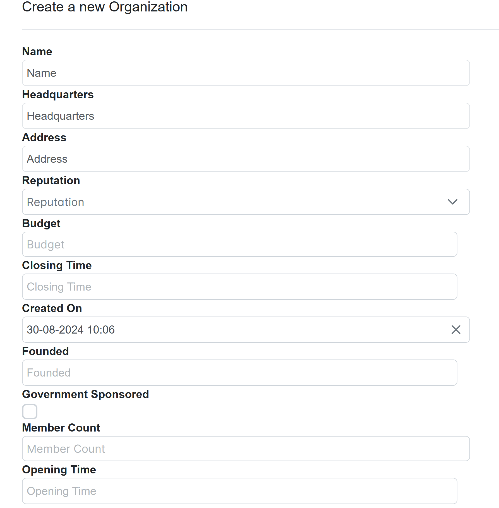
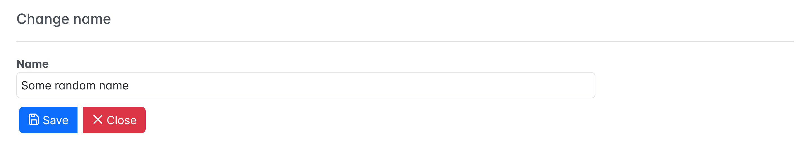

= Dynamo
:toc:
:toclevels: 2
:icons: font

image:media/logo-dynamo.png[image]

Web Application Accelerator Framework

Developed, maintained and sponsored by

image:media/logo-opencirclesolutions.svg[image,width=256,height=53]

Main committer: Bas Rutten

Copyright © 2014 - 2024 Open Circle Solutions BV.

Nothing from this document may be copied and/or made public by use of
print, photocopy, microfilm or by any other means, without prior
permission of Open Circle Solutions BV.

== Introduction

The Dynamo Web Application Accelerator Framework is a software
development framework developed by Open Circle Solutions that aims to
increase productivity by using design principles such as convention over
configuration, model-driven development and the DRY (don’t repeat
yourself) principle.

At the core of Dynamo is the concept of the _Entity Model_. The Entity
Model describes the attributes and behaviour of an entity (or domain
object) in your application. This Entity Model can then be used as the
basis for creating forms, grids, search screens etc.

The _Entity Model_ of an entity is automatically constructed based on
the properties of the attributes of the entity (using sensible defaults
as prescribed by the convention over configuration principle) and can
further be modified by using annotations and message bundle entries. The
main goal is to reduce the amount of (boilerplate) code required to
perform common actions like creating search screens and edit forms.

Complementing the _Entity Model_ is a set of user interface components
(widgets) that can be used to quickly construct screens for common use
cases, and several base classes for the Data Access and Service layers.

The Dynamo framework is built around several proven and highly
productive set of technologies:

* JPA2 for ORM
* QueryDSL for type-safe query generation
* Spring Boot as the application framework
* Angular as the user interface framework (using PrimeNG for a rich
component suite).

== The use case: GTS

For months now, the crime families of infamously crime-infested
Javapolis have been moving away from their traditional activities (like,
you know, murder, armed robbery, and extortion) in favour of sending
each other increasingly elaborate and expensive gifts.

The police, baffled by this development, has ordered the construction of
the Gift Tracking System (GTS) to gain a better understanding of who has
been sending gifts to whom and for what purpose (tax evasion? Mail
fraud? An elaborate delivery van “protection” scheme?).

Since time is of the essence, the Javapolis police have chosen to use
the Dynamo Framework for quickly constructing a first version of the GTS
application.

== Preparations

=== Prerequisite software 

Before you can commence with the training proper, please verify that you
have the following software installed on your machine:

* Java JDK 21 (recent version)
* Apache Maven version 3.8+
* A recent version of Eclipse or Intellij
* Git version 1.9+
* A recent version of npm.

=== Postgresql Setup

The application uses a PostgreSQL database. For this to work, you will
need to install PostgreSQL on your local machine or run it in Docker.

To use Postgresql as the database system on your local machine, first
download the latest *version 15* Postgresql distribution from
http://www.postgresql.org/download/. The installer is straightforward,
but make sure that you write down the administrator password that you
enter during the installation process.

The Postgresql distribution comes with a simple database client named
*pgAdmin*. After the installation is complete, open *pgAdmin*. You
should see a database server configured at port 5432. Connect to this
server (using the password you entered earlier) and create a database
named “gts”.

You do not have to manually add any tables to this database for now –
these will be created as part of the application start up process if they
are not there yet.

*NOTE*: this training assumes that you run Postgresql on the default port
5432 and use the user “postgres” and password “admin”. If these settings
are different for your application, you can modify them in the
*application.properties* file.

=== Obtaining the sources for the example project

Navigate to the root of your workspace directory and execute the
following command:

*TODO describe how/where to get the source code(s)*

If your Postgresql settings are different from the default, open the
“application.properties” file from the gts-ui project and modify the
following properties so that they match your values:

[source,properties]
---
spring.datasource.url=jdbc:postgresql://[.underline]#localhost#:[insert_your_port_here]/[.underline]#gts#
spring.datasource.password=[.underline]#[insert your password here]#
spring.datasource.username=[.underline]#[insert your username here]#
---

If your application does not build, and you get compilation errors like
“QOrganiziation cannot be found”, you might need to add the folder that
contains the generated sources to your class path. To do so, right-click
on the “gts-web” project, then select “New -> Source Folder” and
specify the “target/generated-sources/annotations” folder as a source
folder.

== First steps

=== Project set-up

Once you have imported the backend project in your IDE, you will see a
fairly typical Spring Boot application.

We have already created the domain objects, DAOs, and service classes
for you.

=== Domain Model

When you look inside the *com.opencircle.gts.domain* package you will
see a number of classes that together make up the domain model of our
example application. These include:

* *Organization* which represents a criminal organization we are
interested in tracking.
* *Person* which represents a member of a criminal organization. Persons
sends gifts to one another.
* *Gift* which represents the various types of gifts that can be sent.
* *GiftLogo* which is used to store the logo for a gift.
* *GiftTranslation* which represents the translation of the name of the
gift in various languages.
* *Delivery* which represents one person sending a gift to another
person.

The domain model also uses a class named *Country* which is taken from
the Dynamo framework, more specifically from the
*dynamo-functional-domain* module. This module is covered in more detail
later.

=== Data Access objects

When you look inside the *com.opencircle.gts.dao* package and its
subpackages, you will see several Data Access Objects (DAOs) used
for communication with the database. Typically, there is a DAO interface
and an associated implementation for every entity class, although for
some dependent entities that are never retrieved/stored directly a DAO
is not necessary.

In the example application used for this training, we use almost no
custom logic, so the DAO interfaces are typically simple:

[source,java]
---
public interface* GiftDao extends BaseDao<Integer,Gift> {

}
---

In the easiest scenario, all you have to do is extend the *BaseDao*
interface provided by the framework. This *BaseDao* contains several
dozen utility methods for saving, removing and retrieving entities.

When you look inside a DAO implementation class, you will see that it is
also quite simple:

[source,java]
---
@Repository
public class GiftDaoImpl extends BaseDaoImpl<Integer, Gift> implements GiftDao {

	@Override
	public Class<Gift> getEntityClass() {
		return Gift.class;
	}

	@Override
	protected EntityPathBase<Gift> getDslRoot() {
		return QGift.gift;
	}

}
---

As you can see, the DAO implementation extends the *BaseDaoImpl* class
(which, unsurprisingly, implements *BaseDao*) and must implement the DAO
interface. In its most basic form, you only have to implement the
(trivial) *getEntityClass* method and the *getDslRoot* class – the
latter returns the root path used when creating QueryDSL queries.
QueryDSL is a library that we use for type-safe custom queries. It is a
very useful technology which we encourage you to learn about online, but
it is outside the scope of the training.

For now, this is all you must know about DAOs in Dynamo applications –
the basic functionality is both quite simple and quite nicely hidden
behind several layers of abstraction, so you don’t normally have to
bother with it all that much.

=== Services

Inside the *com.opencircle.gts.service* package you will find the
service layer for the GTS application. Like the DAO layer, this is a
simple layer as since at the moment it contains no business logic. As
with the DAOs, there is one service interface and one corresponding
implementation per entity class (and again, for dependent entities you
don’t have to create a service).

If you look inside the *GiftService* class, you will see the following:

[source,java]
---
public interface GiftService extends BaseService<Integer, Gift> {

}
---

As you can see, all a service interface must do is extend the
*BaseService* class – this gives the service access to the common
methods for retrieving, storing, and deleting entities.

The *GiftServiceImpl* service implementation class is also quite simple:

[source,java]
---
@Service
public class GiftServiceImpl extends BaseServiceImpl<Integer, Gift> implements GiftService {

    @Autowired
    private GiftDao dao;

    @Override
    protected BaseDao<Integer, Gift> getDao() {
        return dao;
    }
---

All it needs to do is extend the *BaseServiceImpl* class (that, of
course, contains the implementation of the common methods) and implement
the corresponding service interface.

It then needs a reference to the data access object (*GiftDao*) which
can simply be injected as a Spring dependency, and an implementation of
the *getDao* method which will simply return the DAO.

Most of the methods from the *BaseServiceImpl* are delegate methods
which directly forward the call to the *BaseDao* method, but the service
layer does add some functionality:

* Checking for duplicate entities – if you have a logical key that makes
an entity unique (e.g. a code or an EAN number) but is not the primary
key, you can overwrite the *findIdenticalEntity* method in your service
implementation and have it perform the check for a duplicate. If this
method return a non-null value, then an error message will automatically
be displayed to the user when he tries to save the entity.
* Validation – when you try to persist an entity or collection of
entities, they are automatically validated using the Java Validation
framework, and an *OCSValidationException* is thrown if there is a
validation error. You can add extra validations by overwriting the
*validate* method (don’t forget to call *super* if you do so).

=== Your first Dynamo Screen

After you have imported the projects into your IDE, make sure they all
build properly. Then, open the *GtsApplication* class and run it. After
a couple of seconds

In order to run the front-end, open a command prompt and navigate to the
root folder of the front-end project. Execute the command *ng server* to
start the application, then open a web browser and navigate to
*http://localhost:4200.*

You will see a mostly empty screen, and be given the option to log into
the application (either via the button in the top right, or by pressing
the button on the login screen.)

After logging in, you will be able to view your first screen, which is a
search screen that allows you to view the organizations that are stored
in the system (we already created some by means of the creation script).

This screen is an example of the *GenericSearchLayoutComponent*. This
component consists of a search form with a results grid, from which you
can select an entity and navigate to a detail screen (which is a
separate page/component in this version of Dynamo).

The code for this search screen is included in the *organization-search*
folder. This folder contains both an HMTL file and a Typescript file.
The HTML file is very small and looks as follows:

[source,angular17html]
---
<app-generic-search-layout entityName="Organization"
  detailNavigationPath="organization"></app-generic-search-layout>
---

* As you can see, we define an **<app-generic-search-layout>** component
which is the generic component from the Dynamo framework that consists
of a search form and a results table.
* It is instantiated here with only a couple of properties:
** *entityName* is the name of the entity that is being managed by the
component. This is basically the simple class name of the entity.
** *detailNavigationPath* is the Angular route that is used to navigate
to the detail screen (this will be covered a bit later).

The Typescript file possibly even simpler, at least for now (although we
will be adding to that later).

And that is basically all there is to it. While there is a lot you can
(and will) tweak, this is basically all that is needed to create a simple
search screen. In the next section, we will tweak this screen and make
sure it performs as desired.

== Tweaking the organization screen

=== Adding fields to search on

The first thing you may notice about the screen is that, although it is
a search screen, there currently aren’t any search fields. This is
because none of the attributes are currently marked as *searchable.*

To change this, we need to modify the entity model generation process,
by means of the *@Attribute* annotation. This is an annotation that can
be placed on a property or on a getter method and can be used to tweak
how the entity model is built.

Open the *Organization* class and place the *@Attribute* annotation on
the *name* property. Then set the *searchable* setting to ALWAYS:

[source,java]
---
@NotNull
@Size(max = 100)
@Attribute(searchable = SearchMode.ALWAYS)
private String name;
---

Restart the back-end application refresh the browser screen. You will
now see a search form that contains a “Name” search field. Experiment
with the searching to find out that by default, the searching is not
case-sensitive and will look for matches anywhere in the attribute
value.

*NOTE*: changes you make to the entity model always require you to
restart the back-end application. However, the (Angular) front-end has
hot deployment and generally does not need to be restarted (simply
refreshing your browser should be enough).

You can change the default search behaviour by modifying the following
settings on the *@Attribute* annotation:

* *searchCaseSensitive* determines if the searching is case-sensitive.
The default value is *BooleanType.FALSE*.
* *searchPrefixOnly* determines if the search query searches only for
matches at the start of the property value. The default is
*BooleanType.FALSE*. E.g. if you set this property to “true” then the
search term “or” will match “order” but not “boredom”.
* *searchForExactValue* determines whether the application will search
for an exact value rather than a range of values. This is only
applicable to properties that contain a numerical value or a date – by
default, *searchForExactValue* will be false and the application will
allow you to search for a range of values, but if you set
*searchForExactValue* to true then only a single search field will be
rendered.

This is what it looks like in the code:

[source,java]
---
@NotNull
@Size(max = 255)
@Attribute(searchable = SearcinMode.ALWAYS,
searchCaseSensitive = BooleanType.TRUE, searchPrefixOnly =
BooleanType.TRUE)
private String name;
---

Now, set the “searchable” setting to ALWAYS on some of the other
attributes.

You will see that depending on the type of the attribute, a different
search field (or combination of fields) will be generated:

* For a String attribute, a text field will be generated.
* For a Boolean attribute, a three-state checkbox will be generated,
which contains the values “Yes”, “No”, and "No value". This allows you
to either NOT search for the field, or for one of its two possible
values.
* For a numeric or date/time attribute, two text fields will be
generated: one field for entering the lower boundary and one for
entering the upper boundary (the boundaries are inclusive).
* You can use the *searchForExactValue* setting for a numerical field
if you want to search on an exact value instead.
* For a timestamp field, you can set the *searchDateOnly* setting to
true. In this case the search form will only allow you to select a date,
and the application will translate this to all time stamps that fall on
that date.
* For an enumeration, a combo box that contains the available values
will be generated. At this moment, the application will still produce
some warnings about missing messages but these will be fixed shortly.

Now, play around with the search form functionality for a bit if you
want, and when you feel comfortable with how it all works, move on to
the next section.

Finally, you might be wondering why we are setting searchable to
“ALWAYS” rather than just “true”. This is because it’s also possible to
specify the value “ADVANCED”. In this case, the property will only show
in the search form when the “advanced search mode” is enabled. To try
this, change the searchable attribute for “headquarters” to “ADVANCED”.
Now, when you restart the application, the headquarters search field
should no longer appear.

Next, in *organization-search.component.html* file, change the code so
that the line referring to FormOptions looks as follows:

[source,angular17html]
--
<app-generic-search-layout entityName="Organization"
  detailNavigationPath="organization" [advancedModeEnabled]="true">
</app-generic-search-layout>
--

You will now see an additional button show up in the button bar.
Clicking it will toggle between showing and hiding the search fields
that are set to searchable = ADVANCED.

image:/media/image3.png[image,width=458,height=70]

=== More searching 

Go ahead at set the *searchable* setting on the *members* attribute to
ALWAYS. After you do this and restart the application, you will see that
there now is a component that allows you to search for the members (to
be interpreted as: search for all organizations of which the selected
person is a member).

You will now see a search component for the *members* attribute that
looks as follows:

image:/media/image4.png[image,width=424,height=328]

By default, the application will render a multiple-select field from
which you can select the members to search on. However, as you can see,
the description of the members is currently empty.

To fix this, open the *Person* class and, at the top of the class, add
the *@Model* annotation like this:

[source,java]
---
@Entity
@Table(name = "person")
@Model(displayProperty = "nickName")
public class Person extends AbstractEntity<Integer> {
---

*@Model* is like *@Attribute* except that it has to placed on the entity,
not on one of its attributes. *@Model* supports several settings:

* *displayProperty* (which you saw above) determines which property to
use when displaying the entity inside a lookup component like a combo
box or a listbox. In the above example, we use the “nickName” property
of the Person as the display property.
* *displayName* determines how the class will be called in the screen.
It defaults to the class name, with camel case replaced by spaces. E.g.
the display name of “Organization” is “Organization”.
* *displayNamePlural* is the plural name of the class. It defaults to
the *displayName* with an “s” added at the end, so you may have to
override this for some classes.
* *description* is a textual description of the entity. It will appear
as a tooltip in e.g. a search results grid.
* *sortOrder* takes a comma-separated list of fields and directions to
sort on. This sort order will be used if no specific sort order is
defined for a layout. It is also the sort order that will by default be
used inside e.g. combo boxes. The format of this property is similar to
a SQL sort order, e.g. “name” or “name asc” will sort by name in
ascending order, “name desc” will sort by name in descending order,
“name asc, age desc” will sort first by name and then by age.
* In addition, there are several settings like *listAllowed,
searchAllowed, createAllowed* etc. that govern which actions are allowed
on this entity. These will be covered in more detail later on.

Note that you place the annotation on the *Person* entity, not on the
*Organization* – this annotation will affect all references to the
Person entity, so it will show up like this in any search or edit form.

As you can see, by default the application will use a multi-select field
for searching inside a detail relation. You can modify this behaviour by
changing the value of the *selectMode* and *searchSelectMode* settings
on *@Attribute*:

* *selectMode* determines the type of UI component to render for this
property inside an edit form.
* *searchSelectMode* determines the type of UI component to render for
this property inside a search form (like the one we were working on). By
default, the framework will use the value of the *selectMode* setting
here, but you can override it by explicitly setting a value for the
*SearchSelectMode* attribute.

Go ahead and set the *searchSelectMode* setting of the *members* field
to AttributeSelectMode.*LOOKUP*. Restart the application and verify that
you now see the following:

image:/media/image5.png[image,width=429,height=68]

You will now see a “lookup field” which consists of a label that
displays the currently selected value(s), a button for clearing the
currently selected value(s) and a button that brings up a search dialog
when clicked,

Please note:

* You don’t normally have to specify a *searchSelectMode*: the
application will by default use the value of the *selectMode* if no
explicit *SearchSelectMode* is set.
* There are several other supported *AttributeSelectModes*, e.g.
*COMBO*, *AUTO_SELECT* and *LOOKUP*. These will be covered in more
detail later. Not all select modes make sense for every attribute. E.g.
for editing a one-to-one relation you cannot use the *TOKEN* setting
since this would allow you to select multiple values. The Dynamo
framework will produce an exception when you try to use an illegal
select mode.

We will end this section with some additional remarks about searching:

* It is possible to set the *requiredForSearching* setting on the
*@Attribute* annotation to *true* – this means that you must enter a
value for the associated property before you can carry out a search.
Concretely, this means that the *Search* button will be disabled unless
you have filled in a value for all fields that are marked as
*requiredForSearching.*
* For fields that contain a time stamp (java.time.LocalDateTime or
java.time.Instant), normally two search fields are rendered – these can
be used to set the upper and lower bound of the interval to search on.
However, if you set the *searchDateOnly* setting to *true* then instead
a single search field will be rendered. This field allows you to select
a date (rather than a time stamp) and when you perform a search, only
the records for which the date part of the value matches will be
returned.
* The *@Attribute* annotation also comes with the *defaultSearchValue* ,
defaultSearchValueFrom* en *defaultSearchValueTo* settings. These can be
used to respectively set:
** A default value for a simple attribute
** A default value for the lower bound when searching on an interval
** A default value for the upper bound when searching on an interval

=== Visual and textual tweaking

We now have a search screen that allows us to search on most fields, but
if we look at the screen there are still several things not in order:

* Instead of a textual representation of the various enumeration values
for the “Reputation” field, we get ugly warnings.
* The order of the fields in the grid is not as desired.
* The caption of the “headquarters” field incorrectly reads “Head
Quarters” (it must not contain a space).

Luckily, the framework contains several ways of tweaking the visual and
textual representation of the generated screens.

First, let’s go back to the *@Attribute* annotation. Like *@Model*, it
has the *displayName, displayNamePlural,* and *description* values that
can be used to modify the captions and labels that are displayed on the
screen. Go ahead and use these to fix the caption of the “Headquarters”
search field.

Next, let’s change the attribute order – go to the *Organization* class
and add the *@AttributeOrder* annotation to the class as seen below

[source,java]
--
@Entity
@Table(name = "organization")
@AttributeOrder(attributeNames = { "name", "headQuarters", "address",
"countryOfOrigin", "reputation" })
public class Organization extends AbstractEntity<Integer> {
--

Restart the back-end to verify that the attributes are now displayed in
the order specified above – note that this goes for both the search
form, the results grid, and the edit screen (which you will see later).
Also, note that some fields like “country of origin” do not show up yet
in the grid, but we will cover this later.

Note that the attribute order is not complete – any attributes that
are not explicitly mentioned will be included behind the ones that you did
mention, in the default (alphabetical) order.

By default, the attribute order is used to determine the ordering in
both the edit form (more on this later), the results grid, and the
search form. If you would rather use a different attribute order for
your search form or the result grid, you can use the
*@SearchAttributeOrder* or *@GridAttributeOrder* to specify this.

[source,java]
--
@AttributeOrder(attributeNames = { "name", "headQuarters", "address",
"countryOfOrigin", "reputation" })
@GridAttributeOrder(attributeNames = { "memberCount",
"yearlyMortalityRate" })
public class Organization extends AbstractEntity<Integer> {
--

In the above example, we have added an *@GridAttributeOrder.* Now when
you restart the application after this, you will see that the grid
starts with the "memberCount" and "yearlyMortalityRate" fields. Note
that the other attributes are shown in alphabetical order.

OK, now it’s time to fix the enumeration. Open the
*ui.messages.properties* file and add the following:

[source,properties]
--
Reputation.REALLY_NOT_FEARSOME=Really not fearsome
Reputation.MILDLY_FEARSOME=Mildly fearsome
Reputation.FEARSOME=Fearsome
Reputation.EXTREMELY_FEARSOME=Extremely fearsome
--

Restart the application and see how the enumeration values have now been
replaced by the values from the message bundle.

It can happen that you run out of room in a grid, i.e. you don’t have
enough horizontal room to display the full descriptions of all
attributes in the grid. In this case, you can limit the maximum length
of the value of an attribute inside the grid by setting the
*maxLengthInGrid* setting. Try this for the *name* attribute:

[source,java]
--
@NotNull
@Size(max = 255)
@Attribute(searchable = SearchMode.ALWAYS, main = true, maxLengthInGrid = 10)
private String name;
--

Restart the application and verify that the values inside the name
column are now truncated after 10 characters.

Now that we are talking about message bundles, it is a good moment to
point out that (almost) anything you can do by means of the entity model
annotations like *@Attribute* and *@Model* can also be achieved by means
a message bundle. For this, we use the *entitymodel.properties* message
bundle.

Open this file and add the following line:

[source,properties]
--
Organization.yearlyMortalityRate.percentage=true
--

Restart the application and verify that we now see a percentage sign
(“%”) near the values of the “yearly mortality rate”. This teaches us
the following:

* The “percentage” setting can be used to specify that a (numeric) value
should be rendered as a percentage. This is purely visual (it will not
divide or multiply the value by anything).
* You can tweak the entity model using the message bundle. The syntax
for this is

[source,properties]
--
[entity name].[property name].[setting] = [value]
--

You can also directly change the settings on the entity by not including
any property name, e.g. *Organization.displayName=Organisatie*

You can also change the value of the percentage setting using the
*@Attribute* annotation – this is just an example to show you that you
can also change it by using the message bundle.

To practice a bit more, add the following lines to *entitymodel.properties*.

[source,properties]
--
Organization.governmentSponsored.trueRepresentation=You bet!
Organization.governmentSponsored.falseRepresentation=No Way!
--

Then, restart the application and verify that instead of the standard
“true” and “false” values for the Boolean *governmentSponsored*
attribute, you will now see the custom descriptions shown above.

The exact syntax and all the names of the settings you can tweak is an
advanced topic and is covered in more detail in the Dynamo manual. For
now, the most important things to remember are:

* You can change attribute settings using the message bundle.
* Changes made using the message bundle will override changes made using
the annotations.

=== Relation fetching 

Now, let’s go back to the *Country of Origin* attribute. We want to
display this attribute in the grid, but it’s not there yet. This is
because it is a _complex attribute_ that refers to another entity or
collection of entities. By default, this type of attribute is not shown
inside a grid. To fix this, add the *@Attribute* annotation to the
*countryOfOrigin* property and set the *visibleInGrid* setting to SHOW.

[source,java]
--
@NotNull
@JoinColumn(name = "country_of_origin")
@ManyToOne(fetch = FetchType.*_LAZY_*)
@Attribute(visibleInGrid = VisibilityType.*_SHOW_*)
private Country countryOfOrigin;
--

Now, after you restart the backend application, the country of origin
column should appear in the table. But the way the data is fetched is
not very efficient – for every organization, that application performs
an extra query in order to retrieve the country.

In order to fix this, we can add a fetch join to the data retrieval. To
do so, add the following to the *Organization* entity:

[source,java]
--
@FetchJoins(joins = {@FetchJoin(attribute = "countryOfOrigin")},
detailJoins = {@FetchJoin(attribute = "countryOfOrigin")})
--

This will make sure that whenever any Organizations are fetched by the
framework, the *countryOfOrigin* relation of those organizations will be
fetched as well.

Note that you can specify both “joins” and “detailJoins”. The “joins”
are the relations that are fetched whenever a collection of entities is
retrieved (basically, to display the in a search results table). The
“detailJoins” are the relations that are fetched when retrieving a
single entity from the back-end, this is mostly used when displaying the
entity in a detail screen or pop-up window.

Fetching is an important concept in the Dynamo framework since it is a
powerful way to limit the number of queries that is carried out and can
thus be crucial for achieving good performance. Keep in mind though,
that if used poorly it can also lead to a lot of useless data being
retrieved with every request – imagine e.g. that the Country keeps track
of all its inhabitants: automatically fetching (millions or billions) of
inhabitants every time a country is fetched is clearly a bad thing and
must be avoided.

So, figuring out which relations to fetch and which not to fetch (or
whether to model those relations in the first place) can be an important
design decision.

=== Domain Values

As you may have noticed, the *Country* class we have seen before isn’t
defined inside the GTS application – instead it comes from a Dynamo
module named *dynamo-functional-domain*. This contains some useful
classes for dealing with “domains”, also known as “code tables” or
“lookup tables”- they are basically simple entities that only consist of
a name, or of a name and a (unique) code.

The module contains several pre-defined domain classes like *Country*
which you can use if you include a database table named “domain” in your
application and fill it with the proper values (this is straightforward,
so we won’t go into it here).

To properly use the values from the *Country* table, though, one more
thing is needed and that is a service for retrieving them from the
repository. Now, we could of course create the proper Java classes for
this, but this is slightly tedious, and we can also use the Dynamo
functionality for _Default Services_ and define the required service in
Spring. Open the *ApplicationConfig.java* class and take note of the
following code:

[source,java]
--
@Bean
public BaseService<Integer, Region> regionService(BaseDao<Integer, Region> regionDao) {
    return new DefaultServiceImpl<>(regionDao, "code");
}

@Bean
public BaseDao<Integer, Country> countryDao() {
    return new DefaultDaoImpl<>(QCountry.country, Country.class, "parent");
}
--

This defines a bean that is an instance of *DefaultServiceImpl* which
has an inner bean of type *DefaultDaoImpl.* These are convenience
classes that in turn inherit from the *BaseServiceImpl* and
*BaseDaoImpl* classes and provide all the basic functionality for
retrieving, saving, and deleting entities. The only catch is of course
that you cannot define any custom methods (e.g.
*findCountriesInEurope*) but for such simple entities, this is usually
not an issue.

*NOTE*: *ApplicationConfig* is an example of a Spring Boot configuration
class and inherits from the *ApplicationConfigSupport* class from the
Dynamo Framework. This class already takes care of some generic
configuration which cannot be taken care of by Spring Boot
automatically. When you build a Dynamo application it is advised that
you create a configuration class which inherits from
*ApplicationConfigSupport.*_

Now, let’s return to the *countryOfOrigin* field in *Organization* for a
bit. By default, the application will render a dropdown component that
can be used to select a country to search on. Let’s play around with
this a little bit and change it to a lookup component:

[source,java]
--
@NotNull
@JoinColumn(name = "country_of_origin")
@ManyToOne(fetch = FetchType._LAZY_)
@Attribute(searchable = SearchMode._ALWAYS_, visibleInGrid =
VisibilityType._SHOW_, selectMode = AttributeSelectMode.LOOKUP)
private Country countryOfOrigin;
--

Restart the backend and observe how you can now use a popup dialog to
search for the country you want to filter on.

Dynamo now also comes with an auto-complete field:

[source,java]
--
@NotNull 
@JoinColumn(name = "country_of_origin") 
@ManyToOne(fetch = FetchType.LAZY)
@Attribute(searchable = SearchMode._ALWAYS_, visibleInGrid =
VisibilityType.SHOW,
searchSelectMode = AttributeSelectMode.AUTO_COMPLETE)
private Country countryOfOrigin;
--

With this in place, the application will render a field that allows the
user to start typing – the available options will be filtered so that
only those that match the entered search term will be returned. Note
that the matching is done on the basis of the *displayProperty* setting.

As an extra exercise, set the *multipleSearch* setting to *true.* This
allows you to search for multiple values for a normally single-valued
relation – the search query will return all entities that match one of
the provided search values. Note that when you set *multipleSearch* to
true, the application will switch to displaying a multi-select field
instead of a drop-down. You can also use a lookup field.

=== Dynamic search layout

In addition to the search form functionality explained above, Dynamo
offers an additional way of handling search requests. This is called the
*Dynamic Search Layout* and basically consists of a search form to which
search terms can be added dynamically. To enable this functionality add
the following in *organization-search.component.ts:*

[source,typescript]
--
searchFormMode: SearchFormMode = SearchFormMode.DYNAMIC;
--

And bind it in the *organization-search.component.html*:

[source,angular17html]
--
<app-generic-search-layout
  entityName="Organization"
  detailNavigationPath="organization"
  [searchFormMode]="searchFormMode"
>
</app-generic-search-layout>
--

Now, you will see that the search screen you saw before has been
replaced by a (normally) initially empty search form, with an “Add
filter” button below it. Pressing this button will add a row to the
search form. This row can be used to add a search criterion.

Each search row starts with a combo box that allows you to select the
attribute you want to filter on. It includes all attributes with
searchable set to either ADVANCED or ALWAYS, sorted in alphabetical
order.

Selecting an attribute from the combo box will cause one or more input
components to appear based on the selected attribute (e.g. a text field
for a string attribute, two number fields for an integer component
etc.). This follows the exact same logic as the regular search form.

When you mark an attribute as *requiredForSearching,* a search row for
that attribute will always be rendered; it cannot be removed and the
selected attribute cannot change. If you define or more default values
for an attribute, then a search row for that attribute will also be
displayed, with the default values filled in, but in this case the rows
can be removed and values can be added.

== Adding, editing, and removing entities

=== Adding new entities

We’ve now done about all we can do to make our search screen behave in
the desired way, so let’s move on to adding new entities.

As you can see, there is already an *Add* button below the search
results grid. If you click this button, the application will navigate to
an edit form that allows you to add a new entity (in this case an
Organization) to the application. Whether this button appears is in fact
dependent on the *createAllowed* setting on the entity model (but this
is *true* by default).

When you click the *Add* button the application will try to navigate to
a separate page. Which page this is, is specified by the
*detailNavigationPath* setting that was mentioned earlier (and which is
set to “organization”).

When you look in *app-routing.module.ts* you will see that the following
routes are defined (one for editing an existing entity and one for
creating a new one).

[source,typescript]
--
  {
    path: 'organizations',
    title: 'Organizations',
    component: OrganizationSearchComponent
  },
  {
    path: 'organization',
    title: 'Create Organization',
    component: OrganizationFormComponent
  },
--

Both routes point to the *OrganizationFormComponent* which looks as
follows:

[source,angular17html]
--
<app-generic-form
entityName="Organization"
[entityId]="entityId"
navigateBackRoute="organizations">
</app-generic-form>
--

This is a minimal set-up that includes a) the name of the entity b) the
ID of the entity being edited (this is undefined when defining a new
entity) and c) the route to use when navigating back to the search
screen.

Note that in the (probably pretty rare) cases where you want to
completely disable navigation from the screen, you can do so by setting
the *navigationAllowed* property to false.

By default, the form will already contain some input fields – as with
the search fields, the entity model determines which type of user
interface component is rendered for which attribute. The edit form looks
like this:

By now, it should not come as a surprise that you will see text fields
for String and numeric attributes, combo boxes for enumerations, etc..
If you look closely, however, you will see that there are no components
for editing the *country of origin* and *members* attributes. This
is because, by default, no components will be created for editing
complex attributes.

To make the components for editing the complex attributes show up, you
can set the *visibleInForm* setting for an attribute to true. We do
this now for the country of origin field:

[source,java]
--
@NotNull
@JoinColumn(name = "country_of_origin")
@ManyToOne(fetch = FetchType.LAZY)
@Attribute(searchable = SearchMode.ALWAYS, visibleInGrid = VisibilityType.SHOW,
        searchSelectMode = AttributeSelectMode.AUTO_COMPLETE,
        visibleInForm = VisibilityType.SHOW)
private Country countryOfOrigin;
--

Now, go ahead and add a new organization to the system (be creative).
Note that validations have automatically been added to the form based on
the Java Validation API annotation like *@NotNull* and *@Size* that are
present on the entity – you don’t have to do anything extra for this.

Note that sometimes it’s not desirable to be able to directly edit an
attribute – e.g. in case of a status field that is automatically set, a
creation time stamp, etc. You can make sure that such an attribute shows
up as read-only in the form by setting the *editable* setting of the
*@Attribute* annotation to *READONLY.* It is also possible to specify the
settings *CREATE_ONLY* and *EDITABLE*. When you use the setting
*CREATE_ONLY* you will only be able to edit the attribute when creating
a new entity. The *EDITABLE* value, which is the default value, means
that the attribute can always be edited.

=== Editing existing entities

Now, return to the search screen for a moment, and observe that you can
click on any row in the table. This will cause the application to
navigate to the detail screen you just saw, but now the details of the
selected row will be shown.

You can also set the *showDetailButton* setting on the
generic-search-layout to *true.* With this setting in place, you can no
longer just click anywhere in the table. Instead, a “pencil” button will
show up in each row in the table. Click this button to navigate to the
detail screen.

[source,angular17html]
--
<app-generic-search-layout entityName="Organization"
 detailNavigationPath="organization" [advancedModeEnabled]="true"
[showDetailButton]="true">
</app-generic-search-layout>
--

image:media/image8.png[image,width=559,height=26]

Note that you can also set the *detailsModeEnabled* setting to *false*.
This will completely disable the functionality to navigate to the detail
screen for existing entities (however, you can still create new entities
using the *Add* button).

Some changes you can make to modify the behaviour of edit forms include:

* Using the *defaultValue* setting on any simple attribute to define a
default value. This can be a string, integer, BigDecimal etc. Try this
out on e.g. the “*yearlyMortalityRate*” attribute. Use a period (“.”) as
the decimal separator if needed. Once you click the *Add* button to
create a new entity, any fields for which a default value has been
defined will be automatically filled with this default value.
* Using the *TextFieldMode* to switch between displaying a text field, a
text area, or a password field. Try this on the *address* property.
_Note: this only works inside edit forms. The TextFieldMode will be
ignored when creating a search form, since the text area in the search
form would take up too much space, and it’s highly unlikely you’d want to
search for an enormously long string match anyway._
* Use the *booleanFieldMode* to switch between using a checkbox, a
toggle button, or a switch component for editing a Boolean property.
_Note that this only has an effect inside an edit form. In a search
form, the framework will always use a tri-state checkbox as described
earlier._
* Use the *enumFieldMode* to switch between using a dropdown component
or a set of radio buttons for editing an enumeration.
* Use the *numberFieldMode* to switch between using a text field or a
numeric input field for a numeric property (this only works for integer
or long properties). When you set this to “NUMBERFIELD”, e.g. for the
“memberCount” property, you will see the following:

image:media/image9.png[image,width=560,height=53]

* This is a numeric input field which will only accept numeric input and
also contains plus and minus buttons for changing the value. You can use
the *numberFieldStep* setting to modify the step size.
* You can use the *groupTogetherWith* setting to specify that multiple
components must be placed on the same row in the edit form. To do so,
use a *groupTogetherWith* value on the attribute you want to appear
*first* in the row:

[source,java]
--
@NotNull
@Size(max = 255)
@Attribute(searchable = SearchMode.ALWAYS, displayName =
"Headquarters", groupTogetherWith = "address")
private String headQuarters;
--

* The above will make sure that the “address” field shows up on the same
line as the “headQuarters” field. When using this setting, take care
that the attributes are in the right order (the attribute on which you
place the *groupTogetherWith* setting must occur in the ordering before
the attribute it refers to. Dynamo will produce an error when you define
an incorrect attribute grouping)

image:media/image10.png[image,width=560,height=79]

=== URL fields

The Dynamo Framework also supports the functionality of turning certain
fields into clickable URLs (that point to external resources).

To demonstrate, set the “url” setting to *true* for the “url” property
of the *Organization* class.

@Attribute(url = *true*)

*private* String url;

Then, restart the application and verify that in the grid in the
Organizations screen you will now see an empty “URL” field. Navigate to
the edit screen and fill in a value.

Enter some valid URLs for some of the Organizations, then look at the
search results grid and check that the URL column now contains clickable
links that can be used to take you to directly to the pages identified
by the URLs you entered.

The clickable URL field will also show up inside a detail view that is
in view mode (more on view mode below).

=== Column and form width

By default, an edit form will contain just a single column containing
the input fields. It will also not take up the entire width of the
screen. Both of these things are fairly easy to change.

In order to change the width of the entire form you can set the value of
the *formWidthClass* property on the app-generic-form. This property
expects standard Bootstrap expressions, e.g. “col-12” means use up all
12 available columns

If you want to change e.g. the number of columns being used, you can
modify the *numberOfColumns* property. By default, this has the value *1*,
but you can set it to *2* or *3.* Using a value other than 1 will cause
the input components to be displayed behind each other on the same row
(provided there is enough room).

=== Attribute Grouping

By default, all attributes inside an edit from will be displayed below
and behind each other, in the order specified by the *@AttributeOrder*
annotation you saw before (with an exception for the attributes that
have been mentioned in the *groupTogetherWith* setting). However,
sometimes, especially when you have many attributes, it can be useful to
have a way of grouping certain attributes together.

To demonstrate how this works, modify the *Organization* view so that it
reads as follows:

[source,java]
--
@Entity
@Table(name = "organization")
@AttributeGroup(messageKey = "organization.first", attributeNames = {
"name", "address", "headQuarters", "countryOfOrigin" })
@AttributeGroup(messageKey = "organization.second", attributeNames = {
"reputation" })
@AttributeOrder(attributeNames = { "name", "headQuarters", "address",
"countryOfOrigin", "reputation" })
public class Organization extends AbstractEntity<Integer> {
--

Here, you define two attribute groups identified by the message keys
“organization.first” and “organization.second” and place some attributes
in each group.

In the *entitymodel.properties* file, add the following lines:

[source,properties]
--
organization.first=First
organization.second=Second
dynamoframework.default.attribute.group=Others
--

Restart the application and verify that the edit form now looks as
follows:

image:media/image11.png[image,width=560,height=279]

You will see three attribute groups: the two groups you declared and an
additional group that contains all attributes that were not explicitly
assigned to any of the groups.

Note that the order of the groups is specified by the
*@AttributeGroup(s)* annotations, but the order of the attributes within
the groups is still taken from the (general) attribute ordering
specified by the *@AttributeOrder* annotation.

Also, by default the application will use panels to group the attributes
together. If you prefer using tabs, define an attribute group mode
property in your Typescript file:

[source,typescript]
--
attributeGroupMode: AttributeGroupMode = AttributeGroupMode.TAB;
--

And refer to that property in the HTML file (organization.form.html).

After you restart the application you should now see three tab sheets
(each containing a number of attributes) in the detail screen.

===  Removing existing entities

By default, the option to delete existing entities is disabled. You can
easily enable this functionality by setting the *deleteAllowed* setting
on the @Model annotation to *true*

[source,java]
--
@Model(displayProperty = "name", deleteAllowed = true)
--

With this setting in place, the application will now render a big bright
red “Delete” button in every row in the search results table.

=== Popup edit dialog

As an alternative to using a separate detail screen, it is also possible
to open a pop-up edit dialog directly from the results table. In order
to enable this functionality, define a *popupButtonMode* variable in the
*OrganizationSearchComponent*:

[source,typescript]
--
popupButtonMode: PopupButtonMode = PopupButtonMode.EDIT;
--

then refer to it from the HTML file. This will cause a “details” button
to appear in each row in the details table. Pressing this button will
cause a pop-up dialog containing the details of the selected entity to
appear. The fields that will appear in this pop-up dialog are rendered
according to the same logic as the edit form (e.g. this will mean the
same attribute groups, ordering, etc. will be used). However, some of the
options that are available on the full edit form (e.g. setting the
number of columns) are not available in the pop-up dialog.

The value EDIT chosen above will ensure that the dialog will be opened
in EDIT mode. You can also specify the value VIEW. In this case the
pop-up dialog will be rendered in read-only mode.

=== Additional GenericEditForm properties

There are several more options available on the
*GenericEditFormComponent* to govern how the component behaves:

* *openInViewMode* (default: false) can be used to specify that the form
must be in view mode after first opening it. In this case, an *Edit*
button will be provided to switch the screen to edit mode.
* *confirmSave* determines whether to ask for confirmation before saving
changes after the user presses the *Save* button. The default value is
*false.*

=== Additional GenericSearchLayout properties

There are several more options available on the
*GenericSearchLayoutComponent* to govern how the component behaves:

* *confirmClear* determines whether to ask for confirmation before
removing all search filters after the user presses the *Clear* button.
The default value is *false*.
* *searchImmediately* determines whether to carry out a search right
away when opening the screen. The default value for this setting is
*true* which means that a search is carried out right away. If you set
it to *false*, the search results grid will be hidden after you open the
screen, and you must carry out a search first before it will show up.
* *preserveSearchTerms* determines whether any search terms that you
enter in a search form will be preserved when you navigate away from a
screen and then navigate back to it. This is enabled by default, so you
don’t normally need to do anything to get this functionality.

=== Adding your own lookup tables

It is also fairly easy to define your own lookup tables. As a case in
point, take a look at the “MainActivity” class. This defines the main
activity of an Organization. In order to use it in the application,
modify Organization.java so that it reads as follows:

[source,java]
--
@JoinColumn(name = "main_activity")
@ManyToOne(fetch = FetchType.LAZY)
@Attribute(quickAddAllowed = true, visibleInForm = VisibilityType.SHOW, searchable = SearchMode.ALWAYS, visibleInGrid = VisibilityType.SHOW)
private MainActivity mainActivity;
--

Now, when you open the detail page for an organization, you should see a
“Main Activity” field in the edit form:

image:media/image12.png[image,width=462,height=61]

Behind the input component, you will see a “plus” button that allows you
to quickly add a new value for this lookup table. This button appears
because you have set the “quickAddAllowed” setting to *true*. Clicking
the button will bring up a dialog that allows the user to create a new
entity. If the creation is successful, the new entity will be added to
the list of available options in the component, and selected.

Dynamo contains automatic protection against entering duplicate values –
when you try to add a new lookup table value with the same name as an
already existing entity, the application will throw a validation
exception. The message that is shown is expected to be in the message
bundle under the *<DomainName>.not.unique* key. To make this work for
the MainActivity, add the following to *entitymodel.properties*.

MainActivity.not.unique=This main activity already exists

Now, restart the application, try to add a duplicate main activity and
verify that see the error message defined here.

=== Additional attribute model settings

The attribute model currently support around 60 separate settings.
Although we refer you to the Dynamo manual for a complete listing, it’s
good to briefly outline some additional settings here:

* The Dynamo framework supports automatic validation of emails (syntax
only) for fields that are annotated with the Java Validation framework
*@Email* annotation. Simply adding this annotation is enough to enable
e-mail validation in both the service layer and UI.
* The setting *ignoreInSearchFilter* can be used to specify that a
property should be ignored when constructing the search filter when
searching using a *GenericSearchLayoutComponent*. When you mark an
attribute as “searchable” but set “ignoreInSearchFilter” to true, a
search field will be rendered inside the form, but the contents of the
field will be ignored when actually searching. The most obvious use case for
this is when working with cascaded fields (outside the scope of this
training).
* Sometimes, when searching or sorting on an attribute, you will want to
search or sort on an attribute path that is different from the actual
path to the attribute. For these situations, you can use the
*replacementSearchPath* and *replacementSortPath* settings.
* The *trimSpaces* setting can be used to automatically remove spaces
from the start and end of a field value before saving the value to the
database.

== Adding a SplitLayout

=== Adding the PersonSearchComponent

Now, let’s move to the *Person* entity which is used to represent the
various members of the criminal organizations we are interested in.

As with the *Organization* entity, the entity class, DAO, and service
classes have already been provided for you. We will, however, be adding
a new Angular component. First, create the skeleton for the component by
running the following Angular CLI command:

[source,commandline]
--
ng generate component person-search --module app
--

This will generate an Angular component (4 files in total) and add it to
the application’s main module.

In the *app-routing.module.ts* file, add the following to the *children*
array:

[source,yaml]
--
  {
    path: 'persons',
    title: 'Persons',
    component: PersonSearchComponent,
  },
--

This defines a new route to the persons component. Finally, in the
*nav.component.ts* file, add a new menu item:

[source,yaml]
--
  {
    topLevel: true,
    text: 'Persons',
    routerLink: "/persons"
  },
--

Which will add a new top-level menu item named “Persons”. If you click
on this link, you will be taken to a page that simply reads
“person-search works”, the Angular default.

We will now replace this default implementation by a Split Layout. This
is a layout that consists of a search results table on the left and a
form for displaying the selected row on the right. Implementing it is
even simpler than for the search layout:

[source,angular17html]
--
<app-generic-split-layout entityName="Person">
</app-generic-split-layout>
--

Which will produce a screen that looks as follows:

image:media/image13.png[image,width=560,height=247]

* You can select a row in the table to the left to make the details of
that row show up in the form to the right.
* If *addAllowed* is true for the entity, an “Add” button will show up
below the table. Clicking this button will bring up an empty form that
allows you to create a new entity.

Now, using everything you have learned so far, modify this screen in the following ways:

* Make sure the “organization” property shows up in the grid and in the
edit form (note: don’t forget to modify the relation fetching using the *@FetchJoin* annotation
and to set a *displayProperty* for the Organization if
that has not been done already).
* The attribute order reads “firstName”, “nickName”, “lastName”,
“organization” “born”, “died”
* The caption for the *nickName* property must be changed to “Nickname”
* The *Remove* button must be displayed for each row in the table.

Play around with the screen a bit and add, edit, or delete some
entities.

By default, the data that is displayed is not filtered in any way. You
can change this by adding *default filters* to the layout. These are
filters that are automatically applied to any search request. In order
to add default filters, define the following in the
person-search.component.ts:

[source,typescript]
--
getDefaultFilters(): FilterModel[] {
return [createEqualsFilter('firstName', 'a')]
}
--

[source,angular17html]
--
<app-generic-split-layout entityName="Person"
  [defaultFilters]="getDefaultFilters()">
</app-generic-split-layout>
--

This sets up a filter for filtering on the *firstName* property of the
person, and will match if this first name contains the letter “a” (note
that the attribute model, specifically the *searchPrefixOnly* and
*searchCaseSensitive* settings determine how exactly the search is
carried out. You don’t have to specify a “like” query or something in
the front-end.)

The Dynamo framework comes with a range of built-in filters. In addition,
the *EqualsFilterModel* shown above, there are classes like
*NumberRangeFilter, DateRangeFilter* and *NumberInFilter.* Please refer
to the full Dynamo documentation for more details.

Like the *GenericSearchLayout*, the *GenericSplitLayout* comes with a
number of useful properties that can be used to change its behaviour.
Some of these include:

* The *quickSearchProperty* can be used to define a property that can be
used to quickly filter the search results. When this property is set, a
“quick search” text field will appear in the split layout above the
search results table. Typing in this input field will filter the search
results based on the specified property. Note that the property must be searchable.
* If this is not sufficient, you can also set the *searchDialogEnabled*
setting to true. With this in place, a “Search” button will be shown
above the results table. Clicking this button will bring up a pop-up
search dialog. This basically functions in the same way as the search
form in the *GenericSearchLayout,* meaning that all attributes that are
marked as searchable will show up. You can carry out searches using this
screen, and when you close it, the search results in the split layout
will match those you selected in the dialog.

The split layout also supports settings like *openInViewMode* and
*confirmSave* that we already covered when discussing the
*GenericSearchLayout*.

== Beware of gangsters bringing gifts

Now, we are finally getting to the good stuff – we are going to add a
screen to manage the various types of gifts that are being sent around
between our notorious gangsters.

To do so, first we need to add a component for displaying the available
gifts. This basically follows the same set-up as

[source,commandline]
--
ng generate component gift-search --module app
--

In the *app-routing.module.ts* file, add the following to the *children*
array

[source,commandline]
--
  {
    path: 'gifts',
    title: 'Gifts',
    component: GiftSearchComponent
  },
--

This defines a new route to the persons component. Finally, in the
*nav.component.ts* file, add a new menu item:

[source,yaml]
--
  {
    topLevel: true,
    text: 'Gifts',
    routerLink: "/gifts"
  },
--

Defining the actual layout is pretty easy as well:

[source,angular17html]
--
<app-generic-split-layout entityName="Gift"></app-generic-split-layout>
--

One of the functionalities of the gifts screen is the option to upload
an image to help us identify what the gift looks like. The application
automatically renders a file upload component for attributes that are of
type “byte[]”, in this case the “image” field in the nested “logo”
attribute.

When you start the application now, the upload functionality should be
working, but it’s not very user-friendly yet. To make the application
behave a bit better, open the *GiftLogo* class and find the *image*
attribute. Annotate it as follows:

[source,java]
--
@Column(columnDefinition = "bytea")
@Attribute(image = true, fileNameProperty = "logo.fileName")
private byte[] image;
--

Also annotate the *fileName* property directly below it as follows:

[source,java]
--
@Attribute(editable = EditableType.READ_ONLY, visibleInGrid =
VisibilityType.HIDE)
private String fileName;
--

Note that we are using the full path of the attribute, “logo.fileName”
rather than just “filename”. This is because the Logo is an embedded
object of the Gift – embedded objects are more or less absorbed into the
object that is embedding them and don’t have their own models. All the
attributes of the embedded model become attributes of the embedding
entity in the Entity Model, and must be referred to using their full
paths.

By changing the value of the *image* setting to true you mark this field
as an image, causing the application to try and render a preview of the
contents of this field (it will of course still fail if you didn't
upload an actual image).

The *fileNameProperty* setting is used to automatically set the value of
another property to the name of the file you uploaded – in this case the
*fileName* property on the *GiftLogo*.

Now, when you try uploading a file again, the application will show
you a preview of the image you uploaded (provided it’s actually an
image) and the "fileName" property will be automatically set after uploading the
image.

Now, if you want to restrict the type of files that the user can upload,
you can use the *allowedExtensions* setting. This setting takes as its
value an array of strings, e.g. "png", "gif". You can also set the
*downloadAllowed* setting to make it so that a "download" button will
show up in the file upload component.

Play around with the file upload functionality for a bit if you want,
then have a look at the rest of the screen and make sure you get all the
little details right (attribute order, captions etc.)

Disclaimer: storing binary data in a relational database is not always
an optimal design decision, but we recognize that it is useful for
scenarios like this where you want to display a quick image or thumbnail
or something similar. When storing large amounts of data, you might want
to use a cloud blob storage like Azure Blob Storage or Amazon S3
instead. Note that in these cases it is still possible to use the Dynamo
entity model, but you have to modify the service logic to write the data
to and retrieve it from the blob storage.

Now, there is one more cool thing we can do with the *Gift* entity, and
that is displaying and editing a collection of dependent objects, in
this case the *translations*.

In the *Gift* class, annotate the *translations* property as follows.

[source,java]
--
@Valid
@OneToMany(mappedBy = "gift", fetch = FetchType.LAZY, cascade = {CascadeType.MERGE,
        CascadeType.PERSIST}, orphanRemoval = true)
@Size(max = 3)
@Attribute(visibleInForm = VisibilityType.SHOW, nestedDetails = true)
private Set<GiftTranslation> translations = new HashSet<>();
--

Of note here is the *nestedDetails* setting that will ensure that the
framework treats this property as a nested detail property. Also note
the use of the standard JPA cascade annotations that make sure that the
detail entities are persisted whenever the parent entity is.

We also have to make sure that the wiring of the translations to the
gifts is done properly. To do so, include the following in the Gift
class:

[source,java]
--
public void setTranslations(Set<GiftTranslation> translations) {
    wireRelations(this, this.translations, translations, (translation, gift) -> translation.setGift(gift));
}
--

The *wireRelations* method is a convenience method from the
*EntityModelUtils* class.

With these annotations in place, start the application and verify that
the application now renders a table that can be used to edit the
translations of a Gift:

image:media/image14.png[image,width=560,height=191]

(Note that you can press the button in the top right to add a new row to
the table). Go ahead and add some translations to the table, then press
the Save button on the form and verify how the Gift plus its
translations are neatly saved to the database.

== Deliveries and editable grids

Now, let’s add a screen for managing the various gift deliveries from
one criminal to the other.

First, create the component again and add it to the menu and routing
files:

[source,commandline]
--
ng generate component delivery-table --module app
--

The component itself is again deceptively simple

[source,angular17html]
--
<app-generic-edit-table-layout entityName="Delivery">
--

However, if you open the Deliveries screen it its current form, it will
not do an awful lot. This is because the Delivery class contains a
number of complex attributes that are not present in either the results
table of the edit form.

To make the screen behave, set the visibleInForm and visibleInGrid settings
for *fromPerson*, *toPerson* and *gift* properties to SHOW. You may also want to set
the *displayProperty* setting on the *Gift* class (to “name”) if you
have not done so already, to make sure that a useful description of the
gift shows up in the table and in the dropdown component.

Now, when you restart the application and open the Deliveries screen,
you will see a grid in which you can edit the displayed entities.
Initially, the grid will be empty, but you can use the *Add* button to
add new entries. However, this is not very useful at the moment since
you won’t be able to see (let alone fill in) all the required fields.

Now, start the application, open the Deliveries screen, and you will see
an empty grid. You can use the *Add* button to add a new delivery.
Clicking this button will cause a pop-up dialog to appear, which you can
then use to create the new entity. Go ahead and do so. The new entities
that you added will show up in the grid.

Note that at the end of every row there is a “Details” button that you
can use to bring up the details of the current row/entity. If
*updateEnabled* is set to true on the entity model, you can also use
this dialog to edit the entity.

== Filters, custom components, and callback methods

The above chapters should have given you a good idea of some of the
capabilities of the Dynamo Framework, but it can do a lot more. We will
now go over some of the more common use cases.

=== Field Filters 

So far, you have only seen occasions in which a combo box or other
lookup component contains all the available values. In a small
application like this, that is usually not an issue, but in a real
application it is likely that you sometimes want to restrict the values
that show up inside a selection component or lookup component. For this
you can use the *field filter* mechanism.

As we’ve seen before with the default filters (in the SplitLayout), the
field filters are defined in the component’s TypeScript file. As an
example, we define the following in the *organization-form.component.ts*

[source,typescript]
--
  getFieldFilters() {
    let fieldFilters: Map<string,FilterModel[]> = new Map<string,FilterModel[]>();

    let countryFilter = createEqualsFilter('name', 'au')
    fieldFilters.set("countryOfOrigin", [
      countryFilter
    ]);

    return fieldFilters;
  }
--

Also, in the HTML file we bind this method to the [fieldFilters]
property.

Now, if we open the screen to edit an organization (or create a new
one), we will see that the available option in the *countryOfOrigin*
component are limited to those countries that contain the substring “au”
(e.g. Austria or Australia). This works regardless of the type of the
input component, but it will of course show up in different ways.

The example above only applies to the edit form, but adding the field
filters to the search form works in exactly the same way.

=== Custom components

While the Dynamo framework has some fairly robust options to modify the
way in which input components behave, it is possible to override the
standard component generated by the framework with a custom one.

To do so, you can insert an ng-template element marked with the
*dOverrideField* annotation inside the component (in this case,
*organization-form.component.html*.

[source,angular17html]
--
  <ng-template
    dOverrideField
    attributeName="name"
    let-am
    let-formGroup="mainForm"
  >
    <ng-container [formGroup]="formGroup">
      <app-generic-field
        id="name"
        name="name"
        [am]="am"
        formControlName="name"
        [formGroup]="formGroup"
        ngDefaultControl
      >
      </app-generic-field>
    </ng-container>
  </ng-template>
--

The *dOverrideField* on the template makes sure the mechanism picks up
this custom component. The “attributeName” must be the name of the
attribute for which to replace the input component.

Inside the template you can create basically any component you like.
Make sure to nest the custom component inside a formGroup though, or no
data binding between the model and the component will take place. Also
don’t forget to set te “formControlName” property to the name of the
attribute.

Using custom components like this is also supported for the search
layout (when in “standard” mode), the split layout, and the editable
table layout.

=== Custom validators

In addition to adding custom components, it is also possible to add
custom validators to the default Dynamo components.

As stated before, the framework will take care of adding validators to
the front-end based on the Java Validation API annotations like @Min,
@NotNull, @Size etc. In case this is not enough, it is of course
possible to provide your own validation logic in the back-end, but this
functionality cannot be automatically duplicated on the front-end. This
is where custom front-end validations come in.

We have already provided a custom validator in the CustomValidators
class, and will now apply this to a field in the *person-search.component.html* that we created before.

In the app-generic-split-layout we create before, we add a template named
*customValidatorTemplate* and bind this to the *customValidatorTemplate*
property of the layout:

[source,angular17html]
--
  <ng-template #customValidatorTemplate let-formGroup>
    <ng-template
      dAdditionalValidators
      attributeName="died"
      [formGroup]="formGroup"
      [validators]="[CustomValidators.diedAfterBornValidator(formGroup)]"
    />
  </ng-template>
--

Inside the template we can create any number of templates annotated with
the *dAdditionalValidators* template. Each template must contain the
following:

* *attributeName* defines the attribute to bind to
* *formGroup* is the form group that the input component belongs to
* *validators* is an array of custom validators that you want to apply
to the field.

In the typescript file, add the following, where the “CustomValidators”
on the right refers to the class you import from the
*custom-validators.ts* file.

[source,typescript]
--
readonly CustomValidators = CustomValidators
--

Note: you must always include the appropriate validations in the
back-end as well. Never rely on the front-end only for validating data,
since it is always possible to bypass the front-end and call the
back-end services directly.

=== Additional actions and buttons

As you have probably seen, many of the composite components contain
button bars that contains buttons to e.g. add entities, switch the
component to edit mode etc. It is possible to add additional buttons to
these button bars in several ways.

The first way is by means of the back-end, using the concept of Entity
Model Actions. These are basically methods that are added to your
service layer that are exposed to the front end as part of the entity
model.

In order to add an entity model action, we need the following things:

* A data transfer object (DTO) to hold the relevant data
* A service method that accepts that DTO as a parameter
* An *@ModelAction* annotation on the service method.

Let’s start with the DTO:

[source,java]
--
package com.opencircle.gts.service;

import jakarta.validation.constraints.NotNull;
import jakarta.validation.constraints.Size;
import lombok.Getter;
import lombok.Setter;
import lombok.ToString;
import org.dynamoframework.domain.AbstractEntity;
import org.dynamoframework.domain.model.annotation.Attribute;
import org.dynamoframework.domain.model.annotation.Model;

@Getter
@Setter
@ToString
@Model(displayName = "Organization Name Change")
public class OrganizationNameDTO extends AbstractEntity<Integer> {

    private Integer id;

    @NotNull
    @Attribute
    @Size(max = 255)
    private String name;

}
--

The DTO class must extend the *AbstractEntity* class, and must have an ID
field that has the same data type as the entity that the action belongs
to (in this case the Organization). The framework constructs an entity
model for the DTO in the same way as it does for an actual entity, so
annotations like *@Model* and *@Attribute* work in the same way.

In the OrganizationService(Impl) we add a method that we want to carry
out:

[source,java]
--
@Override
@Transactional
@ModelAction(id = "ChangeName", displayName = "Change name", type = EntityModelActionType.UPDATE,
icon = "pi-shield")
public Organization updateName(OrganizationNameDTO dto) {
    Organization org = findById(dto.getId());
    org.setName(dto.getName());
    return save(org);
}
--

And in the *OrganizationService* we add the method definition
--
Organization updateName(OrganizationNameDTO dto);
--

This is a fairly simple method that accepts the *OrganizationNameDTO* as a
parameter, and must return the updated entity (in this case the
Organization). The logic is easy – it just sets the name on the
organization, then saves the updated organization to the database.

As you can see the method is annotated with *@ModelAction* which means
Dynamo will translate it to a button that will show up (in this case) in
each row in the table (in this case it’s the button with the shield
icon). The ModelAction has a unique ID, a display name (this will be
shown in the tooltip of the button) and a type. The type can be either
*CREATE* or *UPDATE* and determines where the button corresponding to the
action will show up. *UPDATE* actions will show up in each button in a
results table, and *CREATE* actions will show up in the button bar below
the table.

image:media/image15.png[image,width=560,height=24]

Pressing the button will open a pop-up dialog based on the
*OrganizationNameDTO* we saw before. Any fields that match between the
main entity (Organization) and the DTO, in this case the name, will be
automatically filled in:

In addition to this, you can also add actions/button that are managed on
the front-end. These come in three varieties:

* *additionalRowActions* show up for each row in the details table
* *additionalFormActions* show up in a details screen
* *additionalGlobalActions* show up below the button bar below a results
table.

As an example of a global action, consider the following (which we add
to organization-search.component.ts).

[source,typescript]
--
  getAdditionalGlobalActions(): AdditionalGlobalAction[] {
    let action: AdditionalGlobalAction = {
      action: () => {
        this.messageService.warn('This is a global action');
      },
      messageKey: 'action_one',
      icon: 'pi-times',
      buttonClass: 'btn btn-primary m-1',
      enabled: () => {
        return this.authenticationService.hasRole('bogus')
      },
    };

    return [action];
  }
--

A global action consists of:

* The actual action (code) to carry out
* The message key. This is used to look up the message to display on the
button in the application’s message bundle.
* The icon to display on the button (optional)
* The CSS classes of the button (from Bootstrap)
* A function to determine when the action is enabled (in this example it's always enabled)

Now, if you look at the Organization screen, a button will show up below
the result table, and clicking it will display a notification message.

Adding form actions and row actions goes in much the same way, although
the exact attributes differ based on the action type. Refer to the full
Dynamo documentation for more information.

=== Excel and CSV Exports

The Dynamo Framework offers some functionality for automatically
exporting data that is displayed in results grid to Excel (.xlsx) or CSV
format.

This functionality is enabled by default. It can be turned off on an
entity model by entity model basis by setting the value of
*exportAllowed* on the *@Model* annotation to false.

If exporting is enabled for an entity, a context menu will show up in
any results table (in you right-click anywhere in the table). This menu
will contain the options to create exports to both Excel and CSV
formats.

The export file that will be created contains all the data in the result
set (i.e. all data that matches the search criteria), not just the rows
that are currently displayed – Dynamo will iterate over the entire data set
using pagination.

By default, the export will contain only the columns that are visible
in the table, but you can change the *exportMode* setting to FULL in
order to include all attributes that have their *visibleInForm* setting
equal to "true".

=== Clickable Links

For some properties, it is possible to change the default way they are
displayed (simply as a text or a label) inside a grid or an edit form to
a hyperlink that allows navigation within the application.

We will demonstrate this using the *organization* property of the
*Person.* Change the code inside the Person class so that it reads as
follows:

[source,java]
--
@NotNull
@JoinColumn(name = "organization")
@ManyToOne(fetch = FetchType.LAZY)
@Attribute(visibleInForm = VisibilityType.SHOW, visibleInGrid = VisibilityType.SHOW,
        navigable = true)
private Organization organization;
--

The *navigable* setting on the *@Attribute* annotation will make sure
that whenever the property is shown in read-only mode, a hyperlink will
be rendered instead of just a textual representation. When the user
clicks on the hyperlink, the application will navigate to a (detail)
screen by following the route “/[lower cased name of the entity]/[entity
id]”, in this case *“/organization/1*”. This is the route at which we
configured our “*OrganizationFormComponent*” so the application will
then show a details screen for the selected organization.

In case you want to navigate to a different detail screen, you can set
the *navigationLink* setting on the attribute model in order to
configure a different route.

== Authorization

The Dynamo framework comes with built-in support for authorization. This
support both allows you to show/hide certain screens for certain users,
and to disable or enable certain functionality within a screen (e.g.
whether a certain button shows up or whether the user is allowed to
modify a certain entity type).

To test this, open the *Person* class and modify the class declaration
by adding the *@Roles* annotation as follows:

@Roles(writeRoles = "bogus") +
public class Person extends AbstractEntity<Integer> \{

This means that only users in the “bogus” role are allowed to perform
write actions (i.e. create and update) on this entity. Since you don’t
have the “bogus” role, this should disable the edit functionality for
the Person screen. Note that if you specify multiple roles, the user is
considered eligible if they have at least one of the specified roles.

Verify this by opening the Person screen again and making sure that you
cannot add new persons or modify existing ones.

In addition to the “writeRoles” functionality, the *@Roles* annotation
also offers the “readRoles” and “deleteRoles” settings. The
“deleteRoles” setting is easy, it will simply add or remove the option
to delete entities based on the user’s roles.

When you specify one or more roles for the “readRoles” setting, the
component will only show up if the user has at least one of the
specified role. If not, the user simply will see a “You are not allowed
to view this component” message.

Note that currently, when a user does not have the appropriate roles to
view a screen, the corresponding menu option is *not* automatically
removed from the menu. The current version of Dynamo does not make any
assumptions with regard to how you build your menu.

As a result, you manually have to disable the menu option if the user
does not have the appropriate roles. The demo application supports this
but since it’s not really part of core Dynamo, we do not cover it here.

In addition to this, it is also possible/required to secure the Angular
route so that only authorized users can access the route in the first
place. Here, Dynamo does offer some functionality to help you.

In the *app.routing.module.ts*, modify the entry for the
*PersonSearchComponent* so that it reads as follows:

      \{

        path: 'persons',

        title: 'Persons',

        component: PersonSearchComponent,

        canActivate: [RoleGuard],

        data: \{ roles: ['bogus'] }

      },

Compared to the old situation, we add a *canActivate* element that
points to the *RoleGuard*, and using the “data” element we configure the
allowed roles.

This will result in Angular using the *RoleGuard* to check whether the
user is in any of the configured roles before navigating to the
*PersonSearchComponent*. If the user does not have any of the roles, an
error message will be shown and the application will navigate to the
“/home” route.

== Element collections

One of the lesser known features of JPA is the ability to work with
*element collections* and *collection tables*. An element collection is
basically a collection of primitive values (String, integer, etc.) that
can be defined as a property on an entity. Within the context of our
example, we could define the following in the *Person* class:

@ElementCollection(fetch = FetchType._LAZY_) +
@CollectionTable(name = "person_lucky_numbers") +
@Column(name = "lucky_number") +
@Size(max = 3) +
@Attribute(visibleInForm = VisibilityType._SHOW_) +
private Set<@Min(10) @Max(value = 100) Integer> luckyNumbers = new
HashSet<>();

This will define a collection of integers that can be used to store a
person’s lucky numbers. As you can see, these are stored in the database
in a table named “person_lucky_numbers”. The definition for this table
is as follows:

CREATE TABLE person_lucky_numbers

(

id serial NOT NULL,

person_id integer,

lucky_number integer,

primary key(id)

);

ALTER TABLE person_lucky_numbers ADD CONSTRAINT
fk_person_lucky_numbers_person FOREIGN KEY (person_id)

REFERENCES person(id) ON DELETE CASCADE;

Go ahead and execute these commands in your SQL client.

Restart the application and navigate to the screen for managing persons.
Select a Person and verify that you will now see a so-called “chips”
component for managing the lucky numbers. This component will initially
be empty. You can add values to it by typing directly inside the
component and then pressing Enter when you are done with the input. It
is possible to add multiple values like this.

image:vertopal_93dcc55b4d0c4e7a8d695d891a2e9897/media/image18.png[image,width=560,height=81]

The component comes with several validations, e.g. the @Size annotation
that you can see in the code example above will be used to limit the
maximum allowed number of elements (in this case 3).

We can also use the *minValue* and *maxValue* settings on *@Attribute*
to set minimum and maximum values.

@Attribute(visibleInForm = VisibilityType._SHOW_, minValue = 0, maxValue
= 100) +
private Set<@Min(10) @Max(value = 100) Integer> luckyNumbers = new
HashSet<>();

In addition, it is possible to change the type of the component by
setting the *elementCollectionMode* (in this case to DIALOG).

@Attribute(visibleInForm = VisibilityType._SHOW_, minValue = 0, maxValue
= 100, +
elementCollectionMode = ElementCollectionMode._DIALOG_) +
private Set<@Min(10) @Max(value = 100) Integer> luckyNumbers = new
HashSet<>();

This will result in a different kind of component being used to edit the
element collection: a component that uses a pop-up dialog to add new
values.

In the example above we used an attribute of type Integer. It is also
possible to use the element collection functionality with String
attributes.
