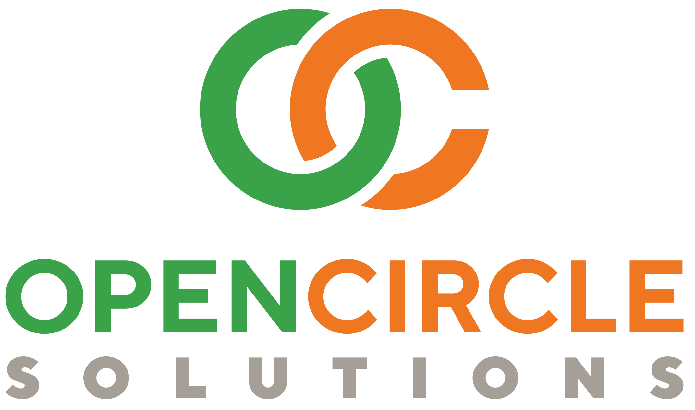

:toc: right
:toc-title: Table of contents
:toclevels: 2
:icons: font
:doctype: article
:!chapter-signifier:
:source-highlighter: rouge
:!sectnums:
:text-align: justify
:pdf-fontsdir: ../../dynamo-documentation/fonts
:pdf-themesdir: ../../dynamo-documentation/themes
:pdf-theme: ocs
:stylesheet: ./css/ocs.css

= Dynamo

[.text-center]
image:media/logo-dynamo.png[image]

[.text-center]
Dynamo: Web Application Accelerator Framework, version {asciidoc-dynamo-version}.

[.text-center]
Developed, maintained and sponsored by:

[.text-center]

---

include::_introduction.adoc[]

== Dynamo versions and innovation

Please note that there currently two different Dynamo versions:

1. Version 4.x and beyond that implements the generated UI with Angular and PrimeNG

2. The older version 3.x that implements the generated UI with Vaadin

The master branch will focus on innovation for Dynamo v4 and beyond. Dynamo V3.x
will be maintained with updates of dependencies when needed, but new functions of
Dynamo V4 will only be backported when demand and business requirements are sufficient.

=== Features and benefits of the different Dynamo versions

Dynamo has many features and functionality, which are not covered fully in this summary.
But this overview is intended to summarize the most notable features and benefits.

=== Features in both Dynamo versions

==== UI features

* Runtime generation of complete UI in several different layouts to support various use cases
* Choice of layouts:
** A _simple search_ layout consisting of a search form based on the Dynamo Entity Model and a results table
** An _edit form_ that can be used to create new entities or modify existing ones
** A _split layout_ that can be used to display a results table and an input form next to each other. The results table can optionally be filtered with a simple quick search or a search popup dialog
** A _search dialog_ to filter and select one or more entities from a potential large result set
** The _FlexibleSearchLayout_ is a search layout that allows the user to create complex search query’s by adding/removing search criteria
** The _EntityPopupDialog_ is a popup dialog that allows the user to create or modify a single entity.
* Automatic form filler using AI (LLM), copy your unstructured data to the form filler dialog and the AI will interpret the data and automatically translate, transform, convert and fill in the form fields
* Automatic generation of applicable components for fields based on datatype and/or declaration:
** Nested detail table (children)
** Dropdown (n-1 relationship to other entity)
** Multi-select (n-m relationship to other entity)
** Auto-complete (n-1 relationship to other entity)
** Lookup field (n-1 relationship to other entity)
** Option to edit element collections (children)
** Radio buttons
** Check boxes
** Date picker
* The functionality to dynamically replace the standard Dynamo input components by custom components
* Functionality to search, filter, add, update and remove entities
* File upload component
* Fields can be grouped together in panels or tabs
* Field ordering can be declared
* Integrated bean validation with fields in UI
* Custom validation support in UI
* Paging and Lazy loading of large result sets
* Default transformation of Enum values to select component
* Automatic link generation to navigate from a child relationship to the applicable detail form
* The option to post-process the edit form after the components have been created (e.g. to add dependencies between fields)
* The option to export data from a table to CSV or Excel
* Nested entities and entity collections are supported
* Can be styled by using themes or custom

==== Backend features

* Default services API for business logic (extensible)
* Default data access layer (extensible)
* No need to write query or persistence logic (extensible)
* Simple but powerful fluent filter logic
* Paging and Lazy loading of large result sets
* Entity query optimization by the use of declarative (fetch)joins which promotes the JPA advise of lazy loading of relationships
* Search results can furthermore be limited to prevent large results and timeouts
* Services are transactional by default

==== Additional (optional) features

* The _MultiDomainEditLayout_ is a layout that can be used to easily edit multiple types of simple domain (code table) entities
* The _MultiDomainEditLayout_ provides a default backend implementation with JPA entities and entity model
* The Hibernate envers module adds supports history on entities
* The parameters module adds form to manage parameter lists

=== Differences between the Dynamo versions

[cols="2,1,1", stripes=even]
|===
|Feature |Dynamo V3.x |Dynamo V4.x

|UI Framework|Vaadin|Angular
|UI Widgets|Vaadin|PrimeNG
|Out of the box https://www.w3.org/WAI/standards-guidelines/wcag/[WCAG] compliance|https://vaadin.com/accessibility[Yes]|https://primeng.org/guides/accessibility[Yes]
|Default REST API for entity CRUDS|No|Yes
|Default REST API for entity model|No|Yes
|Declarative security for pages|Yes|Yes
|Declarative security for REST|No|Yes
|Declarative security for Menus|Yes|No
|Replacing generated UI components|Subclass layout component|Declarative
|Custom actions as buttons with dialog|Subclass layout component, but not intuitive|Easy and concise with code and declaration

|===

== Documentation and further reading

=== Documentation

Documentation of Dynamo can be found xref:reference.html[here as html] (or xref:Dynamo reference.pdf[here as pdf]).
Training documentation can be found xref:training.html[here as html] (or xref:Dynamo training.pdf[here as pdf]).

=== Maven generated site

The Maven generated site with reports can be found xref:maven/index.html[here].

=== Contributing

Interested in contributing? Check our {asciidoc-github-url}/wiki[wiki]!

---

include::_copyright.adoc[]
